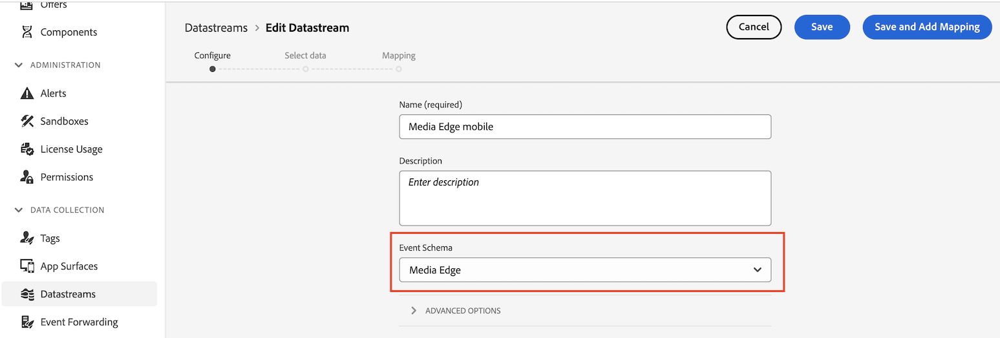

# Installation de Media Analytics avec Experience Platform Edge

Adobe Experience Platform Edge vous permet d’envoyer des données destinées à plusieurs produits vers un emplacement centralisé. Experience Edge transfère les informations appropriées aux produits souhaités. Ce concept vous permet de consolider les efforts de mise en œuvre, en particulier sur plusieurs solutions de données.

Le graphique suivant illustre la manière dont une mise en oeuvre de Media Analytics peut utiliser Experience Platform Edge pour rendre les données disponibles dans Analysis Workspace, que ce soit dans Adobe Analytics ou dans Customer Journey Analytics :

Pour obtenir un aperçu de toutes les options de mise en oeuvre, y compris les méthodes de mise en oeuvre qui n’utilisent pas Experience Platform Edge, voir [Mise en oeuvre de médias en flux continu pour Adobe Analytics ou Customer Journey Analytics](/help/implementation/overview.md).

>[!IMPORTANT]
>
>Les médias en flux continu ne sont pas encore intégrés au SDK Web AEP.

Que vous utilisiez le SDK Mobile ou l’API pour mettre en oeuvre des médias en flux continu avec Experience Edge, vous devez d’abord suivre les sections suivantes :

## Configuration du schéma dans Adobe Experience Platform

Pour normaliser la collecte de données à utiliser dans les applications qui utilisent Adobe Experience Platform, Adobe a créé la norme ouverte et accessible au public, Modèle de données d’expérience (XDM).

Pour créer et configurer un schéma :

1. Dans Adobe Experience Platform, commencez à créer le schéma comme décrit dans la section [Création et modification de schémas dans l’interface utilisateur](https://experienceleague.adobe.com/docs/experience-platform/xdm/ui/resources/schemas.html?lang=en).

   Lors de la création du schéma, choisissez [!UICONTROL **XDM ExperienceEvent**] de la [!UICONTROL **Créer un schéma**] menu déroulant.

1. Dans le [!UICONTROL **Composition**] , dans la zone [!UICONTROL **Groupes de champs**] , sélectionnez [!UICONTROL **Ajouter**], puis recherchez et ajoutez les nouveaux groupes de champs suivants au schéma :
   * `Adobe Analytics ExperienceEvent Template`
   * `Implementation Details`
   * `MediaAnalytics Interaction Details`

   Une fois les groupes de champs ajoutés, ils doivent s’afficher dans le [!UICONTROL **Groupes de champs**] , comme suit :

   

1. Sélectionner [!UICONTROL **Confirmer**] pour enregistrer vos modifications.

1. (Facultatif) Vous pouvez masquer certains champs qui ne sont pas utilisés par l’API Media Edge. Le masquage de ces champs facilite la lecture et la compréhension du schéma, mais il n’est pas obligatoire. Ces champs ne font référence qu’à ceux de la section `MediaAnalytics Interaction Details` fieldgroup

+++ Développez ici pour afficher des instructions sur les champs que vous pouvez masquer.

   1. Dans le [!UICONTROL **Structure**] , sélectionnez la zone `Media Collection Details` champ, puis sélectionnez [!UICONTROL **Gestion des champs associés**].

      

   1. Activez l’option pour [!UICONTROL **Afficher les noms d’affichage des champs**], puis mettez à jour le schéma comme suit :

      * Dans le `Media Collection Details` > `Advertising Details` masquez les champs de création de rapports suivants : `Ad Completed`, `Ad Started`, et `Ad Time Played`.

      * Dans le `Media Collection Details` > `Advertising Pod Details` masquez le champ de création de rapports suivant : `Ad Break ID`

      * Dans le `Media Collection Details` > `Chapter Details` masquez les champs de création de rapports suivants : `Chapter Completed`, `Chapter ID`, `Chapter Started`, et `Chapter Time Played`.

      * Dans le `Media Collection Details` , masquez la variable `List Of States` champ .

        

      * Dans le `Media Collection Details` > `List Of States End` et `Media Collection Details` > `List Of States Start` masquez les champs de création de rapports suivants : `Player State Count`, `Player State Set`, et `Player State Time`.

        

      * Dans le `Media Collection Details` > `Qoe Data Details` masquez les champs de création de rapports suivants : `Average Bitrate`, `Average Bitrate Bucket`, `Bitrate Change Impacted Streams`, `Bitrate Changes`, `Buffer Impacted Streams`, `Buffer Events`, `Dropped Frame Impacted Streams`, `Drops Before Starts`, `Errors`, `External Error IDs`, `Error Impacted Streams`, `Media SDK Error IDs`, `Player SDK Error IDs`, `Stalling Impacted Streams`, `Stalling Events`, `Total Buffer Duration`, et `Total Stalling Duration`.

      * Dans le `Media Collection Details` > `Session Details` masquez les champs de création de rapports suivants : `10% Progress Marker`, `25% Progress Marker`, `50% Progress Marker`, `75% Progress Marker`, `95% Progress Marker`, `Ad Count`, `Average Minute Audience`, `Content Completes`, `Chapter Count`, `Content Starts`, `Content Time Spent`, `Estimated Streams`, `Federated Data`, `Media Segment Views`, `Media Downloaded Flag`, `Media Starts`, `Media Session ID`, `Media Session Server Timeout`, `Media Time Spent`, `Pause Events`, `Pause Impacted Streams`, `Pev3`, `Pccr`, `Total Pause Duration`, `Unique Time Played`, et `Video Segment`.

   1. Sélectionner [!UICONTROL **Confirmer**] pour enregistrer vos modifications.

   1. Dans le [!UICONTROL **Structure**] , activez l’option pour [!UICONTROL **Afficher les noms d’affichage des champs**], puis sélectionnez la variable `List Of Media Collection Downloaded Content Events` champ .

   1. Sélectionner [!UICONTROL **Gestion des champs associés**], puis mettez à jour le schéma comme suit :

      * Dans le `List Of Media Collection Downloaded Content Events` > `Media Details` > `Advertising Details` masquez les champs de création de rapports suivants : `Ad Completed`, `Ad Started`, et `Ad Time Played`.

      * Dans le `List Of Media Collection Downloaded Content Events` > `Media Details` > `Advertising Pod Details` masquez le champ de création de rapports suivant : `Ad Break ID`

      * Dans le `List Of Media Collection Downloaded Content Events` > `Media Details` > `Chapter Details` masquez les champs de création de rapports suivants : `Chapter Completed`, `Chapter ID`, `Chapter Started`, et `Chapter Time Played`.

      * Dans le `List Of Media Collection Downloaded Content Events` > `Media Details` , masquez la variable `List Of States` champ .

      * Dans le `List Of Media Collection Downloaded Content Events` > `Media Details` > `List Of States End` et `Media Collection Details` > `List Of States Start` masquez les champs de création de rapports suivants : `Player State Count`, `Player State Set`, et `Player State Time`.

      * Dans le `List Of Media Collection Downloaded Content Events` > `Media Details` > `Qoe Data Details` masquez les champs de création de rapports suivants : `Average Bitrate`, `Average Bitrate Bucket`, `Bitrate Change Impacted Streams`, `Bitrate Changes`, `Buffer Events`, `Buffer Impacted Streams`, `Drops Before Starts`, `Dropped Frame Impacted Streams`, `Error Impacted Streams`, `Errors`, `External Error IDs`, `Media SDK Error IDs`, `Player SDK Error IDs`, `Stalling Events`, `Stalling Impacted Streams`, `Total Buffer Duration`, et `Total Stalling Duration`.

      * Dans le `List Of Media Collection Downloaded Content Events` > `Media Details` > `Session Details` masquez les champs de création de rapports suivants : `10% Progress Marker`, `25% Progress Marker`, `50% Progress Marker`, `75% Progress Marker`, `95% Progress Marker`, `Ad Count`, `Average Minute Audience`, `Chapter Count`, `Content Completes`, `Content Starts`, `Content Time Spent`, `Estimated Streams`, `Federated Data`, `Media Downloaded Flag`, `Media Segment Views`, `Media Session ID`, `Media Session Server Timeout`, `Media Starts`, `Media Time Spent`, `Pause Events`, `Pause Impacted Streams`, `Pccr`, `Pev3`, `Total Pause Duration`, `Unique Time Played`, et `Video Segment`.

      * Dans le `List Of Media Collection Downloaded Content Events` > `Media Details`  , masquez la variable `Media Session ID` champ .

   1. Sélectionner [!UICONTROL **Confirmer**] pour enregistrer vos modifications.

   1. Dans le [!UICONTROL **Structure**] , sélectionnez la zone `Media Reporting Details` champ, sélectionnez [!UICONTROL **Gestion des champs associés**].

   1. Activez l’option pour [!UICONTROL **Afficher les noms d’affichage des champs**], puis mettez à jour le schéma comme suit :

      * Dans le `Media Reporting Details` masquez les champs suivants : `Error Details`, `List Of States End`, `List of States Start`, et `Media Session ID`.

   1. Sélectionner [!UICONTROL **Confirmer**] > [!UICONTROL **Enregistrer**]  pour enregistrer vos modifications.

1. Passez à la [Création d’un jeu de données dans Adobe Experience Platform](#create-a-dataset-in-adobe-experience-platform).

## Création d’un jeu de données dans Adobe Experience Platform

1. Assurez-vous de configurer un schéma comme décrit dans la section [Configuration du schéma dans Adobe Experience Platform](#set-up-the-schema-in-adobe-experience-platform).

1. Dans Adobe Experience Platform, commencez à créer le jeu de données comme décrit dans la section [Guide de l’interface utilisateur des jeux de données](https://experienceleague.adobe.com/docs/experience-platform/catalog/datasets/user-guide.html?lang=fr#create).

   Lors de la sélection d’un schéma pour votre jeu de données, choisissez le schéma que vous avez précédemment créé, comme décrit à la section [Configuration du schéma dans Adobe Experience Platform](#set-up-the-schema-in-adobe-experience-platform).

1. Passez à la [Configuration d’un flux de données dans Customer Journey Analytics](#configure-a-datastream-in-adobe-experience-platform).

## Configuration d’un flux de données dans Adobe Experience Platform

1. Veillez à créer un jeu de données comme décrit dans la section [Création d’un jeu de données dans Adobe Experience Platform](#create-a-dataset-in-adobe-experience-platform).

1. Créez un flux de données comme décrit dans la section [Configuration d’un flux de données](https://experienceleague.adobe.com/docs/experience-platform/edge/datastreams/configure.html?lang=fr).

   Lors de la création du flux de données, veillez à effectuer les sélections de configuration suivantes :

   * Dans le [!UICONTROL **Schéma d’événement**] lors de la création du flux de données, veillez à sélectionner le schéma que vous avez créé dans [Configuration du schéma dans Adobe Experience Platform](#set-up-the-schema-in-adobe-experience-platform). Sélectionnez [!UICONTROL **Enregistrer**].

     >[!IMPORTANT]
     >
         > Ne pas sélectionner [!UICONTROL **Enregistrement et ajout d’un mappage**] car cela entraînera des erreurs de mappage pour le champ Horodatage .
     
     

   * Ajoutez l’un des services suivants au flux de données, selon que vous utilisez Adobe Analytics ou Customer Journey Analytics :

      * [!UICONTROL **Adobe Analytics**] (si vous utilisez Adobe Analytics)

        Si vous utilisez Adobe Analytics, veillez à définir une suite de rapports, comme décrit dans la section . [Définition d’une suite de rapports](#define-a-report-suite) dans cet article.

      * [!UICONTROL **Adobe Experience Platform**] (en cas d’utilisation de Customer Journey Analytics)

     Pour plus d’informations sur l’ajout d’un service à un flux de données, voir la section &quot;Ajout de services à un flux de données&quot; dans [Configuration d’un flux de données](https://experienceleague.adobe.com/docs/experience-platform/edge/datastreams/configure.html?lang=en#view-details).

     

   * Développer [!UICONTROL **Options avancées**], puis activez l’option [!UICONTROL **Media Analytics**] .

     

1. Vous êtes maintenant prêt à mettre en oeuvre le [API Media Edge](/help/implementation/edge/implementation-edge-api.md) ou [SDK Media Edge](/help/implementation/edge/edge-mobile-sdk.md) pour commencer à collecter des données media analytics.

   Après avoir collecté certaines données, vous pouvez [Création d’une connexion dans Customer Journey Analytics](#create-a-connection-in-customer-journey-analytics).

## Créer une connexion dans Customer Journey Analytics

>[!NOTE]
>
>La procédure suivante n’est requise que si vous utilisez Customer Journey Analytics.

1. Veillez à créer un flux de données comme décrit dans la section [Configuration d’un flux de données dans Customer Journey Analytics](#configure-a-datastream-in-adobe-experience-platform).

1. Dans Customer Journey Analytics, créez une connexion comme décrit dans la section [Création d’une connexion](https://experienceleague.adobe.com/docs/analytics-platform/using/cja-connections/create-connection.html?lang=fr).

   Lors de la création de la connexion, les sélections de configuration suivantes sont requises pour la mise en oeuvre de Streaming Media :

   1. Sélectionnez le jeu de données que vous avez précédemment créé, comme décrit dans la section [Création d’un jeu de données dans Adobe Experience Platform](#create-a-dataset-in-adobe-experience-platform).

   1. Assurez-vous que la variable [!UICONTROL **Importer toutes les nouvelles données**] est activé.

1. Passez à la [Création d’une vue de données dans Customer Journey Analytics](#create-a-new-data-view-in-customer-journey-analytics).

## Création d’une vue de données dans Customer Journey Analytics

>[!NOTE]
>
>La procédure suivante n’est requise que si vous utilisez Customer Journey Analytics.

1. Veillez à créer une connexion en Customer Journey Analytics, comme décrit dans la section [Création d’une connexion dans Customer Journey Analytics](#create-a-connection-in-customer-journey-analytics).

1. Dans Customer Parcours Analytics, créez une vue de données comme décrit dans la section [Création ou modification d’une vue de données](https://experienceleague.adobe.com/docs/analytics-platform/using/cja-dataviews/create-dataview.html?lang=en).

   Lors de la création de la vue de données, les sélections de configuration suivantes sont requises pour l’implémentation de la vue Streaming Media :

   1. Dans le [!UICONTROL **Connexion**] , sélectionnez la connexion que vous avez créée précédemment, comme décrit dans la section [Création d’une connexion dans Customer Journey Analytics](#create-a-connection-in-customer-journey-analytics).

      La sélection de la connexion que vous avez créée peut prendre jusqu’à 15 minutes.

   1. Sur le [!UICONTROL **Composants**] , dans le [!UICONTROL **Champs de schéma**] , recherchez chaque composant répertorié dans les tableaux ci-dessous et faites-le glisser dans la section [!UICONTROL **Mesures**] du panneau. S’il existe plusieurs champs portant le même nom, utilisez le chemin XDM pour vous assurer qu’il s’agit bien du champ.

      **Contenu principal - Mesures de contenu**

      | Nom du composant | Chemin XDM |
      |----------|---------|
      | Démarrage du contenu multimédia | mediaReporting.sessionDetails.isViewed |
      | Vues de segments du fichier multimédia | mediaReporting.sessionDetails.hasSegmentView |
      | Démarrages de contenu | mediaReporting.sessionDetails.isPlayed |
      | Le contenu se termine | mediaReporting.sessionDetails.isCompleted |
      | Temps passé sur le contenu | mediaReporting.sessionDetails.timePlayed |
      | Passé sur le média | mediaReporting.sessionDetails.totalTimePlayed |
      | Durée de lecture unique | mediaReporting.sessionDetails.uniqueTimePlayed |
      | Marqueur de progression de 10% | mediaReporting.sessionDetails.hasProgress10 |
      | Audience moyenne par minute | mediaReporting.sessionDetails.averageMinuteAudience |

      **Chapitre et publicités - Mesures de chapitre et de publicité**

      | Nom du composant | Chemin XDM |
      |----------|---------|
      | Démarrage du chapitre | mediaReporting.chapterDetails.isStarted |
      | Chapitre terminé | mediaReporting.chapterDetails.isCompleted |
      | Durée de lecture des chapitres | mediaReporting.chapterDetails.timePlayed |
      | Publicité lancée | mediaReporting.advertisingDetails.isStarted |
      | Publicité terminée | mediaReporting.advertisingDetails.isCompleted |
      | Durée de lecture des publicités | mediaReporting.advertisingDetails.timePlayed |

      **QoE - Mesures QoE**

      | Nom du composant | Chemin XDM |
      |----------|---------|
      | Temps jusqu’au début | mediaReporting.qoeDataDetails.timeToStart |
      | Pertes avant le début | mediaReporting.qoeDataDetails.isDroppedBeforeStart |
      | Flux touchés par la mémoire tampon | mediaReporting.qoeDataDetails.hasBufferImpactedStreams |
      | Flux touchés par les changements de débit | mediaReporting.qoeDataDetails.hasBitrateChangeImpactedStreams |
      | Changements de débit | mediaReporting.qoeDataDetails.bitrateChangeCount |
      | Débit moyen | mediaReporting.qoeDataDetails.bitrateAverage |
      | Perte d’images | mediaReporting.qoeDataDetails.droppedFrames |
      | Erreurs | mediaReporting.qoeDataDetails.errorCount |
      | Flux touchés par les erreurs | mediaReporting.qoeDataDetails.hasErrorImpactedStreams |
      | Flux touchés par la perte d’images | mediaReporting.qoeDataDetails.hasDroppedFrameImpactedStreams |

      **État du lecteur - Mesures d’état du lecteur**

      | Nom du composant | Chemin XDM |
      |----------|---------|
      | Jeu d’états du lecteur | mediaReporting.states.isSet |
      | Nombre d’états du lecteur | mediaReporting.states.count |
      | Heure d’état du lecteur | mediaReporting.states.time |

   1. Mettez à jour les étiquettes (dans la variable [!UICONTROL **Étiquettes contextuelles**] menu déroulant) pour les composants dans le tableau suivant. Recherchez et faites glisser des composants qui ne se trouvent pas déjà dans le panneau des mesures dans le panneau.

      | Nom du composant | Libellé de contexte |
      |---------|----------|
      | Délai d’expiration du serveur de session multimédia | Média : secondes depuis le dernier appel |
      | Passé sur le média | Média : temps passé sur le média |
      | Durée totale de la mémoire tampon | Média : durée totale de la mémoire tampon |
      | Temps jusqu’au début | Média : temps jusqu’au début |
      | Durée totale de pause | Média : durée totale de pause |

   1. Pour ajouter des ventilations à votre projet Customer Journey Analytics, ajoutez les dimensions suivantes au [!UICONTROL **Dimensions**] panel :

      | Chemin XDM | Nom du composant |
      |---------|----------|
      | mediaReporting.states.name | Nom de l’état du lecteur |
      | mediaReporting.sessionDetails.ID | ID de session multimédia |

      Outre les dimensions de ce tableau, vous pouvez ajouter toute autre dimension que vous souhaitez rendre disponible pour filtrer les données par dans les projets Customer Journey Analytics.

1. Sélectionner [!UICONTROL **Enregistrer et continuer**] > [!UICONTROL **Enregistrer et terminer**] pour enregistrer vos modifications.

1. Passez à la [Création et configuration d’un projet dans Customer Journey Analytics](#create-and-configure-a-project-in-customer-journey-analytics).

## Création et configuration d’un projet dans Customer Journey Analytics

1. Veillez à créer une vue de données en Customer Journey Analytics, comme décrit dans la section [Création d’une vue de données dans Customer Journey Analytics](#create-a-new-data-view-in-customer-journey-analytics).

1. En Customer Journey Analytics, dans la variable [!UICONTROL **Workspace**] , dans le [!UICONTROL **Projets**] zone, sélectionnez [!UICONTROL **Créer un projet**].

1. Sélectionner [!UICONTROL **Projet vierge**] > [!UICONTROL **Créer**].

1. Dans le nouveau projet, sélectionnez la vue de données que vous avez créée précédemment.

   Lors de la création de panneaux dans votre projet, vous pouvez utiliser les composants que vous avez ajoutés à votre vue de données, comme décrit dans la section [Création d’une vue de données dans Customer Journey Analytics](#create-a-new-data-view-in-customer-journey-analytics).

   Les 4 panneaux suivants constituent des exemples de panneaux que vous pouvez créer :

   

   

   

   

1. Sélectionnez la variable **Panneaux** dans le rail de gauche, puis effectuez un glisser-déposer dans la [!UICONTROL **Visionneuses simultanées de médias**] et le panneau [!UICONTROL **Durée de lecture du média**] du panneau.

   Les deux panneaux doivent se présenter comme suit :

   

   

1. Partagez le projet, comme décrit dans la section [Partage de projets](https://experienceleague.adobe.com/docs/analytics-platform/using/cja-workspace/curate-share/share-projects.html?lang=en).

   >[!NOTE]
   >
   >   Si les utilisateurs avec lesquels vous souhaitez partager du contenu ne sont pas disponibles, assurez-vous qu’ils disposent d’un accès utilisateur et administrateur à Customer Journey Analytics dans Adobe Admin Console.

1. Passez à la [Envoi de données à Experience Platform Edge](#send-data-to-experience-platform-edge).

## Envoi de données à Experience Platform Edge à l’aide du SDK AEP Mobile

Vous pouvez utiliser le SDK mobile Adobe Experience Platform pour envoyer des données mobiles à Experience Platform Edge.

Utilisez les ressources de documentation suivantes pour terminer la mise en oeuvre pour iOS et Android :

* [Prise en main](https://developer.adobe.com/client-sdks/documentation/media-for-edge-network/)

* [Référence d’API](https://developer.adobe.com/client-sdks/documentation/media-for-edge-network/api-reference/)

* [Migration vers Adobe Streaming Media pour l’extension Edge Network](https://developer.adobe.com/client-sdks/documentation/adobe-media-analytics/migration-guide/)

Vous pouvez également utiliser une implémentation personnalisée des API Edge à l’aide des ressources suivantes :

* [Présentation de l’API Media Edge](https://experienceleague.adobe.com/docs/experience-platform/edge-network-server-api/media-edge-apis/overview.html)

* [Prise en main de l’API Media Edge](https://experienceleague.adobe.com/docs/experience-platform/edge-network-server-api/media-edge-apis/getting-started.html)

* [Guide de dépannage de l’API Media Edge](https://experienceleague.adobe.com/docs/experience-platform/edge-network-server-api/media-edge-apis/troubleshooting.html)

* [Utilisation du fichier Open API Specification pour les API Media Edge](https://experienceleague.adobe.com/docs/experience-platform/edge-network-server-api/media-edge-apis/swagger.html)
