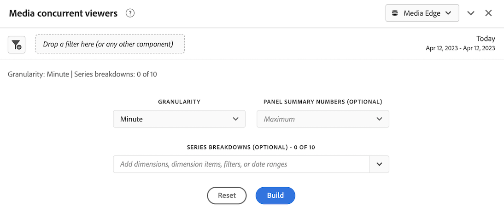

# Implémenter Streaming Media Collection à l’aide de l’Edge Network

Le réseau Edge d&#39;Adobe Experience Platform vous permet d’envoyer des données destinées à plusieurs produits vers un emplacement centralisé. Experience Edge transfère les informations appropriées aux produits souhaités. Ce concept vous permet de consolider les efforts de mise en œuvre, en particulier sur plusieurs solutions de données.

L’illustration suivante montre comment la collecte de médias en flux continu Adobe peut être mise en œuvre pour utiliser Edge Experience Platform afin de rendre les données disponibles dans Analysis Workspace, dans Adobe Analytics ou Customer Journey Analytics :

Pour obtenir un aperçu de toutes les options d’implémentation, y compris des méthodes d’implémentation qui n’utilisent pas Edge Experience Platform, consultez [ Implémentation de la collection de médias en flux continu ](/help/implementation/overview.md).

Que vous utilisiez Adobe Experience Platform Web SDK, Adobe Experience Platform Mobile SDK, Adobe Experience Platform Roku SDK ou l’API pour implémenter la collection de médias en flux continu avec Experience Edge, vous devez d’abord remplir les sections suivantes :

## Configurer le schéma dans Adobe Experience Platform

Pour normaliser la collecte de données à utiliser dans les applications qui utilisent Adobe Experience Platform, Adobe a créé la norme ouverte et accessible au public, Modèle de données d’expérience (XDM).

Pour créer et configurer un schéma :

1. Dans Adobe Experience Platform, commencez à créer le schéma comme décrit dans [Création et modification de schémas dans l’interface utilisateur](https://experienceleague.adobe.com/docs/experience-platform/xdm/ui/resources/schemas.html?lang=en).

1. Sur la page Détails du schéma lors de la création du schéma, choisissez [!UICONTROL **Événement d’expérience**] lors du choix de la classe de base du schéma.

   

1. Sélectionnez [!UICONTROL **Suivant**].

1. Spécifiez un nom d’affichage et une description de schéma, puis sélectionnez [!UICONTROL **Terminer**].

1. Dans la zone [!UICONTROL **Composition**], dans la section [!UICONTROL **Groupes de champs**], sélectionnez [!UICONTROL **Ajouter**], puis recherchez et ajoutez les nouveaux groupes de champs suivants au schéma :
   * `Adobe Analytics ExperienceEvent Template`
   * `Implementation Details`
   * `MediaAnalytics Interaction Details`

   Une fois les groupes de champs ajoutés, ils doivent s’afficher dans la section [!UICONTROL **Groupes de champs**] comme suit :

   

1. Sélectionnez [!UICONTROL **Enregistrer**] pour enregistrer vos modifications.

1. (Facultatif) Vous pouvez masquer certains champs qui ne sont pas utilisés par l’API Media Edge. Le masquage de ces champs facilite la lecture et la compréhension du schéma, mais n’est pas obligatoire. Ces champs se rapportent uniquement à ceux du groupe de champs `MediaAnalytics Interaction Details`.

+++ Développez ici pour afficher les instructions sur les champs que vous pouvez masquer.

   1. Dans la zone [!UICONTROL **Structure**], sélectionnez le champ `Media Collection Details`, puis sélectionnez [!UICONTROL **Gérer les champs associés**].

      

   1. Activez l’option pour [!UICONTROL **Afficher les noms d’affichage des champs**], puis mettez à jour le schéma comme suit :

      * Dans le champ `Media Collection Details` > `Advertising Details` , masquez les champs de reporting suivants : `Ad Completed`, `Ad Started` et `Ad Time Played`.

      * Dans le champ `Media Collection Details` > `Advertising Pod Details` , masquez le champ de reporting suivant : `Ad Break ID`

      * Dans le champ `Media Collection Details` > `Chapter Details` , masquez les champs de reporting suivants : `Chapter Completed`, `Chapter ID`, `Chapter Started` et `Chapter Time Played`.

      * Dans le champ `Media Collection Details`, masquez le champ `List Of States` .

        

      * Dans le champ `Media Collection Details` > `List Of States End` et `Media Collection Details` > `List Of States Start` , masquez les champs de reporting suivants : `Player State Count`, `Player State Set` et `Player State Time`.

        

      * Dans le champ `Media Collection Details` > `Qoe Data Details` , masquez les champs de reporting suivants : `Average Bitrate`, `Average Bitrate Bucket`, `Bitrate Change Impacted Streams`, `Bitrate Changes`, `Buffer Impacted Streams`, `Buffer Events`, `Dropped Frame Impacted Streams`, `Drops Before Starts`, `Errors`, `External Error IDs`, `Error Impacted Streams`, `Media SDK Error IDs`, `Player SDK Error IDs`, `Stalling Impacted Streams`, `Stalling Events`, `Total Buffer Duration`, `Total Stalling Duration`,, et.

      * Dans le champ `Media Collection Details` > `Session Details` , masquez les champs de création de rapports suivants : `10% Progress Marker`, `25% Progress Marker`, `50% Progress Marker`, `75% Progress Marker`, `95% Progress Marker`, `Ad Count`, `Average Minute Audience`, `Content Completes`, `Chapter Count`, `Content Starts`, `Content Time Spent`, `Estimated Streams`, `Federated Data`, `Media Segment Views`, `Media Downloaded Flag`, `Media Starts`, `Media Session ID`, `Media Session Server Timeout`, `Media Time Spent`, `Pause Events`, `Pause Impacted Streams`, `Pev3`, `Pccr`, `Total Pause Duration`, `Unique Time Played`, `Video Segment`, et.

   1. Sélectionnez [!UICONTROL **Confirmer**] pour enregistrer vos modifications.

   1. Dans la zone [!UICONTROL **Structure**], activez l’option [!UICONTROL **Afficher les noms d’affichage des champs**], puis sélectionnez le champ `List Of Media Collection Downloaded Content Events`.

   1. Sélectionnez [!UICONTROL **Gérer les champs associés**] puis mettez à jour le schéma comme suit :

      * Dans le champ `List Of Media Collection Downloaded Content Events` > `Media Details` > `Advertising Details` , masquez les champs de reporting suivants : `Ad Completed`, `Ad Started` et `Ad Time Played`.

      * Dans le champ `List Of Media Collection Downloaded Content Events` > `Media Details` > `Advertising Pod Details` , masquez le champ de reporting suivant : `Ad Break ID`

      * Dans le champ `List Of Media Collection Downloaded Content Events` > `Media Details` > `Chapter Details` , masquez les champs de reporting suivants : `Chapter Completed`, `Chapter ID`, `Chapter Started` et `Chapter Time Played`.

      * Dans le champ `List Of Media Collection Downloaded Content Events` > `Media Details` , masquez le champ `List Of States` .

      * Dans le champ `List Of Media Collection Downloaded Content Events` > `Media Details` > `List Of States End` et `Media Collection Details` > `List Of States Start` , masquez les champs de reporting suivants : `Player State Count`, `Player State Set` et `Player State Time`.

      * Dans le champ `List Of Media Collection Downloaded Content Events` > `Media Details` > `Qoe Data Details` , masquez les champs de reporting suivants : `Average Bitrate`, `Average Bitrate Bucket`, `Bitrate Change Impacted Streams`, `Bitrate Changes`, `Buffer Events`, `Buffer Impacted Streams`, `Drops Before Starts`, `Dropped Frame Impacted Streams`, `Error Impacted Streams`, `Errors`, `External Error IDs`, `Media SDK Error IDs`, `Player SDK Error IDs`, `Stalling Events`, `Stalling Impacted Streams`, `Total Buffer Duration`, `Total Stalling Duration`,, et.

      * Dans le champ `List Of Media Collection Downloaded Content Events` > `Media Details` > `Session Details` , masquez les champs de reporting suivants : `10% Progress Marker`, `25% Progress Marker`, `50% Progress Marker`, `75% Progress Marker`, `95% Progress Marker`, `Ad Count`, `Average Minute Audience`, `Chapter Count`, `Content Completes`, `Content Starts`, `Content Time Spent`, `Estimated Streams`, `Federated Data`, `Media Downloaded Flag`, `Media Segment Views`, `Media Session ID`, `Media Session Server Timeout`, `Media Starts`, `Media Time Spent`, `Pause Events`, `Pause Impacted Streams`, `Pccr`, `Pev3`, `Total Pause Duration`, `Unique Time Played`, `Video Segment`, et.

      * Dans le champ `List Of Media Collection Downloaded Content Events` > `Media Details` , masquez le champ `Media Session ID` .

   1. Sélectionnez [!UICONTROL **Confirmer**] pour enregistrer vos modifications.

   1. Dans la zone [!UICONTROL **Structure**], sélectionnez le champ `Media Reporting Details`, puis sélectionnez [!UICONTROL **Gérer les champs associés**].

   1. Activez l’option pour [!UICONTROL **Afficher les noms d’affichage des champs**], puis mettez à jour le schéma comme suit :

      * Dans le champ `Media Reporting Details`, masquez les champs suivants : `Error Details`, `List Of States End`, `List of States Start` et `Media Session ID`.

   1. Sélectionnez [!UICONTROL **Confirmer**] > [!UICONTROL **Enregistrer**] pour enregistrer vos modifications.

+++

1. (Facultatif) Vous pouvez ajouter des métadonnées personnalisées à votre schéma. Vous pouvez ainsi inclure d’autres métadonnées définies par l’utilisateur ou l’utilisatrice qui peuvent être personnalisées selon des besoins ou des contextes spécifiques. Cette flexibilité est utile dans les scénarios où les schémas existants ne couvrent pas les points de données souhaités. (Vous pouvez également utiliser des métadonnées personnalisées avec les API Media Edge. Pour plus d’informations, voir [Création de métadonnées personnalisées avec les API Media Edge](https://developer.adobe.com/cja-apis/docs/endpoints/media-edge/custom-metadata/).)

+++ Développez ici pour afficher les instructions sur la manière d’ajouter des métadonnées personnalisées à votre schéma.

   1. Recherchez le nom du client de l’organisation en sélectionnant [!UICONTROL **Informations sur le compte**] > [!UICONTROL **Organisations affectées**] > [!UICONTROL _**nom de l’organisation**_] > [!UICONTROL **client**].

      Ces champs personnalisés seront reçus via ce chemin d’accès. (Par exemple, nom du client : _dcbl → chemin myCustomField : _dcbl.myCustomField.)

   1. Ajoutez un groupe de champs personnalisé à votre schéma de média défini.

      

   1. Ajoutez tous les champs personnalisés que vous souhaitez suivre au groupe de champs .

      

   1. [Utilisez le chemin d’accès généré](https://experienceleague.adobe.com/en/docs/experience-platform/xdm/ui/fields/overview#type-specific-properties) pour le champ personnalisé dans la payload de votre requête.

      

+++

1. Continuez avec [Création d’un jeu de données dans Adobe Experience Platform](#create-a-dataset-in-adobe-experience-platform).

## Création d’un jeu de données dans Adobe Experience Platform

1. Veillez à configurer un schéma comme décrit dans la section [Configuration du schéma dans Adobe Experience Platform](#set-up-the-schema-in-adobe-experience-platform).

1. Dans Adobe Experience Platform, commencez à créer le jeu de données comme décrit dans [Guide de l’interface utilisateur des jeux de données](https://experienceleague.adobe.com/docs/experience-platform/catalog/datasets/user-guide.html?lang=fr#create).

   Lors de la sélection d’un schéma pour votre jeu de données, choisissez le schéma que vous avez précédemment créé, comme décrit dans la section [Configurer le schéma dans Adobe Experience Platform](#set-up-the-schema-in-adobe-experience-platform).

1. Continuez avec [Configurer un flux de données dans Customer Journey Analytics](#configure-a-datastream-in-adobe-experience-platform).

## Configurer un flux de données dans Adobe Experience Platform

1. Assurez-vous d’avoir créé un jeu de données comme décrit dans la section [Créer un jeu de données dans Adobe Experience Platform](#create-a-dataset-in-adobe-experience-platform).

1. Créez un flux de données comme décrit dans la section [Configurer un flux de données](https://experienceleague.adobe.com/docs/experience-platform/edge/datastreams/configure.html?lang=fr).

   Lors de la création du flux de données, veillez à effectuer les sélections de configuration suivantes :

   * Dans le champ [!UICONTROL **Schéma d’événement**] lors de la création du flux de données, veillez à sélectionner le schéma que vous avez créé dans [Configurer le schéma dans Adobe Experience Platform](#set-up-the-schema-in-adobe-experience-platform). Sélectionnez [!UICONTROL **Enregistrer**].

     >[!IMPORTANT]
     >
     >Ne sélectionnez pas [!UICONTROL **Enregistrer et ajouter un mappage**], car cela entraînerait des erreurs de mappage pour le champ Date et heure.

     

   * Ajoutez l’un des services suivants au flux de données, selon que vous utilisez Adobe Analytics ou Customer Journey Analytics :

      * [!UICONTROL **Adobe Analytics**] (si vous utilisez Adobe Analytics)

        Si vous utilisez Adobe Analytics, veillez à définir une suite de rapports, comme décrit dans la section [Création d’une suite de rapports](https://experienceleague.adobe.com/en/docs/analytics/admin/admin-tools/manage-report-suites/c-new-report-suite/t-create-a-report-suite).

      * [!UICONTROL **Adobe Experience Platform**] (si vous utilisez Customer Journey Analytics)

     Pour plus d’informations sur l’ajout d’un service à un flux de données, consultez la section « Ajouter des services à un flux de données » dans [Configurer un flux de données](https://experienceleague.adobe.com/docs/experience-platform/edge/datastreams/configure.html?lang=en#view-details).

     

      * Développez [!UICONTROL **Options avancées**], puis activez l’option [!UICONTROL **Media Analytics**].

     

1. Vous êtes maintenant prêt à implémenter l’[API Media Edge](/help/implementation/edge/implementation-edge-api.md) ou l’[SDK Media Edge](/help/implementation/edge/edge-mobile-sdk.md) pour commencer à collecter des données Media Analytics.

   Après avoir collecté des données, vous pouvez [Créer une connexion dans Customer Journey Analytics](#create-a-connection-in-customer-journey-analytics).

## Créer une connexion dans Customer Journey Analytics

>[!NOTE]
>
>La procédure suivante n’est requise que si vous utilisez Customer Journey Analytics.

1. Assurez-vous d’avoir créé un flux de données comme décrit dans [Configurer un flux de données dans Customer Journey Analytics](#configure-a-datastream-in-adobe-experience-platform).

1. Dans Customer Journey Analytics, créez une connexion comme décrit dans la section [Créer une connexion](https://experienceleague.adobe.com/docs/analytics-platform/using/cja-connections/create-connection.html?lang=fr).

   Lors de la création de la connexion, les sélections de configuration suivantes sont requises pour mettre en œuvre la collection Streaming Media :

   1. Sélectionnez le jeu de données que vous avez précédemment créé, comme décrit dans [Création d’un jeu de données dans Adobe Experience Platform](#create-a-dataset-in-adobe-experience-platform).

   1. Assurez-vous que le paramètre [!UICONTROL **Importer toutes les nouvelles données**] est activé.

1. Continuez avec [Créer une vue de données dans Customer Journey Analytics](#create-a-new-data-view-in-customer-journey-analytics).

## Création d’une vue de données dans Customer Journey Analytics

>[!NOTE]
>
>La procédure suivante n’est requise que si vous utilisez Customer Journey Analytics.

1. Assurez-vous d’avoir créé une connexion dans Customer Journey Analytics, comme décrit dans la section [Créer une connexion dans Customer Journey Analytics](#create-a-connection-in-customer-journey-analytics).

1. Dans Customer Parcours Analytics, créez une vue de données comme décrit dans la section [Créer ou modifier une vue de données](https://experienceleague.adobe.com/docs/analytics-platform/using/cja-dataviews/create-dataview.html?lang=fr).

   Lors de la création de la vue de données, les sélections de configuration suivantes sont requises pour mettre en œuvre la collecte de médias en flux continu :

   1. Dans le champ [!UICONTROL **Connexion**], sélectionnez la connexion que vous avez précédemment créée, comme décrit dans [Créer une connexion dans Customer Journey Analytics](#create-a-connection-in-customer-journey-analytics).

      Il peut s’écouler jusqu’à 15 minutes avant que la connexion que vous avez créée soit disponible pour être sélectionnée.

   1. Dans l’onglet [!UICONTROL **Composants**] de la section [!UICONTROL **Champs de schéma**], recherchez chaque composant répertorié dans les tableaux ci-dessous et faites-le glisser dans le panneau [!UICONTROL **Mesures**]. S’il existe plusieurs champs du même nom, utilisez le chemin XDM pour vous assurer qu’il s’agit du champ correct.

      **Contenu principal - Mesures de contenu**

      | Nom du composant | Chemin XDM |
      |----------|---------|
      | Démarrage du contenu multimédia | mediaReporting.sessionDetails.isViewed |
      | Vues de segments du fichier multimédia | mediaReporting.sessionDetails.hasSegmentView |
      | Démarrages de contenu | mediaReporting.sessionDetails.isPlayed |
      | Le contenu se termine | mediaReporting.sessionDetails.isCompleted |
      | Temps passé sur le contenu | mediaReporting.sessionDetails.timePlayed |
      | Passé sur le média | mediaReporting.sessionDetails.totalTimePlayed |
      | Durée de lecture unique | mediaReporting.sessionDetails.uniqueTimePlayed |
      | Marqueur de progression de 10% | mediaReporting.sessionDetails.hasProgress10 |
      | Audience moyenne par minute | mediaReporting.sessionDetails.averageMinuteAudience |

      **Mesures de chapitre et de publicité - Chapitre et publicités**

      | Nom du composant | Chemin XDM |
      |----------|---------|
      | Chapitre démarré | mediaReporting.chapterDetails.isStarted |
      | Chapitre terminé | mediaReporting.chapterDetails.isCompleted |
      | Temps de lecture du chapitre | mediaReporting.chapterDetails.timePlayed |
      | Annonce démarrée | mediaReporting.advertisingDetails.isStarted |
      | Annonce publicitaire terminée | mediaReporting.advertisingDetails.isCompleted |
      | Durée de lecture des publicités | mediaReporting.advertisingDetails.timePlayed |

      **QoE - Mesures de QoE**

      | Nom du composant | Chemin XDM |
      |----------|---------|
      | Temps jusqu’au début | mediaReporting.qoeDataDetails.timeToStart |
      | Pertes avant démarrages | mediaReporting.qoeDataDetails.isDroppedBeforeStart |
      | Flux touchés par la mémoire tampon | mediaReporting.qoeDataDetails.hasBufferImpactedStreams |
      | Flux touchés par les changements de débit | mediaReporting.qoeDataDetails.hasBitrateChangeImpactedStreams |
      | Changements de débit | mediaReporting.qoeDataDetails.bitrateChangeCount |
      | Débit moyen | mediaReporting.qoeDataDetails.bitrateAverage |
      | Perte d’images | mediaReporting.qoeDataDetails.droppedFrames |
      | Erreurs | mediaReporting.qoeDataDetails.errorCount |
      | Flux touchés par les erreurs | mediaReporting.qoeDataDetails.hasErrorImpactedStreams |
      | Flux touchés par la perte d’images | mediaReporting.qoeDataDetails.hasDroppedFrameImpactedStreams |

      **État du lecteur - Mesures d’état du lecteur**

      | Nom du composant | Chemin XDM |
      |----------|---------|
      | État du lecteur défini | mediaReporting.states.isSet |
      | Nombre d’états du lecteur | mediaReporting.states.count |
      | État du lecteur - Heure | mediaReporting.states.time |

   1. Mettez à jour les libellés (dans le menu déroulant [!UICONTROL **Libellés de contexte**]) des composants dans le tableau suivant. Recherchez et faites glisser dans le panneau tous les composants qui ne figurent pas encore dans le panneau mesures .

      | Nom du composant | Libellé de contexte |
      |---------|----------|
      | Délai d’expiration du serveur de session multimédia | Média : secondes depuis le dernier appel |
      | Passé sur le média | Média : temps passé sur le média |
      | Durée totale de la mémoire tampon | Média : durée totale de la mémoire tampon |
      | Temps jusqu’au début | Média : Heure De Début |
      | Durée totale de pause | Média : durée totale de pause |

   1. Pour ajouter des répartitions à votre projet de Customer Journey Analytics, ajoutez les dimensions suivantes au panneau [!UICONTROL **Dimensions**] :

      | Chemin XDM | Nom du composant |
      |---------|----------|
      | mediaReporting.states.name | Nom de l’état du lecteur |
      | mediaReporting.sessionDetails.ID | ID de session multimédia |

      Outre les dimensions de ce tableau, vous pouvez ajouter toute autre dimension que vous souhaitez rendre disponible pour le filtrage des données dans les projets Customer Journey Analytics.

1. Sélectionnez [!UICONTROL **Enregistrer et continuer**] > [!UICONTROL **Enregistrer et terminer**] pour enregistrer vos modifications.

1. Continuez avec [Créer et configurer un projet dans Customer Journey Analytics](#create-and-configure-a-project-in-customer-journey-analytics).

## Création et configuration d’un projet dans Customer Journey Analytics

1. Assurez-vous d’avoir créé une vue de données dans Customer Journey Analytics, comme décrit dans la section [Créer une vue de données dans Customer Journey Analytics](#create-a-new-data-view-in-customer-journey-analytics).

1. Dans Customer Journey Analytics, dans l’onglet [!UICONTROL **Workspace**], dans la zone [!UICONTROL **Projets**], sélectionnez [!UICONTROL **Créer un projet**].

1. Sélectionnez [!UICONTROL **Projet vierge**] > [!UICONTROL **Créer**].

1. Dans le nouveau projet, sélectionnez la vue de données que vous avez précédemment créée.

   Lors de la création de panneaux dans votre projet, vous pouvez utiliser tous les composants que vous avez ajoutés à votre vue de données, comme décrit dans la section [Créer une vue de données dans Customer Journey Analytics](#create-a-new-data-view-in-customer-journey-analytics).

   Les 4 panneaux suivants sont des exemples de panneaux que vous pouvez créer :

   

   

   

   

1. Sélectionnez l’icône **Panneaux** dans le rail de gauche, puis faites glisser le panneau [!UICONTROL **Visionneuses simultanées de médias**] et le panneau [!UICONTROL **Temps de lecture de médias**].

   Les 2 panneaux doivent se présenter comme suit :

   

   

1. (Conditionnel) Si vous avez ajouté des métadonnées personnalisées à votre schéma, comme décrit à l’étape 8 de [Configuration du schéma dans Adobe Experience Platform](#set-up-the-schema-in-adobe-experience-platform), vous devez définir la persistance des champs personnalisés, comme décrit dans [Paramètres des composants de persistance](https://experienceleague.adobe.com/en/docs/analytics-platform/using/cja-dataviews/component-settings/persistence) dans le guide du Customer Journey Analytics.

   Lorsque les données arrivent en Customer Journey Analytics, la dimension ID d’utilisateur personnalisé est disponible.

   

   >[!NOTE]
   >
   >Si vous configurez Adobe Analytics en tant qu’élément en amont de votre flux de données, les métadonnées personnalisées sont également présentes dans ContextData, avec le nom que vous avez défini dans le schéma (sans le préfixe client, par exemple myCustomField). Cela permet d’utiliser toutes les fonctionnalités d’Adobe Analytics disponibles pour ContextData, telles que [création d’une règle de traitement](https://experienceleague.adobe.com/en/docs/analytics/admin/admin-tools/manage-report-suites/edit-report-suite/report-suite-general/c-processing-rules/processing-rules).

1. Partagez le projet comme décrit dans la section [Partager des projets](https://experienceleague.adobe.com/docs/analytics-platform/using/cja-workspace/curate-share/share-projects.html?lang=en).

   >[!NOTE]
   >
   >   Si les utilisateurs avec lesquels vous souhaitez partager ne sont pas disponibles, assurez-vous qu’ils disposent d’un accès utilisateur et administrateur à Customer Journey Analytics dans le Adobe Admin Console.

1. Continuez avec [Envoi de données à Edge Experience Platform ](#send-data-to-experience-platform-edge).

## Envoi de données à Edge Experience Platform

Selon le type de données que vous souhaitez envoyer à Edge Experience Platform, vous pouvez utiliser l’une des méthodes suivantes :

### Web : utiliser le SDK Web Adobe Experience Platform

* [Prise en main](https://developer.adobe.com/client-sdks/documentation/media-for-edge-network/)

* [Envoyer des données web à Edge avec Adobe Experience Platform Web SDK](/help/implementation/edge/edge-web-sdk.md)

* [Migration vers l’extension Adobe Streaming Media for Edge Network ](https://developer.adobe.com/client-sdks/documentation/adobe-media-analytics/migration-guide/)

### Mobile : utiliser le SDK mobile Adobe Experience Platform

Utilisez les ressources de documentation suivantes pour terminer la mise en œuvre pour iOS et Android :

* [Prise en main](https://developer.adobe.com/client-sdks/documentation/media-for-edge-network/)

* [Référence d’API](https://developer.adobe.com/client-sdks/documentation/media-for-edge-network/api-reference/)

* [Migration vers l’extension Adobe Streaming Media for Edge Network ](https://developer.adobe.com/client-sdks/documentation/adobe-media-analytics/migration-guide/)

### Roku : Adobe Experience Platform Roku SDK

* [Prise en main](https://developer.adobe.com/client-sdks/documentation/media-for-edge-network/)

* [Adobe Experience Platform Roku SDK](https://github.com/adobe/aepsdk-roku/tree/main)

* [Migration vers l’extension Adobe Streaming Media for Edge Network ](https://developer.adobe.com/client-sdks/documentation/adobe-media-analytics/migration-guide/) <!-- is the information here also applicable for Roku? -->

### API : Web et autre

L’API est actuellement le seul moyen pris en charge pour envoyer des données web à Edge Experience Platform.

L’API est également disponible si vous souhaitez utiliser une implémentation personnalisée des API d’Edge.

Pour plus d’informations sur l’API Media Edge, consultez les ressources suivantes :

* [Présentation de l’API Media Edge](https://experienceleague.adobe.com/docs/experience-platform/edge-network-server-api/media-edge-apis/overview.html)

* [Prise en main de l’API Media Edge](https://experienceleague.adobe.com/docs/experience-platform/edge-network-server-api/media-edge-apis/getting-started.html)

* [Guide de dépannage de l’API Media Edge ](https://experienceleague.adobe.com/docs/experience-platform/edge-network-server-api/media-edge-apis/troubleshooting.html)

* [Utilisation du fichier de spécification Open API pour les API Media Edge](https://developer.adobe.com/data-collection-apis/docs/api/media-edge/)
