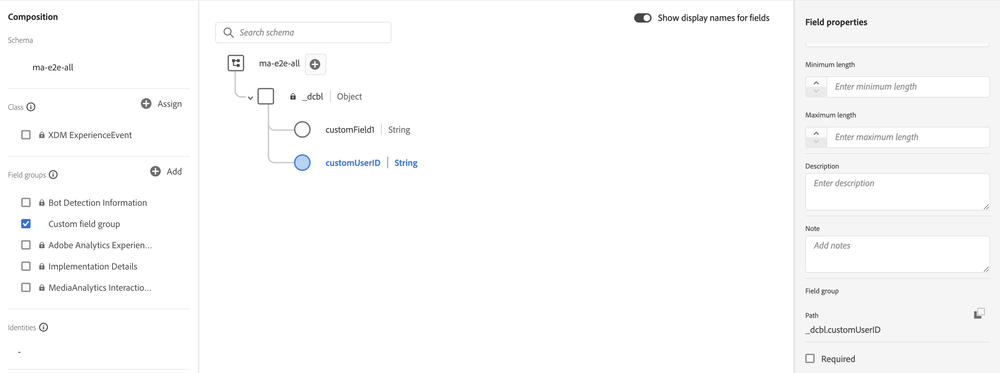

# Présentation de l’implémentation d’Edge

Adobe Experience Platform Edge Network vous permet d’envoyer les données destinées à plusieurs produits à un seul point d’entrée, qui transmet ensuite les informations appropriées à chaque produit. Cela consolide les efforts d’implémentation sur plusieurs solutions de données et constitue la méthode recommandée pour implémenter la collecte de médias en flux continu pour Adobe Analytics et Customer Journey Analytics.

Quelle que soit la base de code que vous utilisez (Web SDK, Mobile SDK (iOS ou Android), Roku SDK ou l’API Media Edge), vous devez d’abord effectuer la configuration de la plateforme décrite sur cette page : créer un schéma, créer un jeu de données et configurer un flux de données.

## Conditions préalables

1. **Remplir les conditions préalables générales.** Voir les [conditions préalables générales](/help/getting-started/prereqs.md).

1. **Confirmez la compatibilité d’une solution Adobe.** Vous devez disposer d’une implémentation Customer Journey Analytics, Adobe Analytics, Adobe Journey Optimizer ou Real-Time Customer Data Platform fonctionnelle :
   * [Guide de Customer Journey Analytics](https://experienceleague.adobe.com/docs/analytics-platform/using/cja-landing.html?lang=fr)
   * [Mise en œuvre d’Adobe Analytics](https://experienceleague.adobe.com/docs/analytics/implementation/home.html?lang=fr)
   * [Documentation de Adobe Journey Optimizer](https://experienceleague.adobe.com/docs/journey-optimizer.html?lang=fr)
   * [Documentation de Real-Time Customer Data Platform](https://experienceleague.adobe.com/docs/real-time-customer-data-platform.html?lang=fr)

## Configurer le schéma dans Adobe Experience Platform

Afin de normaliser la collecte de données entre les applications qui utilisent Adobe Experience Platform, Adobe a créé la norme XDM (modèle de données d’expérience) ouverte et documentée publiquement.

1. Dans Adobe Experience Platform, commencez à créer le schéma comme décrit dans [Création et modification de schémas dans l’interface utilisateur](https://experienceleague.adobe.com/docs/experience-platform/xdm/ui/resources/schemas.html?lang=fr).

1. Sur la page Détails du schéma , choisissez **[!UICONTROL Événement d’expérience]** comme classe de base du schéma.

   

1. Sélectionnez **[!UICONTROL Suivant]**.

1. Spécifiez un nom d’affichage et une description de schéma, puis sélectionnez **[!UICONTROL Terminer]**.

1. Dans la zone **[!UICONTROL Composition]**, dans la section **[!UICONTROL Groupes de champs]**, sélectionnez **[!UICONTROL Ajouter]**, puis recherchez et ajoutez les groupes de champs suivants au schéma :
   * `End User ID Details`
   * `Implementation Details`
   * `MediaAnalytics Interaction Details`

   Une fois les groupes de champs ajoutés, ils s’affichent dans la section **[!UICONTROL Groupes de champs]** :

   

1. Sélectionnez **[!UICONTROL Enregistrer]** pour enregistrer vos modifications.

1. (Facultatif) Vous pouvez masquer certains champs qui ne sont pas utilisés par l’API Media Edge. Le masquage de ces champs facilite la lecture du schéma, mais n’est pas obligatoire. Ces champs se rapportent uniquement à ceux du groupe de champs `MediaAnalytics Interaction Details`.

   +++ Développez pour afficher les instructions sur les champs que vous pouvez masquer.

   1. Dans la zone **[!UICONTROL Structure]**, sélectionnez le champ `Media Collection Details`, puis sélectionnez **[!UICONTROL Gérer les champs associés]**.

      

   1. Activez l’option pour **[!UICONTROL Afficher les noms d’affichage des champs]**, puis mettez à jour le schéma comme suit :

      * Dans le champ `Media Collection Details` > `Advertising Details` , masquez les champs de reporting suivants : `Ad Completed`, `Ad Started` et `Ad Time Played`.

      * Dans le champ `Media Collection Details` > `Advertising Pod Details` , masquez le champ de reporting suivant : `Ad Break ID`

      * Dans le champ `Media Collection Details` > `Chapter Details` , masquez les champs de reporting suivants : `Chapter Completed`, `Chapter ID`, `Chapter Started` et `Chapter Time Played`.

      * Dans le champ `Media Collection Details`, masquez le champ `List Of States` .

        

      * Dans le champ `Media Collection Details` > `List Of States End` et `Media Collection Details` > `List Of States Start` , masquez les champs de reporting suivants : `Player State Count`, `Player State Set` et `Player State Time`.

        

      * Dans le champ `Media Collection Details` > `Qoe Data Details` , masquez les champs de reporting suivants : `Average Bitrate`, `Average Bitrate Bucket`, `Bitrate Change Impacted Streams`, `Bitrate Changes`, `Buffer Impacted Streams`, `Buffer Events`, `Dropped Frame Impacted Streams`, `Drops Before Starts`, `Errors`, `External Error IDs`, `Error Impacted Streams`, `Media SDK Error IDs`, `Player SDK Error IDs`, `Stalling Impacted Streams`, `Stalling Events`, `Total Buffer Duration`, `Total Stalling Duration`,, et.

      * Dans le champ `Media Collection Details` > `Session Details` , masquez les champs de création de rapports suivants : `10% Progress Marker`, `25% Progress Marker`, `50% Progress Marker`, `75% Progress Marker`, `95% Progress Marker`, `Ad Count`, `Average Minute Audience`, `Content Completes`, `Chapter Count`, `Content Starts`, `Content Time Spent`, `Estimated Streams`, `Federated Data`, `Media Segment Views`, `Media Downloaded Flag`, `Media Starts`, `Media Session ID`, `Media Session Server Timeout`, `Media Time Spent`, `Pause Events`, `Pause Impacted Streams`, `Pev3`, `Pccr`, `Total Pause Duration`, `Unique Time Played`, `Video Segment`, et.

   1. Sélectionnez **[!UICONTROL Confirmer]** pour enregistrer vos modifications.

   1. Dans la zone **[!UICONTROL Structure]**, activez l’option **[!UICONTROL Afficher les noms d’affichage des champs]**, puis sélectionnez le champ `List Of Media Collection Downloaded Content Events`.

   1. Sélectionnez **[!UICONTROL Gérer les champs associés]** puis mettez à jour le schéma comme suit :

      * Dans le champ `List Of Media Collection Downloaded Content Events` > `Media Details` > `Advertising Details` , masquez les champs de reporting suivants : `Ad Completed`, `Ad Started` et `Ad Time Played`.

      * Dans le champ `List Of Media Collection Downloaded Content Events` > `Media Details` > `Advertising Pod Details` , masquez le champ de reporting suivant : `Ad Break ID`

      * Dans le champ `List Of Media Collection Downloaded Content Events` > `Media Details` > `Chapter Details` , masquez les champs de reporting suivants : `Chapter Completed`, `Chapter ID`, `Chapter Started` et `Chapter Time Played`.

      * Dans le champ `List Of Media Collection Downloaded Content Events` > `Media Details` , masquez le champ `List Of States` .

      * Dans le champ `List Of Media Collection Downloaded Content Events` > `Media Details` > `List Of States End` et `Media Collection Details` > `List Of States Start` , masquez les champs de reporting suivants : `Player State Count`, `Player State Set` et `Player State Time`.

      * Dans le champ `List Of Media Collection Downloaded Content Events` > `Media Details` > `Qoe Data Details` , masquez les champs de reporting suivants : `Average Bitrate`, `Average Bitrate Bucket`, `Bitrate Change Impacted Streams`, `Bitrate Changes`, `Buffer Events`, `Buffer Impacted Streams`, `Drops Before Starts`, `Dropped Frame Impacted Streams`, `Error Impacted Streams`, `Errors`, `External Error IDs`, `Media SDK Error IDs`, `Player SDK Error IDs`, `Stalling Events`, `Stalling Impacted Streams`, `Total Buffer Duration`, `Total Stalling Duration`,, et.

      * Dans le champ `List Of Media Collection Downloaded Content Events` > `Media Details` > `Session Details` , masquez les champs de reporting suivants : `10% Progress Marker`, `25% Progress Marker`, `50% Progress Marker`, `75% Progress Marker`, `95% Progress Marker`, `Ad Count`, `Average Minute Audience`, `Chapter Count`, `Content Completes`, `Content Starts`, `Content Time Spent`, `Estimated Streams`, `Federated Data`, `Media Downloaded Flag`, `Media Segment Views`, `Media Session ID`, `Media Session Server Timeout`, `Media Starts`, `Media Time Spent`, `Pause Events`, `Pause Impacted Streams`, `Pccr`, `Pev3`, `Total Pause Duration`, `Unique Time Played`, `Video Segment`, et.

      * Dans le champ `List Of Media Collection Downloaded Content Events` > `Media Details` , masquez le champ `Media Session ID` .

   1. Sélectionnez **[!UICONTROL Confirmer]** pour enregistrer vos modifications.

   1. Dans la zone **[!UICONTROL Structure]**, sélectionnez le champ `Media Reporting Details`, puis sélectionnez **[!UICONTROL Gérer les champs associés]**.

   1. Activez l’option pour **[!UICONTROL Afficher les noms d’affichage des champs]**, puis mettez à jour le schéma comme suit :

      * Dans le champ `Media Reporting Details`, masquez les champs suivants : `Error Details`, `List Of States End`, `List of States Start` et `Media Session ID`.

   1. Sélectionnez **[!UICONTROL Confirmer]** > **[!UICONTROL Enregistrer]** pour enregistrer vos modifications.

   +++

1. (Facultatif) Vous pouvez ajouter des métadonnées personnalisées à votre schéma. Vous pouvez ainsi inclure des métadonnées supplémentaires définies par l’utilisateur pour des besoins ou des contextes spécifiques. Pour plus d’informations sur les métadonnées personnalisées avec l’API Media Edge, consultez [Prise en charge des métadonnées personnalisées](custom-metadata.md).

   +++ Développez pour afficher les instructions sur l’ajout de métadonnées personnalisées à votre schéma.

   1. Recherchez le nom du client de l’organisation en sélectionnant **[!UICONTROL Informations sur le compte]** > **[!UICONTROL Organisations affectées]** > [!UICONTROL _&#x200B;**nom de l’organisation**&#x200B;_] > **[!UICONTROL client]**.

      Les champs personnalisés sont reçus via ce chemin d’accès. (Par exemple, nom du client : _dcbl → chemin myCustomField : _dcbl.myCustomField.)

   1. Ajoutez un groupe de champs personnalisé à votre schéma de média défini.

      

   1. Ajoutez tous les champs personnalisés que vous souhaitez suivre au groupe de champs .

      

   1. [Utilisez le chemin d’accès généré](https://experienceleague.adobe.com/fr/docs/experience-platform/xdm/ui/fields/overview#type-specific-properties) pour le champ personnalisé dans la payload de votre requête.

      

   +++

1. Continuez avec [Création d’un jeu de données dans Adobe Experience Platform](#create-a-dataset-in-adobe-experience-platform).

## Créer un jeu de données dans Adobe Experience Platform

1. Veillez à configurer un schéma comme décrit dans la section [Configurer le schéma dans Adobe Experience Platform](#set-up-the-schema-in-adobe-experience-platform).

1. Dans Adobe Experience Platform, commencez à créer le jeu de données comme décrit dans le [Guide de l’interface utilisateur des jeux de données](https://experienceleague.adobe.com/docs/experience-platform/catalog/datasets/user-guide.html?lang=fr#create).

   Lors de la sélection d’un schéma pour votre jeu de données, choisissez le schéma que vous avez précédemment créé.

1. Continuez avec [Configurer un flux de données dans Adobe Experience Platform](#configure-a-datastream-in-adobe-experience-platform).

## Configurer un flux de données dans Adobe Experience Platform

1. Assurez-vous d’avoir créé un jeu de données comme décrit dans la section [Créer un jeu de données dans Adobe Experience Platform](#create-a-dataset-in-adobe-experience-platform).

1. Créez un flux de données comme décrit dans la section [Configurer un flux de données](https://experienceleague.adobe.com/docs/experience-platform/edge/datastreams/configure.html?lang=fr).

   Lors de la création du flux de données, effectuez les sélections suivantes :

   * Dans le champ **[!UICONTROL Schéma d’événement]**, sélectionnez le schéma que vous avez créé dans [Configurer le schéma dans Adobe Experience Platform](#set-up-the-schema-in-adobe-experience-platform). Sélectionnez **[!UICONTROL Enregistrer]**.

     >[!IMPORTANT]
     >
     >Ne sélectionnez pas **[!UICONTROL Enregistrer et ajouter un mappage]**, car cela génère des erreurs de mappage pour le champ Date et heure.

     

   * Ajoutez l’un des services suivants au flux de données, selon que vous utilisez Adobe Analytics ou Customer Journey Analytics :

      * **&#x200B;**&#x200B;(si vous utilisez Adobe Analytics)

        Si vous utilisez Adobe Analytics, définissez une suite de rapports comme décrit dans la section [&#x200B; Création d’une suite de rapports &#x200B;](https://experienceleague.adobe.com/fr/docs/analytics/admin/admin-tools/manage-report-suites/c-new-report-suite/t-create-a-report-suite).

      * **&#x200B;**&#x200B;(si vous utilisez Customer Journey Analytics)

     Pour plus d’informations sur l’ajout d’un service à un flux de données, voir « Ajouter des services à un flux de données » dans [Configurer un flux de données](https://experienceleague.adobe.com/docs/experience-platform/edge/datastreams/configure.html?lang=fr#view-details).

     

   * Développez **[!UICONTROL Options avancées]**, puis activez l’option **[!UICONTROL Media Analytics]**.

     

## Choisir la méthode d’implémentation

Une fois le schéma, le jeu de données et le flux de données en place, implémentez l’une des bases de code suivantes pour commencer à envoyer des données de médias en flux continu à Edge Network. Chaque page couvre la configuration spécifique aux médias en flux continu. Le code par événement et par variable réside dans [Événements](/help/implementation/events/overview.md) et [Variables](/help/implementation/variables/overview.md).

| Base de code | In-code | Par Le Biais De Balises |
|---|---|---|
| Web | [SDK Web](web-sdk.md) | [Extension de balise Web SDK](web-sdk-tags.md) |
| iOS | [iOS](ios.md) | [iOS (Balises)](ios-tags.md) |
| Android | [Android](android.md) | [Android (Balises)](android-tags.md) |
| Roku | [Roku](roku.md) | — |
| API | [&#x200B; API Media Edge &#x200B;](media-edge-api.md) | — |

## Étape suivante

Après avoir commencé à collecter des données, vous pouvez configurer les rapports suivants :

* [Configurer des rapports pour les implémentations d’Edge](/help/reporting/setup/edge-reporting.md) (Customer Journey Analytics)
* [Configurer des rapports pour les implémentations Analytics uniquement](/help/reporting/setup/analytics-reporting.md) (si votre flux de données alimente Adobe Analytics)

>[!MORELIKETHIS]
>
>* [&#x200B; Prise en charge des métadonnées personnalisées &#x200B;](custom-metadata.md)
>* [Schéma de reporting XDM](reporting-schema.md)
>* [Présentation des événements](/help/implementation/events/overview.md)
