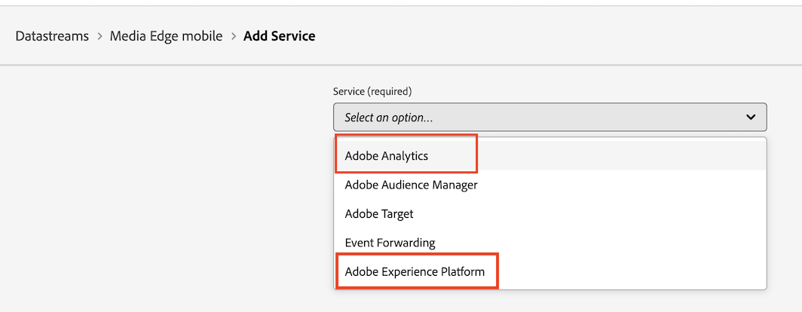
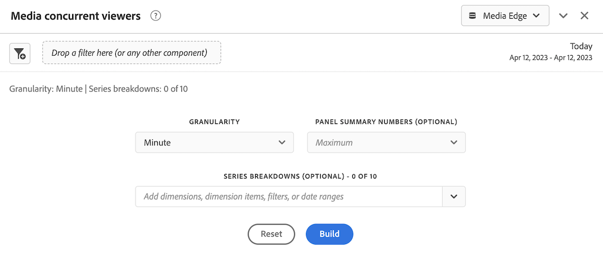

# Installation de Media Analytics avec Experience Platform Edge

Adobe Experience Platform Edge vous permet d’envoyer des données destinées à plusieurs produits vers un emplacement centralisé. Experience Edge transfère les informations appropriées aux produits souhaités. Ce concept vous permet de consolider les efforts de mise en œuvre, en particulier sur plusieurs solutions de données.

Le graphique suivant illustre une mise en oeuvre de Media Analytics qui utilise Experience Platform Edge :

>[!IMPORTANT]
>
>Actuellement, vous pouvez envoyer des données à Experience Edge uniquement à l’aide du SDK Mobile Adobe Experience Platform.

<!-- Replace the above sentence with this after it web releases: You can send data to Experience Edge using any of the following implementation methods:

* Adobe Experience Platform Web SDK (Coming soon)
* Adobe Experience Platform Mobile SDK
* Edge Network Server API

Regardless of which Experience Edge implementation method you use for configuring media tracking, you must first complete the following sections:

-->

Renseignez les sections suivantes pour mettre en oeuvre Media Analytics avec Experience Platform Edge :

* [Définition d’une suite de rapports](#define-a-report-suite)
* [Configuration du schéma dans Adobe Experience Platform](#set-up-the-schema-in-adobe-experience-platform)
* [Création d’un jeu de données dans Adobe Experience Platform](#create-a-dataset-in-adobe-experience-platform)
* [Configuration d’un flux de données dans Adobe Experience Platform](#configure-a-datastream-in-adobe-experience-platform)
* [Créer une connexion dans Customer Journey Analytics](#create-a-connection-in-customer-journey-analytics)
* [Création d’une vue de données dans Customer Journey Analytics](#create-a-data-view-in-customer-journey-analytics)
* [Création et configuration d’un projet dans Customer Journey Analytics](#create-and-configure-a-project-in-customer-journey-analytics)
* [Envoi de données à Experience Platform Edge avec l’extension Edge](#send-data-to-experience-platform-edge-with-the-edge-extension)

## Définition d’une suite de rapports

>[!NOTE]
>
>Une suite de rapports n’est requise que si vous utilisez Adobe Analytics. Aucune suite de rapports n’est nécessaire si vous prévoyez d’utiliser Customer Journey Analytics pour la création de rapports.

Si vous prévoyez d’utiliser Adobe Analytics pour la création de rapports, vous devez disposer d’une suite de rapports à utiliser avec votre mise en oeuvre des médias en flux continu. Pour plus d’informations sur la définition d’une suite de rapports, voir [Gestionnaire de suites de rapports](https://experienceleague.adobe.com/docs/analytics/admin/admin-tools/manage-report-suites/report-suites-admin.html?lang=en).

Une fois la suite de rapports définie, passez à la [Configuration du schéma dans Adobe Experience Platform](#set-up-the-schema-in-adobe-experience-platform).

## Configuration du schéma dans Adobe Experience Platform

Pour normaliser la collecte de données à utiliser dans les applications qui utilisent Adobe Experience Platform, Adobe a créé la norme ouverte et accessible au public, Modèle de données d’expérience (XDM).

Pour créer et configurer un schéma :

1. Dans Adobe Experience Platform, commencez à créer le schéma comme décrit dans la section [Création et modification de schémas dans l’interface utilisateur](https://experienceleague.adobe.com/docs/experience-platform/xdm/ui/resources/schemas.html?lang=en).

   Lors de la création du schéma, choisissez [!UICONTROL **XDM ExperienceEvent**] de la [!UICONTROL **Créer un schéma**] menu déroulant.

1. Dans le [!UICONTROL **Composition**] , dans la zone [!UICONTROL **Groupes de champs**] , sélectionnez [!UICONTROL **Ajouter**], puis recherchez et ajoutez les nouveaux groupes de champs suivants au schéma :
   * `Adobe Analytics ExperienceEvent Template`
   * `Implementation Details`
   * `MediaAnalytics Interaction Details`

   Une fois les groupes de champs ajoutés, ils doivent s’afficher dans le [!UICONTROL **Groupes de champs**] , comme suit :

   

1. Dans le [!UICONTROL **Structure**] , sélectionnez la zone `endUserIds` > `_experience` groupe de champs, puis sélectionnez [!UICONTROL **Gestion des champs associés**].

   

1. Mettez à jour le schéma comme suit :

   * Dans le `Adobe Analytics ExperienceEvent Template` groupe de champs, masquer tous les champs, sauf `EndUserIDs`.

   * Dans le `endUserIds` > `_experience` > `Adobe Advertising Cloud end user IDs` groupe de champs, masquez tous les champs, à l’exception du champ `Identifier` champ .

   * Dans le `endUserIds` > `_experience` > `Adobe Analytics Cloud Custom end user IDs` groupe de champs, masquez tous les champs, à l’exception du champ `Identifier` champ .

      

1. Sélectionner [!UICONTROL **Confirmer**] pour enregistrer vos modifications.

1. Dans le [!UICONTROL **Structure**] , sélectionnez la zone `Implementation Details` groupe de champs, sélectionnez [!UICONTROL **Gestion des champs associés**], puis mettez à jour le schéma comme suit :

   * Dans le `Implementation Details` > `Implementation details` groupe de champs, masquer tous les champs, à l’exception de `version`.

      

1. Sélectionner [!UICONTROL **Confirmer**] pour enregistrer vos modifications.

1. Dans le [!UICONTROL **Structure**] , sélectionnez la zone `Media Collection Details` groupe de champs, sélectionnez [!UICONTROL **Gestion des champs associés**], puis mettez à jour le schéma comme suit :

   * Dans le `Media Collection Details` groupe de champs, masquez la variable `List Of States` groupe de champs.

      

   * Dans le `Media Collection Details` > `Advertising Details` , masquez les champs de rapport suivants : `Ad Completed`, `Ad Started`, et `Ad Time Played`.

   * Dans le `Media Collection Details` > `Advertising Pod Details` , masquez le champ de création de rapports suivant : `Ad Break ID`

   * Dans le `Media Collection Details` > `Chapter Details` masquez les champs de rapport suivants : `Chapter ID`, `Chapter Completed`, `Chapter Started`, et `Chapter Time Played`.

   * Dans le `Media Collection Details` > `Qoe Data Details` masquez les champs de rapport suivants : `Average Bitrate`, `Average Bitrate Bucket`, `Bitrate Changes`, `Buffer Events`, `Total Buffer Duration`, `Errors`, `External Error IDs`, `Bitrate Change Impacted Streams`, `Buffer Impacted Streams`, `Dropped Frame Impacted Streams`, `Error Impacted Streams`, `Stalling Impacted Streams`, `Drops Before Starts`, `Media SDK Error IDs`, `Player SDK Error IDs`, `Stalling Events`, et `Total Stalling Duration`.

   * Dans le `Media Collection Details` > `Session Details` masquez les champs de rapport suivants : `Media Session ID`, `Ad Count`, `Average Minute Audience`, `Chapter Count`, `Estimated Streams`, `Pause Impacted Streams`, `10% Progress Marker`, `25% Progress Marker`, `50% Progress Marker`, `75% Progress Marker`, `95% Progress Marker`, `Media Segment Views`, `Content Completes`, `Media Downloaded Flag`, `Federated Data`, `Content Starts`, `Media Starts`, `Pause Events`, `Total Pause Duration`, `Media Session Server Timeout`, `Video Segment`, `Content Time Spent`, `Media Time Spent`, `Unique Time Played`, `Pev3`, et `Pccr`.

   * Dans le `Media Collection Details` > `List Of States End` et `Media Collection Details` > `List Of States Start` groupes de champs, masquez les champs de rapport suivants : `Player State Count`, `Player State Set`, et `Player State Time`.

      

1. Sélectionner [!UICONTROL **Confirmer**] pour enregistrer vos modifications.

1. Dans le [!UICONTROL **Structure**] , sélectionnez la zone `List Of Media Collection Downloaded Content Events` groupe de champs, sélectionnez [!UICONTROL **Gestion des champs associés**], puis mettez à jour le schéma comme suit :

   * Dans le `List Of Media Collection Downloaded Content Events` > `Media Details` groupe de champs, masquez la variable `List Of States` groupe de champs.

   * Dans le `List Of Media Collection Downloaded Content Events` > `Media Details` > `Advertising Details` , masquez les champs de rapport suivants : `Ad Completed`, `Ad Started`, et `Ad Time Played`.

   * Dans le `List Of Media Collection Downloaded Content Events` > `Media Details` > `Advertising Pod Details` , masquez le champ de création de rapports suivant : `Ad Break ID`

   * Dans le `List Of Media Collection Downloaded Content Events` > `Media Details` > `Chapter Details` masquez les champs de rapport suivants : `Chapter ID`, `Chapter Completed`, `Chapter Started`, et `Chapter Time Played`.

   * Dans le `List Of Media Collection Downloaded Content Events` > `Media Details` > `Qoe Data Details` masquez les champs de rapport suivants : `Average Bitrate`, `Average Bitrate Bucket`, `Bitrate Changes`, `Buffer Events`, `Total Buffer Duration`, `Errors`, `External Error IDs`, `Bitrate Change Impacted Streams`, `Buffer Impacted Streams`, `Dropped Frame Impacted Streams`, `Error Impacted Streams`, `Stalling Impacted Streams`, `Drops Before Starts`, `Media SDK Error IDs`, `Player SDK Error IDs`, `Stalling Events`, et `Total Stalling Duration`.

   * Dans le `List Of Media Collection Downloaded Content Events` > `Media Details` > `Session Details` masquez les champs de rapport suivants : `Media Session ID`, `Ad Count`, `Average Minute Audience`, `Chapter Count`, `Estimated Streams`, `Pause Impacted Streams`, `10% Progress Marker`, `25% Progress Marker`, `50% Progress Marker`, `75% Progress Marker`, `95% Progress Marker`, `Media Segment Views`, `Content Completes`, `Media Downloaded Flag`, `Federated Data`, `Content Starts`, `Media Starts`, `Pause Events`, `Total Pause Duration`, `Media Session Server Timeout`, `Video Segment`, `Content Time Spent`, `Media Time Spent`, `Unique Time Played`, `Pev3`, et `Pccr`.

   * Dans le `List Of Media Collection Downloaded Content Events` > `Media Details` > `List Of States End` et `Media Collection Details` > `List Of States Start` groupes de champs, masquez les champs de rapport suivants : `Player State Count`, `Player State Set`, et `Player State Time`.

   * Dans le `List Of Media Collection Downloaded Content Events` > `Media Details`  groupe de champs, masquez la variable `Media Session ID` champ .

1. Sélectionner [!UICONTROL **Confirmer**] pour enregistrer vos modifications.

1. Dans le [!UICONTROL **Structure**] , sélectionnez la zone `Media Reporting Details` groupe de champs, sélectionnez [!UICONTROL **Gestion des champs associés**], puis mettez à jour le schéma comme suit :

   * Dans le `Media Reporting Details` masquez les groupes de champs suivants : `Error Details`, `List Of States End`, `List of States Start`, `Playhead`, et `Media Session ID`.

1. Sélectionner [!UICONTROL **Confirmer**] > [!UICONTROL **Enregistrer**]  pour enregistrer vos modifications.

1. Passez à la [Création d’un jeu de données dans Adobe Experience Platform](#create-a-dataset-in-adobe-experience-platform).

## Création d’un jeu de données dans Adobe Experience Platform

1. Assurez-vous de configurer un schéma comme décrit dans la section [Configuration du schéma dans Adobe Experience Platform](#set-up-the-schema-in-adobe-experience-platform).

1. Dans Adobe Experience Platform, commencez à créer le jeu de données comme décrit dans la section [Guide de l’interface utilisateur des jeux de données](https://experienceleague.adobe.com/docs/experience-platform/catalog/datasets/user-guide.html?lang=fr#create).

   Lors de la sélection d’un schéma pour votre jeu de données, choisissez le schéma que vous avez précédemment créé, comme décrit à la section [Configuration du schéma dans Adobe Experience Platform](#set-up-the-schema-in-adobe-experience-platform).

1. Passez à la [Configuration d’un flux de données dans Customer Journey Analytics](#configure-a-datastream-in-adobe-experience-platform).

## Configuration d’un flux de données dans Adobe Experience Platform

1. Veillez à créer un jeu de données comme décrit dans la section [Création d’un jeu de données dans Adobe Experience Platform](#create-a-dataset-in-adobe-experience-platform).

1. Créez un flux de données comme décrit dans la section [Configuration d’un flux de données](https://experienceleague.adobe.com/docs/experience-platform/edge/datastreams/configure.html?lang=fr).

   Lors de la création du flux de données, veillez à effectuer les sélections de configuration suivantes :

   * Dans le [!UICONTROL **Schéma d’événement**] lors de la création du flux de données, veillez à sélectionner le schéma que vous avez créé dans [Configuration du schéma dans Adobe Experience Platform](#set-up-the-schema-in-adobe-experience-platform). Sélectionnez [!UICONTROL **Enregistrer**].

      >[!IMPORTANT]
          >
      > Ne pas sélectionner [!UICONTROL **Enregistrement et ajout d’un mappage**] car cela entraînera des erreurs de mappage pour le champ Horodatage .
      

      

   * Ajoutez l’un des services suivants au flux de données, selon que vous utilisez Adobe Analytics ou Customer Journey Analytics :

      * [!UICONTROL **Adobe Analytics**] (en cas d’utilisation d’Adobe Analytics)

         Si vous utilisez Adobe Analytics, veillez à définir une suite de rapports, comme décrit dans la section . [Définition d’une suite de rapports](#define-a-report-suite) dans cet article.

      * [!UICONTROL **Adobe Experience Platform**] (en cas d’utilisation de Customer Journey Analytics)
      Pour plus d’informations sur l’ajout d’un service à un flux de données, voir la section &quot;Ajout de services à un flux de données&quot; dans [Configuration d’un flux de données](https://experienceleague.adobe.com/docs/experience-platform/edge/datastreams/configure.html?lang=en#view-details).

      

   * Développer [!UICONTROL **Options avancées**], puis activez la variable [!UICONTROL **Media Analytics**] .

      

1. Passez à la [Création d’une connexion dans Customer Journey Analytics](#create-a-connection-in-customer-journey-analytics).

## Créer une connexion dans Customer Journey Analytics

>[!NOTE]
>
>La procédure suivante n’est requise que si vous utilisez Customer Journey Analytics.

1. Veillez à créer un flux de données comme décrit dans la section [Configuration d’un flux de données dans Customer Journey Analytics](#configure-a-datastream-in-adobe-experience-platform).

1. Dans Customer Journey Analytics, créez une connexion comme décrit dans la section [Création d’une connexion](https://experienceleague.adobe.com/docs/analytics-platform/using/cja-connections/create-connection.html?lang=fr).

   Lors de la création de la connexion, les sélections de configuration suivantes sont requises pour la mise en oeuvre de Streaming Media :

   1. Sélectionnez le jeu de données que vous avez précédemment créé, comme décrit dans la section [Création d’un jeu de données dans Adobe Experience Platform](#create-a-dataset-in-adobe-experience-platform).

   1. Assurez-vous que la variable [!UICONTROL **Importer toutes les nouvelles données**] est activé.

1. Passez à la [Création d’une vue de données dans Customer Journey Analytics](#create-a-new-data-view-in-customer-journey-analytics).

## Création d’une vue de données dans Customer Journey Analytics

>[!NOTE]
>
>La procédure suivante n’est requise que si vous utilisez Customer Journey Analytics.

1. Veillez à créer une connexion en Customer Journey Analytics, comme décrit dans la section [Création d’une connexion dans Customer Journey Analytics](#create-a-connection-in-customer-journey-analytics).

1. Dans Customer Parcours Analytics, créez une vue de données comme décrit dans la section [Création ou modification d’une vue de données](https://experienceleague.adobe.com/docs/analytics-platform/using/cja-dataviews/create-dataview.html?lang=fr).

   Lors de la création de la vue de données, les sélections de configuration suivantes sont requises pour l’implémentation de la vue Streaming Media :

   1. Dans le [!UICONTROL **Connexion**] , sélectionnez la connexion que vous avez créée précédemment, comme décrit dans la section [Création d’une connexion dans Customer Journey Analytics](#create-a-connection-in-customer-journey-analytics).

      La sélection de la connexion que vous avez créée peut prendre jusqu’à 15 minutes.

   1. Sur le [!UICONTROL **Composants**] , dans le [!UICONTROL **Champs de schéma**] , recherchez chaque composant répertorié dans les tableaux ci-dessous et faites-le glisser dans la section [!UICONTROL **Mesures**] du panneau. S’il existe plusieurs champs portant le même nom, utilisez le chemin XDM pour vous assurer qu’il s’agit bien du champ.

      **Contenu principal - Mesures de contenu**

      | Nom du composant | Chemin XDM |
      |----------|---------|
      | Démarrage du contenu multimédia | mediaReporting.sessionDetails.isViewed |
      | Vues de segments du fichier multimédia | mediaReporting.sessionDetails.hasSegmentView |
      | Démarrages de contenu | mediaReporting.sessionDetails.isPlayed |
      | Le contenu se termine | mediaReporting.sessionDetails.isCompleted |
      | Temps passé sur le contenu | mediaReporting.sessionDetails.timePlayed |
      | Passé sur le média | mediaReporting.sessionDetails.totalTimePlayed |
      | Durée de lecture unique | mediaReporting.sessionDetails.uniqueTimePlayed |
      | Marqueur de progression de 10 % | mediaReporting.sessionDetails.hasProgress10 |
      | Audience moyenne par minute | mediaReporting.sessionDetails.averageMinuteAudience |

      **Chapitre et publicités - Mesures de chapitre et de publicité**

      | Nom du composant | Chemin XDM |
      |----------|---------|
      | Démarrage du chapitre | mediaReporting.chapterDetails.isStarted |
      | Chapitre terminé | mediaReporting.chapterDetails.isCompleted |
      | Durée de lecture des chapitres | mediaReporting.chapterDetails.timePlayed |
      | Publicité lancée | mediaReporting.advertisingDetails.isStarted |
      | Publicité terminée | mediaReporting.advertisingDetails.isCompleted |
      | Durée de lecture des publicités | mediaReporting.advertisingDetails.timePlayed |

      **QoE - Mesures QoE**

      | Nom du composant | Chemin XDM |
      |----------|---------|
      | Temps jusqu’au début | mediaReporting.qoeDataDetails.timeToStart |
      | Pertes avant le début | mediaReporting.qoeDataDetails.isDroppedBeforeStart |
      | Flux touchés par la mémoire tampon | mediaReporting.qoeDataDetails.hasBufferImpactedStreams |
      | Flux touchés par les changements de débit | mediaReporting.qoeDataDetails.hasBitrateChangeImpactedStreams |
      | Changements de débit | mediaReporting.qoeDataDetails.bitrateChangeCount |
      | Débit moyen | mediaReporting.qoeDataDetails.bitrateAverage |
      | Perte d’images | mediaReporting.qoeDataDetails.droppedFrames |
      | Erreurs | mediaReporting.qoeDataDetails.errorCount |
      | Flux touchés par les erreurs | mediaReporting.qoeDataDetails.hasErrorImpactedStreams |
      | Flux touchés par la perte d’images | mediaReporting.qoeDataDetails.hasDroppedFrameImpactedStreams |

      **État du lecteur - Mesures d’état du lecteur**

      | Nom du composant | Chemin XDM |
      |----------|---------|
      | Jeu d’états du lecteur | mediaReporting.states.isSet |
      | Nombre d’états du lecteur | mediaReporting.states.count |
      | Heure d’état du lecteur | mediaReporting.states.time |

   1. Mettez à jour les étiquettes (dans la variable [!UICONTROL **Étiquettes contextuelles**] menu déroulant) pour les composants dans le tableau suivant. Recherchez et faites glisser des composants qui ne se trouvent pas déjà dans le panneau des mesures dans le panneau.

      | Nom du composant | Libellé de contexte |
      |---------|----------|
      | Délai d’expiration du serveur de session multimédia | Média : Secondes depuis le dernier appel |
      | Passé sur le média | Média : Temps passé sur le média |
      | Durée totale de la mémoire tampon | Média : Durée totale de la mémoire tampon |
      | Temps jusqu’au début | Média : Temps jusqu’au début |
      | Durée totale de pause | Média : Durée totale de pause |

   1. Pour ajouter des ventilations à votre projet Customer Journey Analytics, ajoutez les dimensions suivantes au [!UICONTROL **Dimensions**] panel :

      | Chemin XDM | Nom du composant |
      |---------|----------|
      | mediaReporting.states.name | Nom de l’état du lecteur |
      | mediaReporting.sessionDetails.ID | ID de session multimédia |

      Outre les dimensions de ce tableau, vous pouvez ajouter toute autre dimension que vous souhaitez rendre disponible pour filtrer les données par dans les projets Customer Journey Analytics.

1. Sélectionner [!UICONTROL **Enregistrer et continuer**] > [!UICONTROL **Enregistrer et terminer**] pour enregistrer vos modifications.

1. Passez à la [Création et configuration d’un projet dans Customer Journey Analytics](#create-and-configure-a-project-in-customer-journey-analytics).

## Création et configuration d’un projet dans Customer Journey Analytics

1. Veillez à créer une vue de données en Customer Journey Analytics, comme décrit dans la section [Création d’une vue de données dans Customer Journey Analytics](#create-a-new-data-view-in-customer-journey-analytics).

1. En Customer Journey Analytics, dans la variable [!UICONTROL **Workspace**] , dans le [!UICONTROL **Projets**] zone, sélectionnez [!UICONTROL **Créer un projet**].

1. Sélectionner [!UICONTROL **Projet vierge**] > [!UICONTROL **Créer**].

1. Dans le nouveau projet, sélectionnez la vue de données que vous avez créée précédemment.

   Lors de la création de panneaux dans votre projet, vous pouvez utiliser les composants que vous avez ajoutés à votre vue de données, comme décrit dans la section [Création d’une vue de données dans Customer Journey Analytics](#create-a-new-data-view-in-customer-journey-analytics).

   Les 4 panneaux suivants constituent des exemples de panneaux que vous pouvez créer :

   

   

   

   

1. Sélectionnez la **Panneaux** dans le rail de gauche, puis effectuez un glisser-déposer dans la [!UICONTROL **Visionneuses simultanées de médias**] et le panneau [!UICONTROL **Durée de lecture du média**] du panneau.

   Les deux panneaux doivent se présenter comme suit :

   

   

1. Partagez le projet, comme décrit dans la section [Partage de projets](https://experienceleague.adobe.com/docs/analytics-platform/using/cja-workspace/curate-share/share-projects.html?lang=fr).

   >[!NOTE]
   >
   >   Si les utilisateurs que vous souhaitez partager avec ne sont pas disponibles, assurez-vous qu’ils disposent d’un accès utilisateur et administrateur à Customer Journey Analytics dans Adobe Admin Console.

1. Passez à la [Envoi de données à Experience Platform Edge](#send-data-to-experience-platform-edge).

## Envoi de données à Experience Platform Edge à l’aide du SDK AEP Mobile

Vous pouvez utiliser le SDK mobile Adobe Experience Platform pour envoyer des données mobiles à Experience Platform Edge. (Vous pouvez également utiliser une implémentation personnalisée des API Edge.<!-- I guess we don't need/want to document this? -->)

Utilisez les ressources de documentation suivantes pour terminer l’implémentation :

| Système d’exploitation mobile | Ressources  |
|---------|----------|
| **iOS** | Les ressources suivantes sont disponibles pour envoyer des données mobiles iOS : <ul><li>[Configuration du SDK Mobile à l’aide de l’interface utilisateur de collecte de données](https://github.com/adobe/aepsdk-edgemedia-ios/blob/dev/Documentation/getting-started.md)</li><li>[Migration du SDK Media vers le SDK Edge Media](https://github.com/adobe/aepsdk-edgemedia-ios/blob/dev/Documentation/migration-guide.md)</li><li>[Référence de l’API Edge Media](https://github.com/adobe/aepsdk-edgemedia-ios/blob/dev/Documentation/api-reference.md)</li></ul> |
| **Android** | Les ressources suivantes sont disponibles pour l’envoi de données mobiles Android : <ul><li>[Configuration du SDK Mobile à l’aide de l’interface utilisateur de collecte de données](https://github.com/adobe/aepsdk-edgemedia-android/blob/dev/Documentation/getting-started.md)</li><li>[Migration du SDK Media vers le SDK Edge Media](https://github.com/adobe/aepsdk-edgemedia-android/blob/dev/Documentation/migration-guide.md)</li><li>[Référence de l’API Edge Media](https://github.com/adobe/aepsdk-edgemedia-android/blob/dev/Documentation/api-reference.md)</li></ul> |

<!--

+++Adobe Experience Platform Mobile SDK

If you plan to use the Mobile SDK extension in Adobe Experience Platform Data Collection to send data to Edge, complete the following sections:

### Create a mobile property

Create a mobile property, as described in [Set up a mobile property](https://developer.adobe.com/client-sdks/documentation/getting-started/create-a-mobile-property/). 

Content initially copied from here: https://experienceleague.adobe.com/docs/analytics/implementation/aep-edge/mobile-sdk/overview.html?lang=en 

The Adobe Experience Platform Mobile SDK helps power Adobe's Experience Cloud solutions and services in your mobile apps. It is available for Android, iOS, and various cross-platform development frameworks. Configuration is handled through Adobe Experience Platform Data Collection.
>[!IMPORTANT]
>
>An Adobe Analytics extension is also available in Adobe Experience Platform Data Collection. If you install this extension, you do not take advantage of XDM or the Edge Network.

### Register the extensions and load your tag configuration

Use code in your app to register the necessary extensions and load your tag configuration. For more information, see [Set up the configuration](https://developer.adobe.com/client-sdks/documentation/user-guides/getting-started-with-platform/overview/#set-up-the-configuration) in [Getting started with Adobe Experience Platform](https://developer.adobe.com/client-sdks/documentation/user-guides/getting-started-with-platform/overview/#set-up-the-configuration).

### Implement and test fuctionality

Implement and test app functionality using a combination of tags data elements, rules, additional extensions, and SDK API calls. Inspect, validate, and debug data collection and experiences for your mobile application.

For more information, see [Use the sample application](https://developer.adobe.com/client-sdks/documentation/user-guides/getting-started-with-platform/overview/#use-the-sample-application) in [Getting started with Adobe Experience Platform](https://developer.adobe.com/client-sdks/documentation/user-guides/getting-started-with-platform/overview/#set-up-the-configuration).

### Extend and validate your mobile app implementation

Before pushing the mobile app extension to your production environment, first validate that it works.

(What are the steps to do this?)

-->

<!--

+++Adobe Experience Platform Web SDK (Coming soon)

>[!NOTE]
>
>The Adobe Experience Platform Web SDK is not yet available. This page will be updated when it becomes available.

<!-- Content initially copied from here: https://experienceleague.adobe.com/docs/analytics/implementation/aep-edge/web-sdk/overview.html?lang=en -->

<!-- Use the Web SDK extension in Adobe Experience Platform Data Collection to send data to Edge.

You can use the [Adobe Experience Platform Web SDK](https://experienceleague.adobe.com/docs/experience-platform/tags/extensions/client/sdk/overview.html) to send data to Adobe Analytics. This implementation method works by translating the [Experience Data Model (XDM)](https://experienceleague.adobe.com/docs/experience-platform/xdm/home.html) into a format used by Analytics.

You can send data to Experience Edge directly using the Web SDK, or through the Web SDK extension in Tags. -->

<!-- ### Web SDK

A high-level overview of the implementation tasks:

<table style="width:100%">

<tr>
<th style="width:5%"></th><th style="width:60%"><b>Task</b></th><th style="width:35%"><b>More Information</b></th>
</tr>

<tr>
<td>1</td>
<td>Ensure you have <b>defined a report suite</b>.</td>
<td><a href="../../../admin/admin/c-manage-report-suites/report-suites-admin.md">Report Suite Manager</a></td>
</tr>

<tr>
<td>2</td>
<td><b>Setup schemas and datasets</b>. To standardize data collection for use across applications that leverage Adobe Experience Platform, Adobe has created the open and publicly documented standard, Experience Data Model (XDM).</td>
<td><a href="https://experienceleague.adobe.com/docs/experience-platform/xdm/ui/overview.html?lang=en">Schemas UI overview</a> and <a href="https://experienceleague.adobe.com/docs/experience-platform/catalog/datasets/user-guide.html?lang=en">Datasets UI overview</a></td>
</tr>

<tr>
<td>3</td>
<td><b>Create a data layer</b> to manage the tracking of the data on your website.</td>
<td><a href="../../prepare/data-layer.md">Create a data layer</a></td>
</tr>

<tr>
<td> 4</td>
<td><b>Install the prebuilt standalone version</b>. You can reference the library (<code>alloy.js</code>) on the CDN directly on your page or download and host it on your own infrastructure. Alternatively, you can use the NPM package.</td>
<td><a href="https://experienceleague.adobe.com/docs/experience-platform/edge/fundamentals/installing-the-sdk.html?lang=en#option-2%3A-installing-the-prebuilt-standalone-version">Installing the prebuilt standalone version</a> and <a href="https://experienceleague.adobe.com/docs/experience-platform/edge/fundamentals/installing-the-sdk.html?lang=en#option-3%3A-using-the-npm-package">Using the NPM package</a></td>
</tr>

<tr>
<td>5</td>
<td><b>Configure a datastream</b>. A datastream represents the server-side configuration when implementing the Adobe Experience Platform Web SDK.</td>
<td><a href="https://experienceleague.adobe.com/docs/experience-platform/edge/datastreams/configure.html?lang=en">Configure a datastream<a></td> 
</tr>

<td>6</td>
<td><b>Add an Adobe Analytics service</b> to your datastream. That service controls whether and how data is sent to Adobe Analytics.</td>
<td><a href="https://experienceleague.adobe.com/docs/experience-platform/edge/datastreams/configure.html?lang=en#analytics">Add Adobe Analytics service to a datastream</a></td>
</tr>

<tr>
<td>7</td>
<td><b>Configure the Web SDK</b>. Ensure the library that you installed in step 4 is properly configured with the datastream ID (formerly known as edge configuration id (<code>edgeConfigId</code>)), organization id (<code>orgId</code>), and other available options.</td>
<td><a href="https://experienceleague.adobe.com/docs/experience-platform/edge/fundamentals/configuring-the-sdk.html?lang=en">Configure the Web SDK</a></td>
</tr>

<tr>
<td>8</td>
<td><b>Execute commands</b> and/or <b>track events</b>. After the base code has been implemented on your webpage, you can begin executing commands and tracking events with the SDK.
</td>
<td><a href="https://experienceleague.adobe.com/docs/experience-platform/edge/fundamentals/executing-commands.html?lang=en">Execute commands</a> and <a href="https://experienceleague.adobe.com/docs/experience-platform/edge/fundamentals/tracking-events.html?lang=en">Track events</a></td>
</tr>

<tr>
<td>9</td><td><b>Extend and validate your implementation</b> before pushing it out to production.</td><td></td> 
</tr>
</table>

### Web SDK extension

A high-level overview of the implementation tasks:

<table style="width:100%">

<tr>
<th style="width:5%"></th><th style="width:60%"><b>Task</b></th><th style="width:35%"><b>More Information</b></th>
</tr>

<tr>
<td>1</td>
<td>Ensure you have <b>defined a report suite</b>.</td>
<td><a href="../../../admin/admin/c-manage-report-suites/report-suites-admin.md">Report Suite Manager</a></td>
</tr>

<tr>
<td>2</td>
<td><b>Setup schemas and datasets</b>. To standardize data collection for use across applications that leverage Adobe Experience Platform, Adobe has created the open and publicly documented standard, Experience Data Model (XDM).</td>
<td><a href="https://experienceleague.adobe.com/docs/experience-platform/xdm/ui/overview.html?lang=en">Schemas UI overview</a> and <a href="https://experienceleague.adobe.com/docs/experience-platform/catalog/datasets/user-guide.html?lang=en">Datasets UI overview</a></td>
</tr>

<tr>
<td>3</td>
<td><b>Create a data layer</b> to manage the tracking of the data on your website.</td>
<td><a href="../../prepare/data-layer.md">Create a data layer</a></td>
</tr>

<tr>
<td>4</td>
<td><b>Configure a datastream</b>. A datastream represents the server-side configuration when implementing the Adobe Experience Platform Web SDK.</td>
<td><a href="https://experienceleague.adobe.com/docs/experience-platform/edge/datastreams/configure.html?lang=en">Configure a datastream<a></td> 
</tr>

<tr>
<td>5</td> 
<td><b>Add an Adobe Analytics service</b> to your datastream. That service controls whether and how data is sent to Adobe Analytics.</td>
<td><a href="https://experienceleague.adobe.com/docs/experience-platform/edge/datastreams/configure.html?lang=en#analytics">Add Adobe Analytics service to a datastream</a></td>
</tr>

<tr>
<td>6</td>
<td><b>Create a tag property</b>. Properties are overarching containers used to reference tag management data.</td>
<td><a href="https://experienceleague.adobe.com/docs/experience-platform/tags/admin/companies-and-properties.html?lang=en#for-web">Create or configure a tag property for web</a></td>
</tr>

<tr>
<td>7</td> 
<td><b>Install and configure the Web SDK extension</b> in your tag property. Configure the Web SDK extension to send data to the datastream configured in step 4.</td>
<td><a href="https://experienceleague.adobe.com/docs/experience-platform/tags/extensions/client/sdk/overview.html?lang=en">Adobe Experience Platform Web SDK extension overview</a></td>
</tr>

<tr>
<td>8</td>
<td><b>Iterate, validate, and publish</b> to production. Add the tag property to your web site. Then use data elements, rules, and so on, to customize your implementation.</td>
<td><a href="https://experienceleague.adobe.com/docs/experience-platform/tags/publish/overview.html?lang=en">Publishing overview</a></td>
</tr>

</table>

### Additional resources

Tags can be highly customized. Learn more about how you can get the most out of Adobe Analytics by including the right data in your implementation.

-   [Tags documentation](https://experienceleague.adobe.com/docs/experience-platform/tags/home.html#): Learn how the interface works and what extensions are available.

-   [Adobe Experience Platform Web SDK documentation](https://experienceleague.adobe.com/docs/web-sdk.html?lang=en)

+++

-->

<!--

### Adobe Experience Platform SDK

A high-level overview of the implementation tasks:

<table style="width:100%">

<tr>
<th style="width:5%"></th><th style="width:60%"><b>Task</b></th><th style="width:35%"><b>More Information</b></th>
</tr>

<tr>
<td>1</td>
<td>Ensure you have <b>defined a report suite</b>.</td>
<td><a href="../../../admin/admin/c-manage-report-suites/report-suites-admin.md">Report Suite Manager</a></td>
</tr>

<tr>
<td>2</td>
<td><b>Setup schemas and datasets</b>. To standardize data collection for use across applications that leverage Adobe Experience Platform, Adobe has created the open and publicly documented standard, Experience Data Model (XDM).</td>
<td><a href="https://experienceleague.adobe.com/docs/experience-platform/xdm/ui/overview.html?lang=en">Schemas UI overview</a> and <a href="https://experienceleague.adobe.com/docs/experience-platform/catalog/datasets/user-guide.html?lang=en">Datasets UI overview</a></td>
</tr>

<tr>
<td>3</td>
<td><b>Configure a datastream</b>. A datastream represents the server-side configuration when implementing the Adobe Experience Platform Web SDK.</td>
<td><a href="https://experienceleague.adobe.com/docs/experience-platform/edge/datastreams/configure.html?lang=en">Configure a datastream<a></td> 
</tr>

<td>4</td>
<td><b>Add an Adobe Analytics service</b> to your datastream. That service controls whether and how data is sent to Adobe Analytics.</td>
<td><a href="https://experienceleague.adobe.com/docs/experience-platform/edge/datastreams/configure.html?lang=en#analytics">Add Adobe Analytics service to a datastream</a></td>
</tr>

<tr>
<td>5</td>
<td><b>Create a mobile property</b>. A property is a container that you fill with extensions, rules, data elements, and libraries.</td>
<td><a href="https://developer.adobe.com/client-sdks/documentation/getting-started/create-a-mobile-property/">Set up a mobile property</a></tr>

<tr>
<td>6</td>
<td><b>Install the Adobe Experience Platform Edge Network extension</b> in the mobile tag property and configure the datastream in the extension.</td>
<td><a href="https://developer.adobe.com/client-sdks/documentation/edge-network/">Adobe Experience Platform Edge Network</a>
</tr>

<tr>
<td>7</td>
<td><b>Use code in your app</b> to register the necessary extensions and load your tag configuration.</td>
<td><a href="https://developer.adobe.com/client-sdks/documentation/user-guides/getting-started-with-platform/overview/#set-up-the-configuration">Set up the configuration</a></td>
</tr>

<tr>
<td>8</td>
<td><b>Implement and test functionality</b> using combination of tag's data elements, rules, additional extensions, and SDK API calls in your app. Inspect, validate, and debug data collection and experiences for your mobile application.</td>
<td><a href="https://developer.adobe.com/client-sdks/documentation/user-guides/getting-started-with-platform/overview/#use-the-sample-application">Use the sample application</a>
</tr>

<tr>
<td>9</td>
<td><b>Extend and validate your mobile app implementation</b> before pushing it out to production.</td>
<td></td> 
</tr>

</table>

### Adobe Analytics extension.

A high-level overview of the implementation tasks:

<table style="width:100%">

<tr>
<th style="width:5%"></th><th style="width:60%"><b>Task</b></th><th style="width:35%"><b>More Information</b></th>
</tr>

<tr>
<td>1</td>
<td>Ensure you have <b>defined a report suite</b>.</td>
<td><a href="../../../admin/admin/c-manage-report-suites/report-suites-admin.md">Report Suite Manager</a></td>
</tr>

<tr>
<td>2</td>
<td><b>Setup schemas and datasets</b>. To standardize data collection for use across applications that leverage Adobe Experience Platform, Adobe has created the open and publicly documented standard, Experience Data Model (XDM).</td>
<td><a href="https://experienceleague.adobe.com/docs/experience-platform/xdm/ui/overview.html?lang=en">Schemas UI overview</a> and <a href="https://experienceleague.adobe.com/docs/experience-platform/catalog/datasets/user-guide.html?lang=en">Datasets UI overview</a></td>
</tr>

<tr>
<td>3</td>
<td><b>Install the Adobe Analytics extension</b> in the mobile tag property and configure the extension to point to your report suite.</td>
<td><a href="https://developer.adobe.com/client-sdks/documentation/adobe-analytics/">Adobe Analytics extension for mobile property</a>
</tr>

<tr>
<td>4</td>
<td><b>Use code in your app</b> to register the necessary extensions and load your tag configuration.</td>
<td><a href="https://developer.adobe.com/client-sdks/documentation/user-guides/getting-started-with-platform/overview/#set-up-the-configuration">Set up the configuration</a></td>
</tr>

<tr>
<td>5</td>
<td><b>Implement and test functionality</b> using combination of tag's data elements, rules, additional extensions, and SDK API calls in your app. Inspect, validate, and debug data collection and experiences for your mobile application.</td>
<td><a href="https://developer.adobe.com/client-sdks/documentation/user-guides/getting-started-with-platform/overview/#use-the-sample-application">Use the sample application</a>
</tr>

<tr>
<td>6</td>
<td><b>Extend and validate your mobile app implementation</b> before pushing it out to production.</td>
<td></td> 
</tr>

</table>

### Additional resources

-   [Tags documentation](https://experienceleague.adobe.com/docs/experience-platform/tags/home.html#)

-   [Mobile SDK documentation](https://developer.adobe.com/client-sdks/documentation/)

-->

<!--

+++

+++Edge Network Server API

Send data directly to Edge using an API.

Content initially copied from here: https://experienceleague.adobe.com/docs/analytics/implementation/aep-edge/edge-api/overview.html?lang=en 

If you are unable to use the Adobe Experience Platform [Web SDK](../web-sdk/overview.md) or [Mobile SDK](../mobile-sdk/overview.md), you can send data to the Edge Network directly through an API.

See [Edge Network Server API documentation](https://experienceleague.adobe.com/docs/experience-platform/edge-network-server-api/overview.html), and an example [integrating with Adobe Analytics](https://experienceleague.adobe.com/docs/experience-platform/edge-network-server-api/interacting-other-adobe-solutions/interacting-adobe-analytics.html).

+++ 

-->

