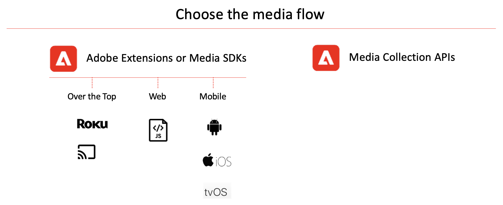

# Mise en œuvre de services de streaming multimédia pour Adobe Analytics ou Customer Journey Analytics

Il existe différentes manières de mettre en œuvre les services de streaming multimédia d’Adobe. Pour une comparaison détaillée des appareils et plateformes pris en charge pour les méthodes d’implémentation décrites sur cette page, consultez [Appareils et plateformes pris en charge](/help/getting-started/supported-devices.md).

## Méthodes d’implémentation Edge

Nous vous recommandons d’utiliser Edge lors de la mise en œuvre des services de médias en flux continu pour tous les nouveaux clients Adobe Analytics ou Customer Journey Analytics.

Les méthodes d’implémentation d’Edge utilisent le module complémentaire Streaming Media Collection.

* **Media pour Edge Network SDK/Extension :** collecte des données à partir d’appareils web, iOS et Android, ou d’appareils Roku, et les envoie à Edge Network. Les données peuvent ensuite être envoyées à Customer Journey Analytics ou à Adobe Analytics.

  Pour plus d’informations sur l’extension Media for Edge Network SDK, voir [ Implémentation de la collection Streaming Media à l’aide d’Edge Network](/help/implementation/edge/implementation-edge.md).

* **API Media Edge :** peut être personnalisé pour collecter des données à partir de n’importe quel appareil ou format (y compris, mobile, web et appareils par contournement) et envoyer des données à Edge Network. Les données peuvent ensuite être envoyées à Customer Journey Analytics ou à Adobe Analytics.

  Pour plus d’informations sur l’API Media Edge, voir [Présentation de l’API Media Edge](https://developer.adobe.com/cja-apis/docs/endpoints/media-edge/).

## Méthodes d’implémentation Adobe Analytics uniquement

Les méthodes d’implémentation Edge décrites ci-dessus sont recommandées pour Customer Journey Analytics et Adobe Analytics, en particulier pour les nouvelles implémentations.

Outre les méthodes d’implémentation Edge, d’autres sont disponibles. Ces méthodes d’implémentation ont été conçues pour être utilisées avec Adobe Analytics. Cependant, la clientèle existante qui dispose de l’une des méthodes d’implémentation suivantes peut toujours rendre les données disponibles dans Customer Journey Analytics en créant une [connexion source Analytics](https://experienceleague.adobe.com/docs/experience-platform/sources/ui-tutorials/create/adobe-applications/analytics.html?lang=fr).

Les méthodes d’implémentation réservées à Adobe Analytics utilisent le module complémentaire Adobe Analytics for Streaming Media.

* **Extension Media avec des balises :** l’extension Adobe Media Analytics for Audio and Video permet d’ajouter l’instance de suivi Media à un site ou à un projet prenant en charge les balises. Les données sont envoyées à Adobe Analytics.

  Pour plus d’informations sur l’installation, la configuration et l’implémentation de l’extension Media avec des balises, consultez [Présentation de l’extension Adobe Media Analytics (SDK 3.x) for Audio and Video](https://experienceleague.adobe.com/docs/experience-platform/tags/extensions/client/media-analytics-3x/overview.html?lang=fr).

* **SDK Media :** le SDK Media vous permet de mesurer plusieurs plateformes multimédias, notamment des sites web, des téléphones mobiles, des télévisions connectées, des tablettes, des appareils OTT, des décodeurs et des consoles de jeux. (Pour plus d’informations, consultez [Appareils et plateformes pris en charge](/help/getting-started/supported-devices.md).)

  Les SDK Media utilisent les API Media Collection pour effectuer le suivi. Les données sont envoyées à Adobe Analytics.

  Pour obtenir des informations sur le téléchargement et l’installation des SDK Media et des extensions, consultez [Obtention des SDK Media, des extensions à l’aide de balises et des SDK OTT](/help/getting-started/download-sdks.md).

* **API Media Collection :** les API Media Collection pouvant être personnalisées, elles peuvent être utilisées pour les applications nécessitant des fonctionnalités de suivi personnalisées et pour les appareils non pris en charge par les SDK Media. Les API Media Collection effectuent le suivi des événements audio et vidéo à l’aide d’appels HTTP RESTful. Les données sont envoyées à Adobe Analytics.

  Pour obtenir des informations sur l’utilisation des API Media Collection, consultez [API Media Collection](media-collection-api/mc-api-overview.md).

<!--
(Not sure if we need the following paragraph and graphic. Paragraph is somewhat redundant with the intro paragraph of this article)
Choose the implementation method depending on the supported platforms. Some players are not supported by the Media SDKs or the Adobe Experience Platform Media Extensions. The Media Collection APIs provide a way to support those players. For information on supported devices, see [Supported devices and platforms](/help/getting-started/supported-devices.md).

-->
