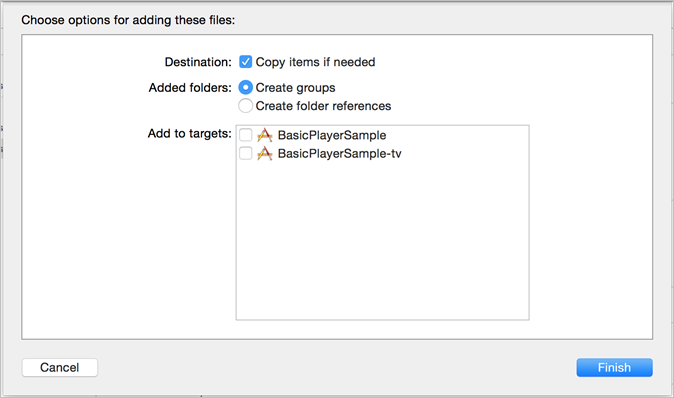

# Configuration d’iOS{#set-up-ios}

Découvrez comment configurer les services de streaming multimédia pour les appareils iOS.

>[!IMPORTANT]
>
>Avec l’abandon de la prise en charge des SDK mobiles de version 4 programmée au 31 août 2021, Adobe cessera également de prendre en charge le SDK Media Analytics pour iOS et Android.  Pour plus d’informations, reportez-vous à la [FAQ sur l’abandon de la prise en charge du SDK Media Analytics](/help/additional-resources/end-of-support-faqs.md).

## Conditions préalables

* **Obtention de paramètres de configuration valides pour le SDK Media** Vous pouvez vous procurer ces paramètres auprès d’un représentant Adobe après avoir configuré votre compte Analytics.
* **Mise en œuvre d’ADBMobile pour iOS dans votre application** Pour plus d’informations sur la documentation du kit SDK Adobe Mobile, reportezvous à la rubrique [Kit SDK iOS 4.x pour les solutions Experience Cloud.](https://experienceleague.adobe.com/docs/mobile-services/ios/overview.html?lang=fr)

  >[!IMPORTANT]
  >
  >À partir d’iOS 9, Apple a introduit une fonction appelée ATS (App Transport Security). Cette fonctionnalité vise à améliorer la sécurité du réseau en veillant à ce que vos applications utilisent uniquement des protocoles et des algorithmes de chiffrement standard. Cette fonctionnalité est activée par défaut, mais vous disposez d’options de configuration vous permettant d’effectuer des choix quant à l’utilisation d’ATS. Pour plus d’informations sur ATS, voir [Sécurité du transport des applications.](https://experienceleague.adobe.com/docs/mobile-services/ios/config-ios/app-transport-security.html?lang=fr)

* **Fournissez les informations suivantes à votre lecteur multimédia :**

   * _Une API pour vous abonner aux événements du lecteur_ - Le SDK Media exige d’appeler un ensemble d’API simples lorsque des événements se produisent dans votre lecteur.
   * _Une API qui fournit des informations au lecteur_ - Ces informations incluent des éléments tels que le nom du média et la position de la tête de lecture.

## Implémentation du SDK

>[!IMPORTANT]
>
>À compter de la version 2.3.0, le SDK est distribué par le biais de XCFrameworks.
>
>La version 2.3.0 du SDK requiert Xcode 12.0 ou une version ultérieure et, le cas échéant, Cocoapods 1.10.0 ou une version ultérieure.

* Chaque fois qu’un fichier de bibliothèque binaire est mentionné, son remplaçant XCFramework doit être utilisé à la place :
   * MediaSDK.a > MediaSDK.xcframework
   * MediaSDK_TV.a > MediaSDKTV.xcframework
* Si vous ajoutez manuellement les XCFrameworks Adobe à votre projet, vérifiez qu’ils ne sont pas incorporés.

1. Ajoutez le SDK Media que vous avez [téléchargé](/help/getting-started/download-sdks.md) à votre projet.

   1. Vérifiez que le répertoire `libs` contient les composants logiciels suivants :

      * `ADBMediaHeartbeat.h` : fichier d’en-tête Objective-C utilisé pour les API de suivi de la pulsation iOS.
      * `ADBMediaHeartbeatConfig.h` : fichier d’en-tête Objective-C utilisé pour la configuration du kit SDK.
      * `MediaSDK.a` : binaire gras en bytecode contenant les versions de bibliothèque pour les appareils (armv7, armv7s et arm64) et les simulateurs (i386 et x86_64) iOS.

        Ce binaire doit être lié lorsque la cible est destinée à une application iOS.

      * `MediaSDK_TV.a` : binaire gras en bytecode contenant les versions de bibliothèque pour les nouveaux appareils (arm64) et le nouveau simulateur (x86_64) Apple TV.

        Ce binaire doit être lié lorsque la cible est destinée à une application Apple TV (tvOS).

   1. Ajoutez la bibliothèque à votre projet :

      1. Lancez Xcode IDE et ouvrez votre application.
      1. Dans **[!UICONTROL Navigateur de projets]**, faites glisser le répertoire `libs` sous votre projet.

      1. Assurez-vous que la case **[!UICONTROL Copier les éléments si nécessaire]** est cochée, que **[!UICONTROL Créer des groupes]** est sélectionné et qu’aucune des cases dans **[!UICONTROL Ajouter à la cible]** n’est cochée.

      .

      1. Cliquez sur **[!UICONTROL Terminer]**.
      1. Dans **[!UICONTROL Navigateur de projets]**, sélectionnez votre application et vos cibles.
      1. Liez les structures et bibliothèques requises dans la section **[!UICONTROL Structures liées]** et **[!UICONTROL Bibliothèques]** dans l’onglet **[!UICONTROL Général]**.

         **Cibles d’une application iOS :**

         * **AdobeMobileLibrary.a**
         * **MediaSDK.a**
         * **libsqlite3.0.tbd**

         **Cibles d’une application Apple TV (tvOS) :**

         * **AdobeMobileLibrary_TV.a**
         * **MediaSDK_TV.a**
         * **libsqlite3.0.tbd**
         * **SystemConfiguration.framework**

      1. Vérifiez qu’aucune erreur n’est générée lors de la création de votre application.

1. Importez la bibliothèque.

   ```
   #import "ADBMediaHeartbeat.h"
   #import "ADBMediaHeartbeatConfig.h"
   ```

1. Créez une instance `ADBMediaHeartbeatConfig`.

   Cette section vous aide à comprendre les paramètres de configuration `MediaHeartbeat` et à définir les bonnes valeurs de configuration sur votre instance `MediaHeartbeat` pour un suivi précis.

   Voici un exemple d’ `ADBMediaHeartbeatConfig` initialisation :

   ```
   // Media Heartbeat Initialization
   ADBMediaHeartbeatConfig *config = [[ADBMediaHeartbeatConfig alloc] init];
   config.trackingServer = <SAMPLE_HEARTBEAT_TRACKING_SERVER>;
   config.channel        = <SAMPLE_HEARTBEAT_CHANNEL>;
   config.appVersion     = <SAMPLE_HEARTBEAT_SDK_VERSION>;
   config.ovp            = <SAMPLE_HEARTBEAT_OVP_NAME>;
   config.playerName     = <SAMPLE_PLAYER_NAME>;
   config.ssl            = <YES/NO>;
   config.debugLogging   = <YES/NO>;
   ```

1. Mettez en œuvre le protocole `ADBMediaHeartbeatDelegate`.

   ```
   @interface VideoAnalyticsProvider : NSObject <ADBMediaHeartbeatDelegate>
   
   @end
   
   @implementation VideoAnalyticsProvider
   
   // Replace <bitrate>, <startuptime>, <fps> and <droppeFrames>  
   // with the current playback QoS values.
   - (ADBMediaObject *)getQoSObject {
       return [ADBMediaHeartbeat createQoSObjectWithBitrate:<bitrate>  
                                 startupTime:<startuptime>   
                                 fps:<fps>  
                                 droppedFrames:<droppedFrames>];
   }
   
   // Return the current video player playhead position.
   // Replace <currentPlaybackTime> with the video player current playback time
   - (NSTimeInterval)getCurrentPlaybackTime {
       return <currentPlaybackTime>;
   }
   
   @end
   ```

1. Utilisez les instances `ADBMediaHeartBeatConfig` et `ADBMediaHeartBeatDelegate` pour créer l’instance `ADBMediaHeartbeat`.

   ```
   //Replace <ADBMediaHeartBeatDelegate> with your delegate instance
   _mediaHeartbeat = [[ADBMediaHeartbeat alloc] initWithDelegate:
     <ADBMediaHeartBeatDelegate> config:config];
   ```

   >[!IMPORTANT]
   >
   >Assurez-vous que votre instance `ADBMediaHeartbeat` est accessible et *reste attribuée jusqu’à la fin de la session*. Cette instance sera utilisée pour tous les événements de suivi suivants.

## Migration de la version 1.x vers 2.x sur iOS {#migrate-to-two-x}

Dans la version 2.x, toutes les méthodes publiques sont consolidées dans la classe `ADBMediaHeartbeat` pour faciliter le travail des développeurs. Toutes les configurations ont été consolidées dans la classe `ADBMediaHeartbeatConfig`.

Pour plus d’informations sur la migration de la version 1.x vers la version 2.x, consultez la documentation sur l’implémentation héritée.

## Configuration d’une application native pour tvOS

Avec la sortie de la nouvelle Apple TV, vous pouvez désormais créer des applications s’exécutant dans l’environnement natif de tvOS. Vous pouvez soit créer une application complètement native, à l’aide des différentes structures disponibles dans iOS, soit créer votre application à l’aide de modèles XML et de JavaScript. La version 2.0 du SDK Media prend désormais en charge tvOS. Pour en savoir plus sur tvOS, consultez le [site du développeur tvOS.](https://developer.apple.com/tvos/)

Effectuez les étapes suivantes dans votre projet Xcode. Ce guide est rédigé en supposant que votre projet dispose d’une cible qui est une application Apple TV ciblant tvOS :

1. Faites glisser le fichier de bibliothèque `VideoHeartbeat_TV.a` dans le dossier `lib` de votre projet.

1. Dans l’onglet **[!UICONTROL Phases de création]** de la cible de votre application tvOS, développez la section **[!UICONTROL Lier le fichier binaire aux bibliothèques]** et ajoutez les bibliothèques suivantes :

   * `MediaSDK_TV.a`
   * `AdobeMobileLibrary_TV.a`
   * `libsqlite3.0.tbd`
   * `SystemConfiguration.framework`
