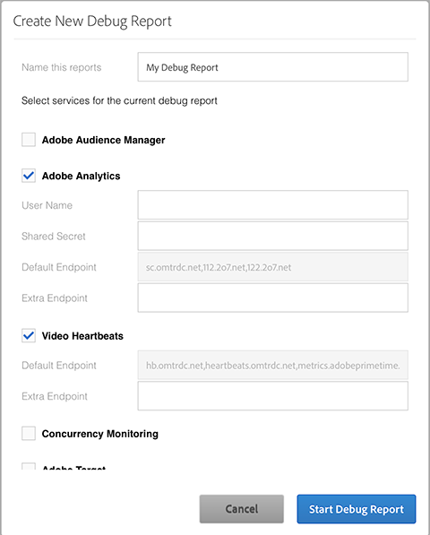

# Création d’un nouveau rapport de débogage{#create-a-new-debug-report}

Pour créer un nouveau rapport de débogage :

1. Dans [!UICONTROL Création d’un nouveau rapport de débogage] sélectionnez les options suivantes :

   

1. Renseignez les champs avec les informations suivantes :

   * **Nommer le rapport** : Entrez le nom et la date du lecteur afin de pouvoir facilement suivre le lecteur pendant la certification et conserver les marques et les plates-formes distinctes.
   * **Adobe Analytics**

      * [!UICONTROL Nom d’utilisateur] et [!UICONTROL Secret partagé] : Ces champs sont facultatifs, mais vous pouvez ajouter vos informations d’identification de l’API de services Web à Adobe Debug pour afficher les noms de variable et les paramètres de variable pour la suite de rapports.

         L’accès peut s’effectuer de l’une des manières suivantes :

         * [!UICONTROL Analytics > Admin > Paramètres de la société > Services Web]
         * [!UICONTROL Analytics > Administration > Gestion des utilisateurs > Utilisateurs > Paramètres d’utilisateur individuels]  Pour créer des informations d’identification d’API de services Web pour un nouvel utilisateur, dans [!UICONTROL Gestion des utilisateurs], ajoutez l’utilisateur au groupe d’utilisateurs **Accès au service Web**.
      * [!UICONTROL Point de terminaison par défaut] - Les données de ce champ sont fournies par Adobe et ne peuvent pas être modifiées.
      * [!UICONTROL Point de terminaison supplémentaire] - Ajoutez `CNAMES`, si vous les utilisez, pour le suivi de serveur comme `metrics.companyname.com`
   * **Vidéo Heartbeat (Media Analytics)**

      * [!UICONTROL Point de terminaison par défaut] - Les données de ce champ sont fournies par Adobe et ne peuvent pas être modifiées.
      * [!UICONTROL Point de terminaison supplémentaire] - Ajoutez `CNAMES`, si vous les utilisez, pour le suivi de serveur comme, par exemple, `metrics.companyname.com`.
