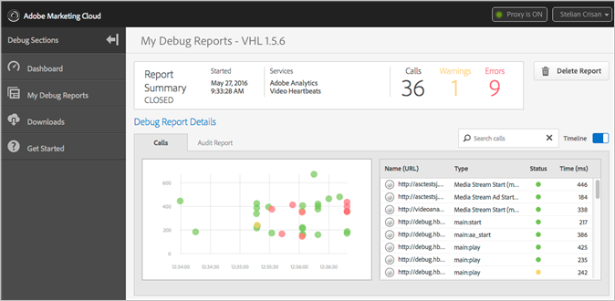

# Tableaux de bord et rapports de débogage {#debug-dashboards-and-reports}

Adobe Debug fournit des rapports, en temps réel, afin que vous puissiez afficher les accès et les métadonnées envoyés pendant la lecture vidéo. Chacun de ces rapports peut être enregistré dans Debug.

Pour la certification, ces rapports peuvent être partagés en copiant simplement l’URL et en envoyant le lien, par exemple dans un ticket ZenDesk.

>[!NOTE]
>
>Une seule session peut être active à la fois. La session active peut être ouverte à partir du tableau de bord.

