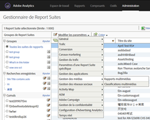
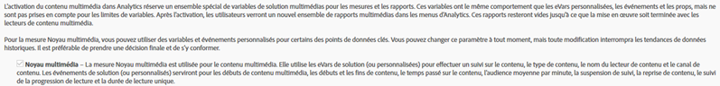
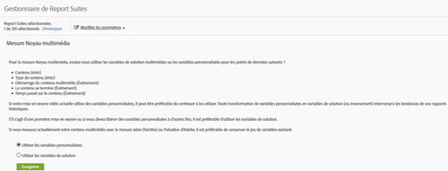
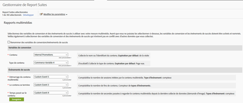

# Aperçu de Milestone{#milestone-overview}

>[!CAUTION]
>
>Cette option de mesure est désormais obsolète.

[Ancienne documentation Milestone](milestone_analytics_video.pdf)

## Configuration {#configuration}

### Configuration des vidéos Milestone

Pour effectuer le suivi vidéo, vous pouvez désigner une série de *variables de conversion* (eVars) et d’*événements personnalisés* à utiliser dans le suivi et la création de rapports. Une variable *Custom Insight* () est également utilisée pour le cheminement.`s.prop`

Les variables que vous sélectionnez pour chaque mesure sont ajoutées à la page de configuration des vidéos. Cela permet au système de générer et de formater automatiquement les rapports vidéo standard. L’eVar du *nom de la vidéo* et le compteur *d’affichages vidéo* sont tous les deux requis. Les autres variables sont facultatives mais recommandées pour effectuer les mesures. Une fois que le suivi vidéo est activé, vous pouvez afficher les rapports générés à partir des données vidéo signalées à l’aide du suivi vidéo.

Vous pouvez également effectuer le suivi d’autres mesures supplémentaires pour la vidéo. Par exemple, si vous utilisez plusieurs lecteurs vidéo sur votre site, vous pouvez renseigner une eVar avec le nom du lecteur. Certaines des variables sélectionnées peuvent également être utilisées dans d’autres zones de votre site. Par exemple, si elle est utilisée sur l’ensemble du site, la variable de *type de contenu* peut vous permettre de mesurer le pourcentage de pages vues provenant de la vidéo et vous permettre d’établir un lien entre les événements de conversion et la vidéo.

### Configuration des rapports Milestone

Pour configurer les rapports vidéo pour une mise en œuvre Milestone, accédez à **[!UICONTROL Administration > Gestionnaire de suites de rapports].** Sélectionnez la suite de rapports, puis choisissez **[!UICONTROL Gestion des vidéos > Création de rapports vidéo] :**

<!--
{width="248"}
-->


Sur le premier écran, seule la mesure Cœur de la vidéo fonctionnera avec les données Milestone. Sélectionnez **[!UICONTROL Cœur de la vidéo]**, puis cliquez sur **[!UICONTROL Enregistrer].**



Sur l’écran suivant, sélectionnez **[!UICONTROL Utiliser les variables personnalisées].**

<!--
{width="470"}
-->


Sur le dernier écran, sélectionnez les deux eVar et les trois événements à utiliser avec votre mesure vidéo :

<!--

-->


## Référence de variables vidéo {#video-variable-reference}

Le tableau suivant contient des détails supplémentaires sur les variables de commerce et les événements personnalisés pour la vidéo :

| Mesure vidéo | Type de variable | Description |
| --- | --- | --- |
| Contenu | eVar <br/>Délai d’expiration par défaut : Visite | (Obligatoire) Collecte le nom de la vidéo, tel que spécifié dans la mise en œuvre. |
| Type de contenu | eVar <br/>Délai d’expiration par défaut : page vue | Collecte les données sur le type de contenu affiché par un visiteur. Les accès envoyés par mesure vidéo se voient attribuer un type de contenu de `video.` <br/>Cette variable ne doit pas être réservée exclusivement au suivi vidéo. Les autres types de contenu des rapports de contenu utilisant la même variable permettent d’analyser la distribution des visiteurs par rapport aux différents types de contenu. Par exemple, vous pouvez baliser d’autres types de contenu en utilisant des valeurs telles que `article` ou `product page` à l’aide de cette variable. <br/>Du point de vue des mesures vidéo, le *type de contenu* permet d’identifier les visiteurs de vidéos et donc de calculer les taux de conversion vidéo. |
| Temps passé sur le contenu | Type <br/>d’événement : Compteur | Compte le temps de lecture vidéo passé, en secondes, depuis le dernier processus de collecte de données (requêtes d’images). |
| Démarrages de vidéo | Type <br/>d’événement : Compteur | Indique qu’un visiteur a visionné une partie d’une vidéo. Cependant, cette mesure ne fournit aucune information quant au pourcentage de la vidéo que le visiteur a regardée, ni la partie visionnée. |
| La vidéo se termine | Type <br/>d’événement : Compteur | Indique qu’un utilisateur a visionné une vidéo dans son intégralité. Par défaut, la fin de l’événement est mesurée 1 seconde avant la fin de la vidéo.  <br/>Pendant la mise en œuvre, vous pouvez spécifier combien de secondes à partir de la fin de la vidéo vous souhaitez considérer comme une lecture intégrale. Pour les vidéos en direct et les autres flux qui n’ont pas de fin définie, vous pouvez spécifier un point personnalisé pour mesurer la fin. Par exemple, après un temps de lecture spécifique. |

## Variables du module média {#media-module-variables}

Les variables suivantes vous permettent de configurer les mesures vidéo. Vous devez définir les valeurs des variables figurant dans le tableau Variables obligatoires. En outre, pour effectuer le suivi des événements dans votre lecteur vidéo, vous devez activer le suivi automatique (pour les lecteurs pris en charge) ou mettre en œuvre le suivi personnalisé des événements du lecteur à l’aide des méthodes open, play, stop et close.

| Variable    | Description |
| --- | --- |
| `Media.trackUsingContextData` | **Syntaxe :** <br/><br/> `s.Media.trackUsingContextData = true;` <br/>Cette option permet d’activer le suivi vidéo intégré. Lorsqu’il est défini sur « true », le module média génère des données contextuelles pour le suivi multimédia, au lieu de l’héritage `pev3`. <br/>Utilisez `Media.contextDataMapping` pour mettre en correspondance les données contextuelles avec les eVars et les événements sélectionnés.<br/>Valeur par défaut : `false` |
| `Media.contextDataMapping` | **Syntaxe :** <br/><br/> `s.Media.contextDataMapping = {`<br/>      `"a.media.name":"eVar2, prop2",` <br/>     `"a.media.segment":"eVar3",` <br/>     `"a.contentType":"eVar1",` <br/>     `"a.media.timePlayed":"event3",` <br/>     `"a.media.view":"event1",` <br/>     `"a.media.segmentView":"event2",` <br/>     `"a.media.complete":"event7",` <br/>     `"a.media.milestones":{` <br/>         `25:"event4",` <br/>         `50:"event5",` <br/>         `75:"event6"` <br/>     ` }` <br/> `};` <br/><br/>Objet définissant la mise en correspondance des variables avec les eVars et les événements que vous souhaitez utiliser pour les mesures vidéo. L’objet doit mettre en correspondance les champs suivants :<br/><br/> **a.media.name :** (obligatoire) renseigne des variables avec le nom de la vidéo. Fournissez l’eVar que vous avez sélectionnée pour le stockage du nom de la vidéo, ainsi que la variable vidéo Custom Insight (`s.prop`) que vous souhaitez utiliser pour le cheminement vidéo. Fournissez une liste des valeurs séparées par des virgules. <br/><br/> **a.media.segment** : (facultatif) eVar que vous souhaitez utiliser pour le stockage du nom du segment de média. a.contentType : (facultatif) eVar que vous souhaitez utiliser pour le stockage de la valeur vidéo pour laquelle le suivi des visites et des visiteurs est activé afin de générer des rapports sur les visites et les visiteurs de la vidéo. Il est probable que la variable sélectionnée soit déjà utilisée pour le stockage de données comme un diaporama des articles ou une page de produits.<br/><br/> **a.media.view** : (obligatoire) événement que vous souhaitez utiliser pour la comptabilisation des consultations médias. <br/><br/> **a.media.segmentView** : (facultatif) événement que vous souhaitez utiliser pour la comptabilisation des affichages de segments. <br/><br/> **a.media.complete** : (facultatif) événement que vous souhaitez utiliser pour la comptabilisation des vues complètes. <br/><br/> **a.media.timePlayed** : (facultatif, fortement recommandé) événement numérique que vous souhaitez utiliser pour le stockage du nombre de secondes de vidéo lues. <br/><br/> **a.media.milestones** : (facultatif) objet mettant en correspondance les jalons s.Media.trackMilestones avec des événements de compteur. Media.segmentByMilestones doit être défini sur true si vous définissez des jalons. <br/><br/> **Suivi des publicités** Les variables de données contextuelles suivantes permettent d’effectuer le suivi des publicités :<br/> **a.media.ad.name** : (obligatoire) renseigne les variables avec le nom de la publicité. Fournissez l’eVar que vous avez sélectionnée pour le stockage du nom de la publicité, ainsi que la variable vidéo Custom Insight (`s.prop`) que vous souhaitez utiliser pour le cheminement. Fournissez une liste des valeurs séparées par des virgules. <br/><br/> **a.media.ad.pod :** position de lecture de la publicité dans le contenu principal. <br/><br/> **a.media.ad.podPosition :** position de lecture de la publicité dans la capsule. <br/><br/> **a.media.ad.CPM :** CPM ou CPM chiffré (précédé du préfixe « ~ ») applicable à la lecture. <br/><br/> **a.media.ad.view** : fonctionne de la même manière que `a.media.view` <br/><br/> **a.media.ad.clicked** : comptabilise le nombre de clics pour la publicité (appels `Media.click`) <br/><br/> **a.media.ad.timePlayed** : fonctionne de la même manière que `a.media.timePlayed` <br/><br/> **a.media.ad.complete** : fonctionne de la même manière que `a.media.complete` a.media.ad.segment : fonctionne de la même manière que `a.media.segment` <br/><br/> **a.media.ad.segmentView** : fonctionne de la même manière que `a.media.segmentView` <br/><br/> **a.media.ad.milestones** : fonctionne de la même manière que `a.media.milestones` <br/><br/> **a.media.ad.offsetMilestones** : fonctionne de la même manière que `a.media.offsetMilestones` |
| `Media.trackVars` | **Syntaxe :** <br/><br/> `s.Media.trackVars =` <br/>    `"events,` `prop2,` `eVar1,` `eVar2,` `eVar3";` <br/><br/>Liste de toutes les variables définies dans votre code de suivi vidéo, séparées par des virgules. |
| `Media.trackEvents` | **Syntaxe :** <br/><br/> `s.Media.trackEvents =` <br/>    `"event1,` `event2,` `event3,` `event4,` `event5,` `event6,` `event7"` <br/><br/>Liste de tous les événements définis dans votre code de suivi vidéo, séparés par des virgules. |

## Variables facultatives {#optional-variables}

|  Variable    | Description |
| --- | --- |
| `Media.autoTrack` | **Syntaxe :** <br/><br/> `s.Media.autoTrack = true`<br/><br/>Active le suivi automatique pour les lecteurs pris en charge. Les lecteurs pris en charge sont les suivants : <ul> <li> Open Source Media Framework (OSMF) </li> <li> FLVPlayback (lecteurs vidéo créés par l’assistant d’importation de vidéos dans Flash Professional) </li> <li> Silverlight </li> <li> MediaDisplay </li> <li> MediaPlayback </li> <li> API Brightcove versions 2 et 3 (consultez [Brightcove](https://experienceleague.adobe.com/docs/media-analytics/using/media-overview.html?lang=fr)) </li> <li> Windows Media Player, Quicktime ou Real Player à l’aide de JavaScript </li> </ul> <br/><br/>Si vous n’utilisez aucun des lecteurs précédents, vous pouvez utiliser `Media.open` `Media.play` `Media.stop` `Media.close` pour effectuer le suivi des événements du lecteur. |
| `Media.autoTrackNetStreams` | **Syntaxe :** <br/><br/> `s.Media.autoTrackNetStreams = true` <br/><br/>Flash 10.3 intègre une nouvelle fonctionnalité au composant NetStream, permettant un meilleur suivi vidéo. Si vous utilisez un lecteur NetStream Flash personnalisé, vous pouvez activer cette variable pour bénéficier d’une fonctionnalité similaire au suivi automatique. Cette méthode requiert que les vidéos soient visionnées dans Flash 10.3 ou version ultérieure. |
| `Media.completeByCloseOffset` | **Syntaxe :** <br/><br/> <br/><br/>`s.Media.completeByCloseOffset = true` <br/><br/>Ce paramètre permet de comptabiliser une vue complète quelques secondes avant la fin de la vidéo.  <br/><br/>L’événement est envoyé en fonction du nombre de secondes spécifié dans `completeCloseOffsetThreshold`. Cela vous permet de mesurer des vidéos terminées dans des lecteurs vidéo qui n’enregistrent jamais de décalage équivalant à la durée de la vidéo.<br/><br/>Par défaut, la valeur est définie sur true et le seuil est défini sur 1 seconde. Avec les valeurs par défaut, l’événement complete est envoyé 1 seconde avant la fin de la vidéo. |
| `Media.completeCloseOffsetThreshold` | **Syntaxe :** <br/><br/> `s.Media.completeCloseOffsetThreshold = 1` <br/><br/>Ce seuil vous permet de comptabiliser une vue complète quelques secondes avant la fin de la vidéo.  `Media.completeByCloseOffset` doit être défini sur true pour utiliser ce seuil.<br/><br/>La valeur entière renseignée détermine le décalage en secondes par rapport à la fin de la vidéo pour lequel une vue complète est comptabilisée. Cela vous permet de mesurer des vidéos terminées dans des lecteurs vidéo qui n’enregistrent jamais de décalage équivalant à la durée de la vidéo.  <br/><br/>Par défaut, le seuil est défini sur 1 seconde. |
| `Media.playerName` | **Syntaxe :** <br/><br/> `s.Media.playerName = "Custom Player Name"` <br/><br/>Définit un nom personnalisé pour le lecteur vidéo. |
| `Media.trackSeconds` | **Syntaxe :** <br/><br/> `s.Media.trackSeconds = 15` <br/><br/>Définit l’intervalle, en secondes, d’envoi des données de suivi vidéo aux serveurs de collecte de données Adobe pendant la lecture de la vidéo. La valeur doit être définie par incréments de 5 secondes. <br/><br/> L’activation de `Media.trackSeconds` déclenche uniquement les événements définis dans `Media.contextDataMapping`. Pour envoyer des variables supplémentaires en plus de celles définies pour les mesures vidéo, utilisez Media.Monitor. |
| `Media.trackMilestones` | Effectue le suivi des jalons en tant que pourcentage de la durée de la vidéo.  <br/><br/> **Syntaxe :** <br/><br/> `s.Media.trackMilestones = "25, 50, 75";` <br/><br/>Définit l’intervalle, en pourcentage de la durée de la vidéo, d’envoi des données de suivi vidéo aux serveurs de collecte de données Adobe. Définit les jalons sous forme de liste de nombres entiers séparés par des virgules. Par exemple : 10 = 10 %, 23 = 23 %.  <br/><br/>Puisque ces jalons correspondent à des points fixes dans la vidéo, si un visiteur visionne la vidéo au-delà du jalon 10 %, revient en arrière et franchit à nouveau le jalon 10 %, l’événement de jalon est envoyé plusieurs fois. De la même manière, si un visiteur saute un jalon, le module média n’envoie pas les données de suivi pour ce jalon.  <br/><br/>L’activation de `Media.trackMilestones` déclenche uniquement les événements définis dans `Media.contextDataMapping`. Pour envoyer des variables supplémentaires en plus de celles définies pour les mesures vidéo, utilisez Media.Monitor. |
| `Media.trackOffsetMilestones` | Effectue le suivi des jalons par secondes écoulées depuis le début de la vidéo.  <br/><br/> **Syntaxe :** <br/><br/> `s.Media.trackOffsetMilestones = "20, 40, 60";` <br/><br/>Définit l’intervalle, en secondes écoulées depuis le début de la vidéo, d’envoi des données de suivi vidéo aux serveurs de collecte de données Adobe. Définit les jalons sous forme de liste de nombres entiers séparés par des virgules. Par exemple : 20 = 20 secondes, 40 = 40 secondes.  <br/><br/>Puisque ces jalons correspondent à des points fixes dans la vidéo, si un visiteur visionne la vidéo au-delà du jalon 20 secondes, revient en arrière et franchit à nouveau le jalon 20 secondes, l’événement de jalon est envoyé plusieurs fois. De la même manière, si un visiteur saute un jalon, le module média n’envoie pas les données de suivi pour ce jalon.  <br/><br/> L’activation de `Media.trackOffsetMilestones` déclenche uniquement les événements définis dans `Media.contextDataMapping`. Pour envoyer des variables supplémentaires en plus de celles définies pour les mesures vidéo, utilisez Media.Monitor. |
| `Media.segmentByMilestones` | **Syntaxe :** <br/><br/> `s.Media.segmentByMilestones = true;` <br/><br/>Génère automatiquement les données sur le nom du segment, le numéro du segment et la longueur du segment, en fonction de la longueur du média et des jalons spécifiés dans la section `Media.trackMilestones` <br/><br/>La segmentation par jalons est le seul moyen de définir des segments lors de l’utilisation `autoTrack`. <br/><br/>Valeur par défaut : `false` |
| `Media.segmentByOffsetMilestones` | **Syntaxe :** <br/><br/> `s.Media.segmentByOffsetMilestones = true;` <br/><br/>Génère automatiquement les données sur le nom du segment, le numéro du segment et la longueur du segment, en fonction de la longueur du média et des jalons spécifiés dans la section `Media.trackOffsetMilestones` <br/><br/>La segmentation par jalons est le seul moyen de définir des segments lors de l’utilisation `autoTrack`.  <br/><br/>Valeur par défaut : `false` |

## Variables de suivi des publicités {#ad-tracking-variables}

Ces variables sont utilisées pour envoyer des informations sur la publicité en association avec la méthode openAd. Consultez la rubrique [Suivi des publicités vidéo VAST.](https://experienceleague.adobe.com/docs/media-analytics/using/media-overview.html)

| Variable    | Description |
| --- | --- |
| `Media.adTrackSeconds` | **Syntaxe :** <br/><br/> `s.Media.adTrackSeconds = 15;` <br/><br/>Définit l’intervalle, en secondes, d’envoi des données de suivi des publicités vidéo aux serveurs de collecte de données Adobe pendant la lecture de la vidéo. La valeur doit être définie par incréments de 5 secondes.  <br/><br/> L’activation de `Media.adTrackSeconds` déclenche uniquement les événements définis dans `Media.contextDataMapping`. Pour envoyer des variables supplémentaires en plus de celles définies pour les mesures vidéo, utilisez `Media.monitor`. |
| `Media.adTrackMilestones` | Effectue le suivi des jalons en tant que pourcentage de la durée de la publicité.  <br/><br/> **Syntaxe :** <br/><br/> `s.Media.adTrackMilestones = "25, 50, 75";` <br/><br/>Définit l’intervalle, en pourcentage de la durée de la publicité, d’envoi des données de suivi des publicités aux serveurs de collecte de données Adobe. Définit les jalons sous forme de liste de nombres entiers séparés par des virgules. Par exemple : 10 = 10 %, 23 = 23 %).  <br/><br/>Puisque ces jalons correspondent à des points fixes dans la publicité, si un visiteur visionne la vidéo au-delà du jalon 10 %, revient en arrière et franchit à nouveau le jalon 10 %, l’événement de jalon est envoyé plusieurs fois. De la même manière, si un visiteur saute un jalon, le module média n’envoie pas les données de suivi pour ce jalon.  <br/><br/> L’activation de `Media.adTrackMilestones` déclenche uniquement les événements définis dans `Media.contextDataMapping`. Pour envoyer des variables supplémentaires en plus de celles définies pour les mesures vidéo, utilisez `Media.monitor`. |
| `Media.adTrackOffsetMilestones` | Effectue le suivi des jalons par secondes écoulées depuis le début de la publicité.  <br/><br/> **Syntaxe :** <br/><br/> `s.Media.adTrackOffsetMilestones = "20, 40, 60";` <br/><br/>Définit l’intervalle, en secondes écoulées depuis le début de la publicité, d’envoi des données de suivi des publicités aux serveurs de collecte de données Adobe. Définit les jalons sous forme de liste de nombres entiers séparés par des virgules. Par exemple : 20 = 20 secondes, 40 = 40 secondes.  <br/><br/>Puisque ces jalons correspondent à des points fixes dans la publicité, si un visiteur visionne la vidéo au-delà du jalon 20 secondes, revient en arrière et franchit à nouveau le jalon 20 secondes, l’événement de jalon est envoyé plusieurs fois. De la même manière, si un visiteur saute un jalon, le module média n’envoie pas les données de suivi pour ce jalon.  <br/><br/> L’activation de `Media.adTrackOffsetMilestones` déclenche uniquement les événements définis dans `Media.contextDataMapping`. Pour envoyer des variables supplémentaires en plus de celles définies pour les mesures vidéo, utilisez `Media.monitor`. |
| `Media.adSegmentByMilestones` | **Syntaxe :** <br/><br/> `s.Media.adSegmentByMilestones = true;` <br/><br/>Génère automatiquement les données sur le nom du segment, le numéro du segment et la longueur du segment, en fonction de la longueur du média et des jalons spécifiés dans la section `Media.adTrackMilestones` <br/><br/>La segmentation par jalons est le seul moyen de définir des segments lors de l’utilisation `autoTrack`.  <br/><br/>Valeur par défaut : `false` |
| `Media.adSegmentByOffsetMilestones` | **Syntaxe :** <br/><br/> `s.Media.adSegmentByOffsetMilestones = true;` <br/><br/>Génère automatiquement les données sur le nom du segment, le numéro du segment et la longueur du segment, en fonction de la longueur du média et des jalons spécifiés dans la section `Media.adTrackOffsetMilestones` <br/><br/>La segmentation par jalons est le seul moyen de définir des segments lors de l’utilisation `autoTrack`. <br/><br/>Valeur par défaut : `false` |

## Méthodes du module média {#media-module-methods}

Les méthodes du module média sont utilisées pour effectuer le suivi manuel des événements du lecteur et le suivi de mesures supplémentaires qui ne font pas partie des rapports vidéo standard.

Si vous utilisez `Media.autoTrack` sans effectuer le suivi d’autres mesures, il est inutile d’appeler directement l’une de ces méthodes. Tous les arguments sont obligatoires, sauf indication contraire.

| Méthode    | Description |
| --- | --- |
| `Media.open` | **Syntaxe :** <br/><br/> `s.Media.open(mediaName, mediaLength, mediaPlayerName)` <br/><br/>Prépare le module média pour la collecte de données de suivi vidéo. Cette méthode utilise les paramètres suivants : <ul><li> **mediaName :** (obligatoire) nom de la vidéo tel que vous souhaitez le voir apparaître dans les rapports vidéo. </li><li>  **mediaLength :** (obligatoire) durée de la vidéo, en secondes.  </li><li> **mediaPlayerName** : (obligatoire) nom du lecteur multimédia utilisé pour visionner la vidéo, tel que vous souhaitez le voir apparaître dans les rapports vidéo. </li></ul> |
| `Media.openAd` | **Syntaxe :** <br/><br/> `s.Media.openAd(name, length, playerName, parentName,`<br/>   `parentPod, parentPodPosition, CPM)` <br/><br/>Prépare le module média pour la collecte de données de suivi des publicités. Cette méthode utilise les paramètres suivants : <ul> <li> **name :** (obligatoire) nom ou identifiant de la publicité.  </li> <li> **length :** (obligatoire) durée de la publicité.  </li> <li> **playerName :** (obligatoire) nom du lecteur multimédia utilisé pour visionner la publicité.  </li> <li> **parentName :** nom ou identifiant du contenu principal dans lequel la publicité est incorporée.  </li> <li> **parentPod :** position de lecture de la publicité dans le contenu principal.  </li> <li> **parentPodPosition :** position de lecture de la publicité dans la capsule.  </li> <li> **CPM :** CPM ou CPM chiffré (précédé du préfixe « ~ ») applicable à la lecture.  </li> </ul> |
| `Media.click` | **Syntaxe :** <br/><br/> `s.Media.click(name, offset)` <br/><br/>Effectue un suivi lorsqu’un utilisateur clique sur la publicité dans une vidéo. Cette méthode utilise les paramètres suivants : <ul> <li> **name :** nom de l’activité. Celui-ci doit correspondre au nom utilisé dans Media.openAd.  </li> <li> **offset :** décalage dans la publicité lorsque le clic s’est produit.  </li> </ul> |
| `Media.close` | **Syntaxe :** <br/><br/> `s.Media.close(mediaName)` <br/><br/>Met fin à la collecte des données vidéo et envoie des informations aux serveurs de collecte de données Adobe. Appelez cette méthode à la fin de la vidéo. Cette méthode utilise le paramètre suivant :  <br/><br/> **mediaName** : nom de la vidéo. Celui-ci doit correspondre au nom utilisé dans `Media.open`. |
| `Media.complete` | **Syntaxe :** <br/><br/> `s.Media.complete(name, offset)` <br/><br/>Cette méthode effectue le suivi manuel d’un événement complete. Cette méthode est utilisée lorsque vous devez déclencher des événements au moyen d’une logique spéciale, car ils ne peuvent être gérés à l’aide de `Media.completeByCloseOffset`. <br/><br/>Par exemple, si vous mesurez une diffusion en direct dont la fin n’est pas définie, il se peut que vous deviez utiliser un complete après que l’utilisateur l’a visionné pendant X secondes. Vous pouvez mesurer un événement complete à partir d’un pourcentage calculé en fonction de la durée et du type de contenu. Cette méthode utilise les paramètres suivants : <ul> <li> **mediaName** : nom de la vidéo. Celui-ci doit correspondre au nom utilisé dans Media.open.  </li> <li> **mediaOffset :** moment de la vidéo (en secondes) auquel l’événement complete doit être envoyé. Précisez le décalage par rapport au démarrage de la vidéo à zéro seconde. <br/><br/>Si votre lecteur multimédia effectue un suivi en utilisant les millisecondes, veillez à convertir cette valeur en secondes avant d’appeler Media.complete.  </li> </ul> Si vous prévoyez de terminer l’appel manuellement, définissez <br/><br/> `s.Media.completeByCloseOffset = false`. |
| `Media.play` | **Syntaxe :** <br/><br/> `s.Media.play(name, offset, segmentNum, segment, segmentLength)` <br/><br/>Appelez cette méthode à chaque démarrage de lecture d’une vidéo. Lorsque vous utilisez des mesures vidéo manuelles, vous pouvez fournir les données du segment actuel lors de l’envoi des données des mesures vidéo.  <br/><br/>Si votre lecteur passe d’un segment à un autre pour une raison quelconque, vous devez appeler `Media.stop` `Media.play`. <br/><br/> Cette méthode utilise les paramètres suivants : <br/><br/> **mediaName** : nom de la vidéo. Celui-ci doit correspondre au nom utilisé dans Media.open.   <br/><br/> **mediaOffset :** moment de la vidéo (en secondes) auquel la lecture démarre. Précisez le décalage par rapport au démarrage de la vidéo à zéro seconde. Si votre lecteur multimédia effectue un suivi à partir de millisecondes, veillez à convertir cette valeur en secondes avant d’appeler Media.play.   <br/><br/> **segmentNum** : (facultatif) numéro du segment actuel, utilisé par les rapports marketing pour classer l’affichage des segments dans les rapports. Le paramètre segmentNum doit être supérieur à zéro.   <br/><br/> **segment** : (facultatif) nom du segment actuel.  <br/><br/> **segmentLength** : (facultatif) <br/><br/>durée du segment actuel, en secondes.  <br/><br/>Par exemple : <br/><br/> `s.Media.play("My Video", 1800, 2,"Second Quarter", 1800)` <br/><br/> `s.Media.play("My Video", 0, 1,"Preroll", 30)` |
| `Media.stop` | **Syntaxe :** <br/><br/> `s.Media.stop(mediaName, mediaOffset)`<br/><br/>Effectue le suivi d’un événement stop (stop, pause, etc.) pour la vidéo spécifiée. Cette méthode utilise les paramètres suivants : <ul> <li> **mediaName** : nom de la vidéo. Celui-ci doit correspondre au nom utilisé dans `Media.open`.  </li> <li> **mediaOffset** : moment de la vidéo (en secondes) auquel l’événement stop ou pause se produit. Précisez le décalage par rapport au démarrage de la vidéo à zéro seconde.  </li> </ul> |
| `Media.monitor` | **Syntaxe :** <br/><br/> `s.Media.monitor(s, media)` <br/><br/> **Syntaxe de Silverlight :**<br/><br/> `s.Media.monitor =` <br/>   `new AppMeasurement_Media_Monitor(myMediaMonitor);` <br/><br/>Le moniteur multimédia de l’application Silverlight met en œuvre le schéma de conception du délégué Objective-C. La `myMediaMonitor`méthode de classe utilise les paramètres `s` et `media`. <br/><br/>Utilisez cette méthode pour envoyer des mesures vidéo supplémentaires. Vous pouvez configurer des variables complémentaires (Props, eVars, Events) et les envoyer à l’aide de `Media.track` en fonction de l’état de lecture actuel de la vidéo. <br/><br/>Voir [Mesures vidéo supplémentaires à l’aide de Media.monitor.](https://experienceleague.adobe.com/docs/media-analytics/using/media-overview.html) <br/><br/>Cette méthode utilise les paramètres suivants : <br/><br/>  **s** : `AppMeasurement`instance (ou objet `s` JavaScript). <br/><br/> **Media** : objet dont les membres transmettent l’état de la vidéo. Ces membres comprennent les éléments suivants :  <ul><li> `media.name:` Nom de la vidéo. Celui-ci doit correspondre au nom utilisé dans `Media.open` ; </li><li> `media.length:` Durée de la vidéo, en secondes, fournie dans l’appel à `Media.open` ; </li><li> `media.playerName:` Nom du lecteur multimédia fourni dans l’appel à `Media.open` ; </li><li> `media.openTime:` Objet NSDate comportant des données concernant le moment où `Media.open` a été appelé ; </li><li> `media.offset:` Décalage actuel dans la vidéo, en secondes (point actuel dans la vidéo). Le décalage commence à zéro (la première seconde de la vidéo correspond à la seconde 0) ; </li><li> `media.percent:` Pourcentage actuel lu de la vidéo, en fonction de la durée de la vidéo et du décalage actuel. ;  </li><li> `media.timePlayed:` Nombre total de secondes lues jusqu’ici ;  </li><li> `media.eventFirstTime:` Indique s’il s’agit de la première fois que cet événement multimédia est appelé pour cette vidéo ; </li><li> `media.mediaEvent:` Chaîne contenant le nom de l’événement qui a provoqué l’appel monitor. </li></ul> |
|  | `media.mediaEvent` events : <ul><li> `OPEN:` Lorsque la lecture est d’abord observée par le biais de `Media.autoTrack` ou lors d’un appel à `Media.play` ; </li><li> `CLOSE:` Lorsque la lecture se termine à la fin de la vidéo par le biais de `Media.autoTrack` ou lors d’un appel à `Media.close` ;</li><li> `PLAY:` Lorsque la lecture reprend après avoir été mise en pause ou après un parcours de `Media.autoTrack`, ou lors d’un second appel à `Media.play` ;</li><li> `STOP:` Lorsque la lecture s’arrête en raison d’une mise en pause au début d’un défilement à l’aide de `Media.autoTrack`, ou lors d’un appel à `Media.stop` ;</li><li> `MONITOR:` Lorsque notre surveillance automatique vérifie l’état de la vidéo en cours de lecture (seconde par seconde) ;</li><li> `SECONDS:` À l’intervalle de secondes défini par la variable `Media.trackSeconds` ;</li><li> `MILESTONE:` Au jalon défini par la variable `Media.trackMilestones` ; </li></ul> |
| `Media.track` | **Syntaxe :** <br/><br/> `s.Media.track(mediaName)` <br/><br/>Transmet immédiatement l’état actuel de la vidéo ainsi que les variables `Media.trackVars` et Media.trackEvents que vous avez définies. Cette méthode est utilisée avec `Media.monitor`. <br/><br/>Voir [Mesures vidéo supplémentaires à l’aide de Media.monitor.](https://experienceleague.adobe.com/docs/media-analytics/using/media-overview.html) <br/><br/>Appelez `Media.open` et `Media.play` sur la vidéo avant d’appeler cette méthode. Cette méthode utilise le paramètre suivant : <ul> <li> **mediaName** : nom de la vidéo. Celui-ci doit correspondre au nom utilisé dans `Media.open`.</li> </ul> Cette méthode constitue le seul moyen d’envoyer des variables supplémentaires pendant la lecture de la vidéo. Elle réinitialise les compteurs d’intervalles, en secondes, et de jalons, en pourcentage, pour éviter la double comptabilisation d’accès de suivi. |


## Suivi des événements du lecteur vidéo {#track-video-player-events}

Vous pouvez effectuer le suivi de lecteurs multimédia en créant des fonctions associées aux gestionnaires d’événements du lecteur vidéo. Cela vous permet d’appeler `Media.open`, `Media.play`, `Media.stop` et `Media.close` aux moments appropriés. Par exemple :

* **Chargement :** Appelle `Media.open` et `Media.play`
* **Pause :** Appelle `Media.stop`. Par exemple, si un utilisateur met en pause une vidéo après 15 secondes, appelez `s.Media.stop("Video1", 15)`.
* **Mémoire tampon** : appelez `Media.stop` pendant la mise en mémoire tampon de la vidéo. Appelez `Media.play` lorsque la lecture reprend.
* **Reprendre :** Appelle `Media.play`. Par exemple, quand un utilisateur reprend la lecture d’une vidéo après en avoir affiché initialement 15 secondes, appelez `s.Media.play("Video1", 15)`.
* **Lecture à vitesse variable (réglette) :** lorsque l’utilisateur fait glisser la réglette de la vidéo, appelez `Media.stop`. Lorsque l’utilisateur relâche la réglette de la vidéo, appelez `Media.play`.
* **Fin :** Appelle `Media.stop`, puis `Media.close`. Par exemple, à la fin d’une vidéo de 100 secondes, appelez `s.Media.stop("Video1", 100)`, puis `s.Media.close("Video1")`..

Pour ce faire, vous pouvez définir quatre fonctions personnalisées que vous pouvez appeler à partir des gestionnaires d’événements du lecteur multimédia. Les différents paramètres transmis à `Media.open`, `Media.play`, `Media.stop` et `Media.close` proviennent du lecteur. Le pseudocode suivant montre comment c’est possible :

```javascript
/* Call on video load */ 
function startMovie() { 
    s.Media.open(mediaName, mediaLength, mediaPlayerName); 
    playMovie(); 
} 
 
/* Call on video resume from pause and slider release */ 
function playMovie() { 
    s.Media.play(mediaName, 
                 mediaOffset,  
                 segmentNum,  
                 segment,  
                 segmentLength); 
} 
/* Call on video pause and slider grab */ 
function stopMovie() { 
    s.Media.stop(mediaName, mediaOffset); 
} 
 
/* Call on video end */ 
/* Measuring Video for Developers 43 */ 
function endMovie() { 
    stopMovie(); 
    s.Media.close(mediaName); 
} 
```

## Suivi automatique JavaScript {#javascript-autotrack}

Le module média JavaScript identifie toutes les balises `<embed>` ou `<object>` dans la page HTML. Ensuite, il recherche les données de chaque balise pour déterminer quel lecteur multimédia est en cours d’utilisation, le cas échéant. Si le lecteur est un lecteur Windows Media, Quicktime ou Real Player, le `autoTrack` peut être utilisé. Cependant, le `autoTrack` sur le lecteur Windows Media fonctionne uniquement sur Internet Explorer. Le suivi manuel du lecteur Windows Media est nécessaire pour la prise en charge de tous les navigateurs.

L’attribut `classid` doit être configuré sur l’objet que vous souhaitez suivre. L’attribut `classid` doit être défini afin d’exposer les gestionnaires d’événements utilisés par le module média pour le suivi automatique de la vidéo.

```javascript
s.Media.autoTrack = true
```

## Exemple de code JavaScript {#javascript-sample-code}

```javascript
// Sample implementation 
s.usePlugins=true 
function s_doPlugins(s) { 
    /* Add manual calls to modules and plugins here */ 
} 
 
s.doPlugins=s_doPlugins 
 
/*********Media Module Calls**************/ 
s.loadModule("Media") 
 
/*Configure Media Module Functions */ 
s.Media.autoTrack= true; 
s.Media.trackVars="events, prop2, eVar1, eVar2, eVar3"; 
s.Media.trackEvents="event1, event2, event3, event4, event5, event6, event7" 
s.Media.trackMilestones="25, 50, 75"; 
s.Media.playerName="My Media Player"; 
s.Media.segmentByMilestones = true; 
s.Media.trackUsingContextData = true; 
s.Media.contextDataMapping = { 
    "a.media.name":"eVar2, prop2", 
    "a.media.segment":"eVar3", 
    "a.contentType":"eVar1", 
    "a.media.timePlayed":"event3", 
    "a.media.view":"event1", 
    "a.media.segmentView":"event2", 
    "a.media.complete":"event7", 
    "a.media.milestones":{ 
        25:"event4", 
        50:"event5", 
        75:"event6" 
    } 
} 
 
s.Media.monitor = function (s, media) { } //If Needed

/* Turn on and configure debugging here */ 
s.debugTracking = true; 
s.trackLocal = true; 
 
/* WARNING: Changing any of the below variables will cause drastic changes to how your visitor 
data is collected. Changes should only be made when instructed to do so by your account 
manager.*/ 
s.visitorNamespace = "yourNamespace"; 
s.trackingServer="metrics.mysite.com" //Use only if using first party cookies 
s.trackingServerSecure="smetrics.mysite.com" // Use only if using first party cookies in  
                                             // conjunction with SSL 
s.dc = '122'; 
 
/************************** PLUGINS SECTION *************************/ 
/* Insert any plugins code you want to use here. */ 
 
/****************************** MODULES *****************************/ 
/* Insert the media module tracking code here. */ 
```
