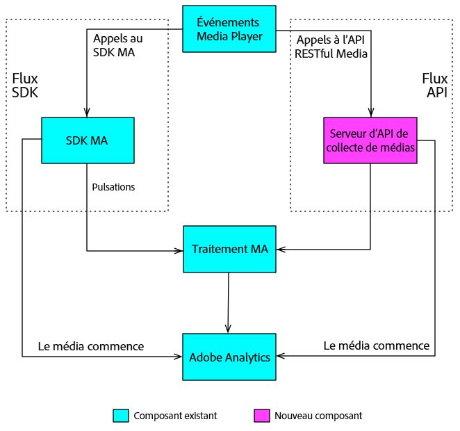

# Aperçu{#overview}

L’API Media Collection constitue l’alternative RESTful d’Adobe au kit SDK Media côté client. Grâce à l’API Media Collection, votre lecteur peut effectuer le suivi des événements audio et vidéo à l’aide d’appels HTTP RESTful. The Media Collection API offers the same realtime tracking of the Media SDK, plus one additional feature:

* **Suivi du contenu téléchargé**

   Cette fonctionnalité vous permet d’effectuer le suivi des médias lorsqu’un utilisateur est hors ligne, en stockant localement les données d’événement jusqu’à ce que le périphérique de l’utilisateur revienne en ligne. (Consultez la rubrique [Suivi du contenu téléchargé](track-downloaded-content.md) pour en savoir plus.)

L’API Media Collection est essentiellement un adaptateur, agissant comme une version côté serveur du kit SDK Media. This means that some aspects of the Media SDK documentation are also relevant to the Media Collection API. For example, both solutions use the same Audio and Video Parameters, and the collected Audio and Video tracking data leads to the same Reporting and Analysis.[](/help/metrics-and-metadata/audio-video-parameters.md)[](/help/media-reports/media-reports-enable.md)

## Flux de données de suivi multimédia {#section_pwq_n34_qbb}

Un lecteur multimédia mettant en oeuvre l’API Media Collection émet des appels de suivi de l’API RESTful directement vers le serveur principal de suivi des médias, tandis qu’un lecteur mettant en oeuvre le SDK Media effectue des appels de suivi vers les API du SDK dans l’application du lecteur. L’un des effets des appels sur le Web est que le lecteur mettant en œuvre l’API Media Collection doit gérer une partie du traitement que le kit SDK Media gère automatiquement. (Détails dans la mise en oeuvre de [la collection de médias.](mc-api-impl/mc-api-quick-start.md))

Les données de suivi capturées avec l’API de collecte de médias sont envoyées et traitées initialement différemment des données de suivi capturées dans un lecteur Media SDK, mais le même moteur de traitement sur le serveur principal est utilisé pour les deux solutions.



## Présentation de l’API {#section_y4n_mcl_kcb}

**URI :** Procurez-vous cette information auprès de votre représentant Adobe.

**Méthode HTTP :** POST, avec corps de requête JSON.

### API Calls {#mc-api-calls}

* **`sessions`-** Etablit une session avec le serveur et renvoie un ID de session utilisé dans les `events` appels suivants. Votre application appelle ceci une fois au début d’une session de suivi.

   ```
   {uri}/api/v1/sessions
   ```

* **`events`-** Envoie des données de suivi multimédia.

   ```
   {uri}/api/v1/sessions/{session-id}/events
   ```

### Request Body {#mc-api-request-body}

```
{ 
    "playerTime": { 
        "playhead": {playhead position in seconds}, 
        "ts": {timestamp in milliseconds} 
    }, 
    "eventType": {event-type}, 
    "params": { 
        {parameter-name}: {parameter-value}, 
        ... 
        {parameter-name}: {parameter-value} 
    }, 
    "qoeData" : { 
        {parameter-name}: {parameter-value}, 
        ... 
        {parameter-name}: {parameter-value} 
    }, 
    "customMetadata": { 
        {parameter-name}: {parameter-value}, 
        ... 
        {parameter-name}: {parameter-value} 
    } 
} 
```

* `playerTime` - Obligatoire pour toutes les demandes.
* `eventType` - Obligatoire pour toutes les demandes.
* `params` : Obligatoire pour certains `eventTypes` ; vérifiez le [schéma de validation JSON](mc-api-ref/mc-api-json-validation.md) pour déterminer quels eventTypes sont obligatoires et lesquels sont facultatifs.

* `qoeData` - Facultatif pour toutes les requêtes.
* `customMetadata` - Facultatif pour toutes les requêtes, mais envoyée uniquement avec les types `sessionStart`, `adStart`et `chapterStart` d'événements.

Pour chaque `eventType`, il existe un [schéma de validation JSON](mc-api-ref/mc-api-json-validation.md) disponible publiquement que vous devez utiliser pour vérifier les types de paramètre et savoir si un paramètre est facultatif ou obligatoire pour un événement particulier.

### Types d’événement {#mc-api-event-types}

* `sessionStart`
* `play`
* `ping`
* `pauseStart`
* `bufferStart`
* `adStart`
* `adComplete`
* `adSkip`
* `adBreakStart`
* `adBreakComplete`
* `chapterStart`
* `chapterSkip`
* `chapterComplete`
* `sessionEnd`
* `sessionComplete`

