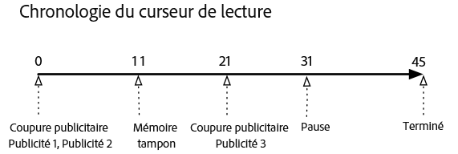
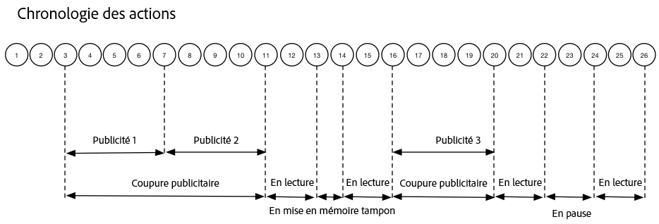

# Chronologie 1 : Regarder jusqu’à la fin du contenu{#timeline-view-to-end-of-content}

## VOD, publicités preroll, mise en pause, mise en mémoire tampon, affichage du contenu jusqu’à la fin

Les diagrammes suivants illustrent le chronologie du curseur de lecture et la chronologie des clics des actions d'un utilisateur. Les détails de chaque action et les requêtes associées sont présentés ci-dessous.








## Détails de l'action

### Action 1 - Start session {#Action-1}

| Action | Chronologie d’actions (secondes) | Position du curseur de lecture (secondes) | Requête client |
| --- | :---: | :---: | --- |
| Bouton de lecture automatique ou de lecture enfoncé, la vidéo commence à se charger. | 0 | 0 | `/api/v1/sessions` |

**Détails de mise en œuvre**

Cet appel signale _l’intention de l’utilisateur de lire_ une vidéo. <br/><br/>Elle renvoie un ID de session ( `{sid}`) au client utilisé pour identifier tous les appels de suivi ultérieurs au sein de la session. L’état du lecteur n’est pas encore « lecture », mais à la place, « démarrage ». <br/><br/>[Les paramètres de session obligatoires](/help/media-collection-api/mc-api-ref/mc-api-sessions-req.md) doivent être inclus dans la carte `params` du corps de la requête. <br/><br/>Sur le serveur principal, cet appel génère un appel de lancement d’Adobe Analytics.

**Exemple de corps de requête**

```
{
    playerTime: {
        playhead: 0, ts: <timestamp>
    },
    eventType:sessionStart, params: {
        "media.playerName": "sample-html5-api-player",
        "analytics.trackingServer": "[ _YOUR_TS_ ]",
        "analytics.reportSuite": "[ _YOUR_RSID_ ]",
        "analytics.visitorId": "[ _YOUR_VISITOR_ID_ ]",
        "media.contentType": "VOD",
        "media.length": 60.3333333333333,
        "media.id": "VA API Sample Player",
        "visitor.marketingCloudOrgId": "[YOUR_MCID]",
        "media.name": "ClickMe",
        "media.channel": "sample-channel",
        "media.sdkVersion": "va-api-0.0.0",
        "analytics.enableSSL": false
    }
}
```

### Action 2 - Ping timer start {#Action-2}

| Action | Chronologie d’actions (secondes) | Position du curseur de lecture (secondes) | Requête client |
| --- | :---: | :---: | --- |
| L’application commence à envoyer un ping au minuteur d’événement | 0 | 0 | `/api/v1/sessions/{sid}/events` |  |

**Détails de mise en œuvre**

Démarrez le minuteur ping de l'application. Le premier événement ping doit déclencher 1 seconde dans s'il y a des publicités preroll, 10 secondes dans le cas contraire.

### Action 3 - Ad break start {#Action-3}

| Action | Chronologie d’actions (secondes) | Position du curseur de lecture (secondes) | Requête client |
| --- | :---: | :---: | --- |
| Suivez le démarrage de la coupure publicitaire preroll | 0 | 0 | `/api/v1/sessions/{sid}/events` |

**Détails de mise en œuvre**

Les publicités ne peuvent être suivies que dans une coupure publicitaire.

**Exemple de corps de requête**

```
{
    playerTime: {
        playhead: 0,
        ts: <timestamp>
    },
    eventType:adBreakStart, params: {
        "media.ad.podFriendlyName": "ad_pod1",
        "media.ad.podIndex": 0,
        "media.ad.podSecond": 0
    }
}
```

### Action 4 - Ad start {#Action-4}

| Action | Chronologie d’actions (secondes) | Position du curseur de lecture (secondes) | Requête client |
| --- | :---: | :---: | --- |
| Suivez le démarrage de la publicité preroll #1 | 0 | 0 | `/api/v1/sessions/{sid}/events` |

**Détails de mise en œuvre**

Démarrez le suivi de la première publicité preroll, qui dure 15 secondes. Incluez des métadonnées personnalisées avec ce `adStart` .

**Exemple de corps de requête**

```
{
    playerTime: {
        playhead: 0,
        ts: &lt;timestamp&gt;
    },
    eventType:adStart,
    params: {
        "media.ad.podFriendlyName": "ad_pod1",
        "media.ad.name": "Ad 1",
        "media.ad.id": "001",
        "media.ad.length": 15,
        "media.ad.podPosition": 1,
        "media.ad.playerName": "Sample Player",
        "media.ad.advertiser": "Ad Guys",
        "media.ad.campaignId": "1",
        "media.ad.creativeId": "42",
        "media.ad.siteId": "XYZ",
        "media.ad.creativeURL": "https://xyz_creative.com",
        "media.ad.placementId": "sample_placement"
    },
    customMetadata: {
        "myCustomData1": "CustomData1",
        "myCustomData2": "CustomData2"
    }
}
```

### Action 5 - Ad pings {#Action-5}

#### Action 5.1 - Ad ping 1 {#Action-5-1}

| Action | Chronologie d’actions (secondes) | Position du curseur de lecture (secondes) | Requête client |
| --- | :---: | :---: | --- |
| L’application envoie un événement ping | 1 | 0 | `/api/v1/sessions/{sid}/events` |

**Détails de mise en œuvre**

Appuyez sur la touche Retour toutes les 1 secondes lors de l'intérieur d'une publicité.

**Exemple de corps de requête**

```
{
    playerTime: {
        playhead: 0,
        ts: <timestamp>
    },
    eventType:ping
}
```

#### Action 5.2 - Ad ping 2 {#Action-5-2}

| Action | Chronologie d’actions (secondes) | Position du curseur de lecture (secondes) | Requête client |
| --- | :---: | :---: | --- |
| L’application envoie un événement ping | 2 | 0 | `/api/v1/sessions/{sid}/events` |

**Détails de mise en œuvre**

Appuyez sur la touche Retour toutes les 1 secondes lors de l'intérieur d'une publicité.

**Exemple de corps de requête**

```
{
    playerTime: {
        playhead: 0,
        ts: <timestamp>
    },
    eventType:ping
}
```

#### Action 5.3 - Ad ping 3 {#Action-5-3}


| Action | Chronologie d’actions (secondes) | Position du curseur de lecture (secondes) | Requête client |
| --- | :---: | :---: | --- |
| L’application envoie un événement ping | 3 | 0 | `/api/v1/sessions/{sid}/events` |

**Détails de mise en œuvre**

Appuyez sur la touche Retour toutes les 1 secondes lors de l'intérieur d'une publicité.

>[!NOTE]
>
>Les publicités suivantes dans le chronologie ne montrent pas la série de chaînes d'une seconde
>par souci de concision…

**Exemple de corps de requête**

```
{
    playerTime: {
        playhead: 0,
        ts: <timestamp>
    },
    eventType:ping
}
```

### Action 6 - Ad complete {#Action-6}

| Action | Chronologie d’actions (secondes) | Position du curseur de lecture (secondes) | Requête client |
| --- | :---: | :---: | --- |
| Suivez la fin de la publicité preroll #1 | 15 | 0 | `/api/v1/sessions/{sid}/events` |

**Détails de mise en œuvre**

Suivez la fin de la première publicité preroll.

**Exemple de corps de requête**

```
{
    playerTime: {
        playhead: 0,
        ts: <timestamp>
    },
    eventType:adComplete
}
```

### Action 7 - Ad start {#Action-7}

| Action | Chronologie d’actions (secondes) | Position du curseur de lecture (secondes) | Requête client |
| --- | :---: | :---: | --- |
| Suivez le démarrage de la publicité preroll #2 | 15 | 0 | `/api/v1/sessions/{sid}/events` |

**Détails de mise en œuvre**

Suivez le début de la seconde publicité preroll, qui dure 7 secondes.

**Exemple de corps de requête**

```
{
    playerTime: {
        playhead: 0,
        ts: <timestamp>
    },
    eventType:adStart, params: {
        "media.ad.podFriendlyName": "ad_pod1",
        "media.ad.name": "Ad 2",
        "media.ad.id": "002",
        "media.ad.length": 7,
        "media.ad.podPosition": 1,
        "media.ad.playerName": "Sample Player",
        "media.ad.advertiser": "Ad Guys",
        "media.ad.campaignId": "2",
        "media.ad.creativeId": "44",
        "media.ad.siteId": "XYZ",
        "media.ad.creativeURL": "https://xyz_creative.com",
        "media.ad.placementId": "sample_placement2"
    },
}
```

### Action 8 - Ad pings {#Action-8}

| Action | Chronologie d’actions (secondes) | Position du curseur de lecture (secondes) | Requête client |
| --- | :---: | :---: | --- |
| L’application envoie un événement ping | 20 | 0 | `/api/v1/sessions/{sid}/events` |

**Détails de mise en œuvre**

Appuyez sur la touche Retour toutes les 1 secondes.

**Exemple de corps de requête**

```
{
    playerTime: {
        playhead: 0,
        ts: <timestamp>
    },
    eventType:ping
}
```

### Action 9 - Ad complete {#Action-9}

| Action | Chronologie d’actions (secondes) | Position du curseur de lecture (secondes) | Requête client |
| --- | :---: | :---: | --- |
| Suivez la fin de la publicité preroll #2 | 22 | 0 | `/api/v1/sessions/{sid}/events` |

**Détails de mise en œuvre**

Suivez la fin de la seconde publicité preroll.

**Exemple de corps de requête**

```
{
    playerTime: {
        playhead: 0,
        ts: <timestamp>
    },
    eventType:adComplete
}
```

### Action 10 - Ad break complete {#Action-10}

| Action | Chronologie d’actions (secondes) | Position du curseur de lecture (secondes) | Requête client |
| --- | :---: | :---: | --- |
| Suivez la fin de la coupure publicitaire preroll | 22 | 0 | `/api/v1/sessions/{sid}/events` |

**Détails de mise en œuvre**

La coupure publicitaire est terminée. Du début à la fin de la coupure publicitaire, l’état de lecture est resté sur « lecture ».

**Exemple de corps de requête**

```
{
    playerTime: {
        playhead: 0,
        ts: <timestamp>
    },
    eventType:adBreakComplete
}
```

### Action 11 - Play content {#Action-11}

| Action | Chronologie d’actions (secondes) | Position du curseur de lecture (secondes) | Requête client |
| --- | :---: | :---: | --- |
| Suivez l’événement de lecture | 22 | 0 | `/api/v1/sessions/{sid}/events` |

**Détails de mise en œuvre**

Après l’événement `adBreakComplete`, placez le lecteur dans l’état « lecture » à l’aide de l’événement `play`.

**Exemple de corps de requête**

```
{
    playerTime: {
        playhead: 0,
        ts: <timestamp>
    },
    eventType:play
}
```

### Action 12 - Ping {#Action-12}

| Action | Chronologie d’actions (secondes) | Position du curseur de lecture (secondes) | Requête client |
| --- | :---: | :---: | --- |
| L’application envoie un événement ping | 30 | 8 | `/api/v1/sessions/{sid}/events` |

**Détails de mise en œuvre**

Envoyez un ping au serveur principal toutes les 10 secondes.

**Exemple de corps de requête**

```
{
    playerTime: {
        playhead: 8,
        ts: <timestamp>
    },
    eventType:ping
}
```

### Action 13 - Buffer start {#Action-13}

| Action | Chronologie d’actions (secondes) | Position du curseur de lecture (secondes) | Requête client |
| --- | :---: | :---: | --- |
| Un événement de début de mise en mémoire tampon s’est produit | 33 | 11 | `/api/v1/sessions/{sid}/events` |

**Détails de mise en œuvre**

Suivez le déplacement du lecteur à l’état « mise en mémoire tampon ».

**Exemple de corps de requête**

```
{
    playerTime: {
        playhead: 11,
        ts: <timestamp>
    }, eventType:bufferStart
}
```

### Action 14 - Buffer end {#Action-14}

| Action | Chronologie d’actions (secondes) | Position du curseur de lecture (secondes) | Requête client |
| --- | :---: | :---: | --- |
| Mise en mémoire tampon terminée, l’application suit la reprise du contenu. | 36 | 11 | `/api/v1/sessions/{sid}/events` |

**Détails de mise en œuvre**

La mise en mémoire tampon se terminant au bout de 3 secondes, replacez le lecteur à l’état « lecture ». Vous devez envoyer un autre événement de suivi de lecture provenant de la mise en mémoire tampon.  **L'`play`appel suivant a`bufferStart`extrait un appel bufferend à l'arrière-plan ;** il n'est donc pas nécessaire d' `bufferEnd` utiliser un événement.

**Exemple de corps de requête**

```
{
    playerTime: {
        playhead: 11,
        ts: <timestamp>
    },
    eventType:play
}
```

### Action 15 - Ping {#Action-15}

| Action | Chronologie d’actions (secondes) | Position du curseur de lecture (secondes) | Requête client |
| --- | :---: | :---: | --- |
| L’application envoie un événement ping | 40 | 15 | `/api/v1/sessions/{sid}/events` |

**Détails de mise en œuvre**

Envoyez un ping au serveur principal toutes les 10 secondes.

**Exemple de corps de requête**

```
{
    playerTime: {
        playhead: 15,
        ts: <timestamp>
    }, eventType:ping
}
```

### Action 16 - Ad break start {#Action-16}

| Action | Chronologie d’actions (secondes) | Position du curseur de lecture (secondes) | Requête client |
| --- | :---: | :---: | --- |
| Suivez le démarrage de la coupure publicitaire mid-roll | 46 | 21 | `/api/v1/sessions/{sid}/events` |

**Détails de mise en œuvre**

Publicité mid-roll d’une durée de 8 secondes : envoyez `adBreakStart` .

**Exemple de corps de requête**

```
{
    playerTime: {
        playhead: 21,
        ts: <timestamp>
    },
    eventType:adBreakStart,
    params: {
        "media.ad.podFriendlyName": "ad_pod2",
        "media.ad.podIndex": 1,
        "media.ad.podSecond": 21
    }
}
```

### Action 17 - Ad start {#Action-17}

| Action | Chronologie d’actions (secondes) | Position du curseur de lecture (secondes) | Requête client |
| --- | :---: | :---: | --- |
| Suivez le démarrage de la publicité mid-roll #3 | 46 | 21 | `/api/v1/sessions/{sid}/events` |

**Détails de mise en œuvre**

Suivez la publicité mid-roll.

**Exemple de corps de requête**

```
{
    playerTime: {
        playhead: 21,
        ts: <timestamp>
    },
    eventType:adStart, params: {
        "media.ad.podFriendlyName": "ad_pod2",
        "media.ad.name": "Ad 3",
        "media.ad.id": "003",
        "media.ad.length": 8,
        "media.ad.podPosition": 2,
        "media.ad.playerName": "Sample Player",
        "media.ad.advertiser": "Ad Guys",
        "media.ad.campaignId": "7",
        "media.ad.creativeId": "40",
        "media.ad.siteId": "XYZ",
        "media.ad.creativeURL": "https://xyz_creative.com",
        "media.ad.placementId": "sample_placement2"
    },
}
```

### Action 18 - Ad ping {#Action-18}

| Action | Chronologie d’actions (secondes) | Position du curseur de lecture (secondes) | Requête client |
| --- | :---: | :---: | --- |
| L’application envoie un événement ping | 50 | 21 | `/api/v1/sessions/{sid}/events` |

**Détails de mise en œuvre**

Envoyez un ping au serveur principal toutes les 10 secondes.

**Exemple de corps de requête**

```
{
    playerTime: {
        playhead: 21,
        ts: <timestamp>
    }, eventType:ping
}
```

### Action 19 - Ad complete {#Action-19}

| Action | Chronologie d’actions (secondes) | Position du curseur de lecture (secondes) | Requête client |
| --- | :---: | :---: | --- |
| Suivez la fin de la publicité mid-roll #1 | 54 | 21 | `/api/v1/sessions/{sid}/events` |

**Détails de mise en œuvre**

La publicité mid-roll est terminée.

**Exemple de corps de requête**

```
{
    playerTime: {
        playhead: 21,
        ts: <timestamp>
    },
    eventType:adComplete
}
```

### Action 20 - Ad break complete {#Action-20}

| Action | Chronologie d’actions (secondes) | Position du curseur de lecture (secondes) | Requête client |
| --- | :---: | :---: | --- |
| Suivez la fin de la coupure publicitaire mid-roll | 54 | 21 | `/api/v1/sessions/{sid}/events` |

**Détails de mise en œuvre**

La coupure publicitaire est terminée.

**Exemple de corps de requête**

```
{
    playerTime: {
        playhead: 21,
        ts: <timestamp>
    },
    eventType:adBreakComplete
}
```

### Action 21 - Ping {#Action-21}

| Action | Chronologie d’actions (secondes) | Position du curseur de lecture (secondes) | Requête client |
| --- | :---: | :---: | --- |
| L’application envoie un événement ping | 60 | 27 | `/api/v1/sessions/{sid}/events` |

**Détails de mise en œuvre**

Envoyez un ping au serveur principal toutes les 10 secondes.

**Exemple de corps de requête**

```
{
    playerTime: {
        playhead: 27,
        ts: <timestamp>
    },
    eventType:ping
}
```

### Action 22 - Pause {#Action-22}

| Action | Chronologie d’actions (secondes) | Position du curseur de lecture (secondes) | Requête client |
| --- | :---: | :---: | --- |
| L’utilisateur a appuyé sur Pause | 64 | 31 | `/api/v1/sessions/{sid}/events` |

**Détails de mise en œuvre**

L’action de l’utilisateur déplace l’état de lecture sur « pause ».

**Exemple de corps de requête**

```
{
    playerTime: {
        playhead: 31,
        ts: <timestamp>
    },
    eventType:pauseStart
}
```

### Action 23 - Ping {#Action-23}

| Action | Chronologie d’actions (secondes) | Position du curseur de lecture (secondes) | Requête client |
| --- | :---: | :---: | --- |
| L’application envoie un événement ping | 70 | 31 | `/api/v1/sessions/{sid}/events` |

**Détails de mise en œuvre**

Envoyez un ping au serveur principal toutes les 10 secondes. Le lecteur est toujours dans l’état « mise en mémoire tampon » ; l’utilisateur est bloqué à 20 secondes de contenu. Fuming...

**Exemple de corps de requête**

```
{
    playerTime: {
        playhead: 31,
        ts: <timestamp>
    }, eventType:ping
}
```

### Action 24 - Play {#Action-24}

| Action | Chronologie d’actions (secondes) | Position du curseur de lecture (secondes) | Requête client |
| --- | :---: | :---: | --- |
| L’utilisateur a appuyé sur Lecture pour reprendre le contenu principal. | 74 | 31 | `/api/v1/sessions/{sid}/events` |

**Détails de mise en œuvre**

Déplacez l’état de lecture sur « lecture ».  **L'`play`appel suivant a`pauseStart`extrait un appel « resume » à l'arrière-plan ;** il n'est donc pas nécessaire d' `resume` utiliser un événement.

**Exemple de corps de requête**

```
{
    playerTime: {
        playhead: 31,
        ts: <timestamp>
    }, eventType:play
}
```

### Action 25 - Ping {#Action-25}

| Action | Chronologie d’actions (secondes) | Position du curseur de lecture (secondes) | Requête client |
| --- | :---: | :---: | --- |
| L’application envoie un événement ping | 80 | 37 | `/api/v1/sessions/{sid}/events` |

**Détails de mise en œuvre**

Envoyez un ping au serveur principal toutes les 10 secondes.

**Exemple de corps de requête**

```
{
    playerTime: {
        playhead: 37,
        ts: <timestamp>
    }, eventType:ping
}
```

### Action 26 - Session complete {#Action-26}

| Action | Chronologie d’actions (secondes) | Position du curseur de lecture (secondes) | Requête client |
| --- | :---: | :---: | --- |
| L’utilisateur termine de regarder le contenu jusqu’à la fin. | 88 | 45 | `/api/v1/sessions/{sid}/events` |

**Détails de mise en œuvre**

Envoyez `sessionComplete` au serveur principal pour indiquer que l’utilisateur a fini de regarder le contenu entier.

**Exemple de corps de requête**

```
{
    playerTime: {
        playhead: 45,
        ts: <timestamp>
    }, eventType:sessionComplete
}
```

>[!NOTE]
>
>**Aucun événement de recherche ? -** Il n’y a pas de prise en charge explicite des événements `seekStart` ou `seekComplete` dans l’API Media Collection. En effet, certains lecteurs génèrent une grande quantité de ces événements lorsque l’utilisateur final fait défiler le contenu, et plusieurs centaines d’utilisateurs pourraient facilement bloquer la bande passante réseau d’un service principal. Adobe s’efforce d’assurer une prise en charge explicite des événements de recherche en calculant la durée des pulsations selon l’horodatage de l’appareil plutôt que selon la position du curseur de lecture.

