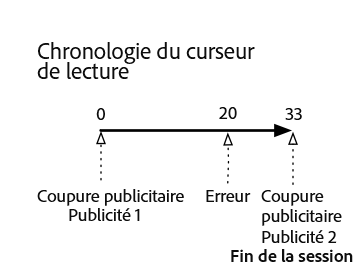
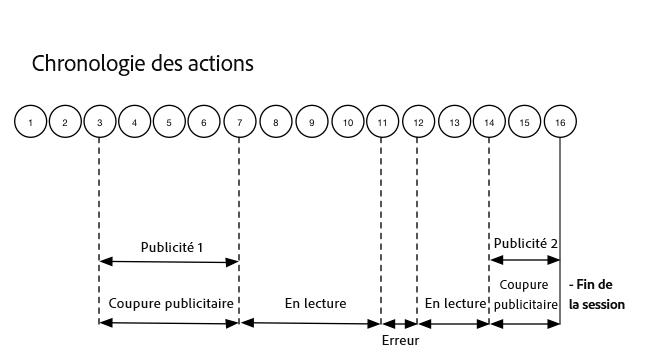

# Chronologie 2 : L’utilisateur abandonne la session {#timeline--2-user-abandons-session}

## VOD, publicité preroll, publicités mid-roll, utilisateur abandonne le contenu tôt

Les diagrammes suivants illustrent la chronologie du curseur de lecture et la chronologie correspondante des actions d’un utilisateur. Les détails de chaque action et des demandes qui l’accompagnent sont présentés ci-dessous.








## Détails de l’action

### Action 1 - Démarrage de la session {#Action-1}

| Action | Chronologie des actions (secondes) | Position du curseur de lecture (secondes) | Demande client |
| --- | :---: | :---: | --- |
| Bouton Lecture automatique ou bouton Lecture enfoncé | 0 | 0 | `/api/v1/sessions` |

**Détails de mise en œuvre**

Cet appel signale _l’intention de l’utilisateur de lire_ une vidéo. Il renvoie un ID de session (`{sid}`) au client, utilisé pour identifier tous les appels de suivi suivants dans la session. L’état du lecteur n’est pas encore « lecture », mais à la place, « démarrage ».  Les [paramètres de session obligatoires](/help/media-collection-api/mc-api-ref/mc-api-sessions-req.md) doivent être inclus dans la carte `params` du corps de la requête.  Sur le serveur principal, cet appel génère un appel de lancement d’Adobe Analytics.

**Exemple de corps de requête**

```
{
    playerTime: {
        playhead: 0,
        ts: <timestamp>
    },
    eventType:sessionStart, params: {
        "media.playerName": "sample-html5-api-player",
        "analytics.trackingServer": "[ _YOUR-TS_ ]",
        "analytics.reportSuite": "[ _YOUR-RSID_ ]",
        "analytics.visitorId": "[ _YOUR-VISITOR-ID_ ]",
        "media.contentType": "VOD",
        "media.length": 60.3333333333333,
        "media.id": "VA API Sample Player",
        "visitor.marketingCloudOrgId": "[YOUR-MCID]",
        "media.name": "ClickMe",
        "media.channel": "sample-channel",
        "media.sdkVersion": "va-api-0.0.0",
        "analytics.enableSSL": false
    }
}
```

### Action 2 - Démarrage du minuteur de ping {#Action-2}

| Action | Chronologie des actions (secondes) | Position du curseur de lecture (secondes) | Demande client |
| --- | :---: | :---: | --- |
| L’application démarre le minuteur d’événement de ping | 0 | 0 |  |

**Détails de mise en œuvre**

Démarrez le minuteur de ping de votre application. Le premier événement ping doit alors se déclencher après 1 seconde en cas de publicités preroll ou après 10 secondes dans le cas contraire.

### Action 3 - Début de la coupure publicitaire {#Action-3}

| Action | Chronologie des actions (secondes) | Position du curseur de lecture (secondes) | Demande client |
| --- | :---: | :---: | --- |
| Suivi du début de la coupure publicitaire preroll | 0 | 0 | `/api/v1/sessions/{sid}/events` |

**Détails de mise en œuvre**

Les publicités preroll doivent être suivies. Les publicités ne peuvent être suivies que dans une coupure publicitaire.

**Exemple de corps de requête**

```
{
    playerTime: {
        playhead: 0,
        ts: <timestamp>
    },
    eventType:adBreakStart, params: {
        "media.ad.podFriendlyName": "ad_pod1",
        "media.ad.podIndex": 0,
        "media.ad.podSecond": 0
    }
}
```

### Action 4 - Démarrage de la publicité {#Action-4}

| Action | Chronologie des actions (secondes) | Position du curseur de lecture (secondes) | Demande client |
| --- | :---: | :---: | --- |
| Le suivi de la publicité preroll N°1 commence | 0 | 0 | `/api/v1/sessions/{sid}/events` |

**Détails de mise en œuvre**

Une publicité de 12 secondes commence.

**Exemple de corps de requête**

```
{
    playerTime: {
        playhead: 0,
        ts: <timestamp>
    },
    eventType:adStart, params: {
        "media.ad.podFriendlyName": "ad_pod1",
        "media.ad.name": "Ad 1",
        "media.ad.id": "002",
        "media.ad.length": 7,
        "media.ad.podPosition": 1,
        "media.ad.playerName": "Sample Player",
        "media.ad.advertiser": "Ad Guys",
        "media.ad.campaignId": "1",
        "media.ad.creativeId": "42",
        "media.ad.siteId": "XYZ",
        "media.ad.creativeURL": "https://xyz-creative.com",
        "media.ad.placementId": "sample-placement2"
    },
}
```

### Action 5 - Pings de publicité {#Action-5}

| Action | Chronologie des actions (secondes) | Position du curseur de lecture (secondes) | Demande client |
| --- | :---: | :---: | --- |
| L’application envoie un événement ping | 1 | 0 | `/api/v1/sessions/{sid}/events` |

**Détails de mise en œuvre**

Envoyez un ping au serveur principal toutes les secondes. (Les pings de publicité suivants ne se pas montrés, dans un souci de concision.)

**Exemple de corps de requête**

```
{
    playerTime: {
        playhead: 0,
        ts: <timestamp>
    },
    eventType:ping
}
```

### Action 6 - Fin de la publicité {#Action-6}

| Action | Chronologie des actions (secondes) | Position du curseur de lecture (secondes) | Demande client |
| --- | :---: | :---: | --- |
| Le suivi de la publicité preroll N°1 est terminé | 12 | 0 | `/api/v1/sessions/{sid}/events` |

**Détails de mise en œuvre**

La première publicité preroll est terminée.

**Exemple de corps de requête**

```
{
    playerTime: {
        playhead: 0,
        ts: <timestamp>
    },
    eventType:adComplete
}
```

### Action 7 - Fin de la coupure publicitaire {#Action-7}

| Action | Chronologie des actions (secondes) | Position du curseur de lecture (secondes) | Demande client |
| --- | :---: | :---: | --- |
| Le suivi de la coupure publicitaire preroll est terminé | 12 | 0 | `/api/v1/sessions/{sid}/events` |

**Détails de mise en œuvre**

La coupure publicitaire est terminée. Tout au long de la coupure publicitaire, le lecteur est resté à l’état « lecture ».

**Exemple de corps de requête**

```
{
    playerTime: {
        playhead: 0,
        ts: <timestamp>
    },
    eventType:adBreakComplete
}
```

### Action 8 - Lecture du contenu {#Action-8}

| Action | Chronologie des actions (secondes) | Position du curseur de lecture (secondes) | Demande client |
| --- | :---: | :---: | --- |
| Suivi de l’événement de lecture | 12 | 0 | `/api/v1/sessions/{sid}/events` |

**Détails de mise en œuvre**

Déplacez le lecteur vers l’état « lecture » ; commencez le suivi du début de la lecture du contenu.

**Exemple de corps de requête**

```
{
    playerTime: {
        playhead: 0,
        ts: <timestamp>
    },
    eventType:play,
    qoeData: { bitrate: 10000 }
}
```

### Action 9 - Ping {#Action-9}

| Action | Chronologie des actions (secondes) | Position du curseur de lecture (secondes) | Demande client |
| --- | :---: | :---: | --- |
| L’application envoie un événement ping | 20 | 8 | `/api/v1/sessions/{sid}/events` |

**Détails de mise en œuvre**

Envoyez un ping au serveur principal toutes les 10 secondes.

**Exemple de corps de requête**

```
{
    playerTime: {
        playhead: 8ß,
        ts: <timestamp>
    },
    eventType:ping
}
```

### Action 10 - Ping {#Action-10}

| Action | Chronologie des actions (secondes) | Position du curseur de lecture (secondes) | Demande client |
| --- | :---: | :---: | --- |
| L’application envoie un événement ping | 30 | 18 | `/api/v1/sessions/{sid}/events` |

**Détails de mise en œuvre**

Envoyez un ping au serveur principal toutes les 10 secondes.

**Exemple de corps de requête**

```
{
    playerTime: {
        playhead: 18,
        ts: <timestamp>
    },
    eventType:ping
}
```

### Action 11 - Erreur {#Action-11}

| Action | Chronologie des actions (secondes) | Position du curseur de lecture (secondes) | Demande client |
| --- | :---: | :---: | --- |
| Une erreur se produit, l’application envoie des informations d’erreur. | 32 | 20 | `/api/v1/sessions/{sid}/events` |

**Détails de mise en œuvre**


**Exemple de corps de requête**

```
{
    playerTime: {
        playhead: 20,
        ts: <timestamp>
    },
    eventType:error
}
```

### Action 12 - Lecture du contenu {#Action-12}

| Action | Chronologie des actions (secondes) | Position du curseur de lecture (secondes) | Demande client |
| --- | :---: | :---: | --- |
| L’application récupère après l’erreur, l’utilisateur appuie sur Lecture. | 37 | 20 | `/api/v1/sessions/{sid}/events` |

**Détails de mise en œuvre**


**Exemple de corps de requête**

```
{
    playerTime: {
        playhead: 18,
        ts: <timestamp>
    },
    eventType:play, qoeData: { bitrate: 10000 }
}
```

### Action 13 - Ping {#Action-13}

| Action | Chronologie des actions (secondes) | Position du curseur de lecture (secondes) | Demande client |
| --- | :---: | :---: | --- |
| L’application envoie un événement ping | 40 | 28 | `/api/v1/sessions/{sid}/events` |

**Détails de mise en œuvre**

Envoyez un ping au serveur principal toutes les 10 secondes.

**Exemple de corps de requête**

```
{
    playerTime: {
        playhead: 28,
        ts: <timestamp>
    },
    eventType:ping
}
```

### Action 14 - Début de la coupure publicitaire {#Action-14}

| Action | Chronologie des actions (secondes) | Position du curseur de lecture (secondes) | Demande client |
| --- | :---: | :---: | --- |
| Le suivi de la coupure publicitaire mid-roll commence | 45 | 33 | `/api/v1/sessions/{sid}/events` |

**Détails de mise en œuvre**

Publicité mid-roll d’une durée de 8 secondes : envoyez `adBreakStart` .

**Exemple de corps de requête**

```
{
    playerTime: {
        playhead: 33,
        ts: <timestamp>
    },
    eventType:adBreakStart, params: {
        "media.ad.podFriendlyName": "ad_pod2",
        "media.ad.podIndex": 1,
        "media.ad.podSecond": 33
    }
}
```

### Action 15 - Démarrage de la publicité {#Action-15}

| Action | Chronologie des actions (secondes) | Position du curseur de lecture (secondes) | Demande client |
| --- | :---: | :---: | --- |
| Le suivi de la publicité mid-roll N°1 commence | 45 | 33 | `/api/v1/sessions/{sid}/events` |

**Détails de mise en œuvre**

Suivez la publicité mid-roll.

**Exemple de corps de requête**

```
{
    playerTime: { playhead: 33, ts: <timestamp>
    },
    eventType:adStart, params: {
        "media.ad.podFriendlyName": "ad_pod1",
        "media.ad.name": "Ad 1",
        "media.ad.id": "002",
        "media.ad.length": 8,
        "media.ad.podPosition": 1,
        "media.ad.playerName": "Sample Player",
        "media.ad.advertiser": "Ad Guys",
        "media.ad.campaignId": "7",
        "media.ad.creativeId": "40",
        "media.ad.siteId": "XYZ",
        "media.ad.creativeURL": "https://xyz_creative.com",
        "media.ad.placementId": "sample_placement2"
    },
}
```

### Action 16 - Fermeture de l’application {#Action-16}

| Action | Chronologie des actions (secondes) | Position du curseur de lecture (secondes) | Demande client |
| --- | :---: | :---: | --- |
| L’utilisateur ferme l’application. L’application détermine que l’utilisateur a abandonné l’affichage et ne revient pas sur cette session. | 48 | 33 | `/api/v1/sessions/{sid}/events` |

**Détails de mise en œuvre**

Envoyez `sessionEnd` au serveur principal VA pour indiquer que la session doit être fermée immédiatement, sans autre traitement.

**Exemple de corps de requête**

```
{
    playerTime: {
        playhead: 33,
        ts: <timestamp>
    },
    eventType:sessionEnd
}
```
