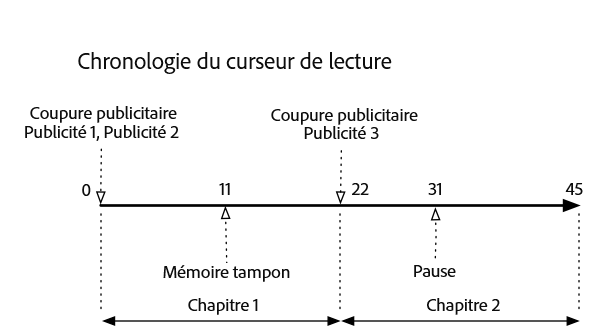
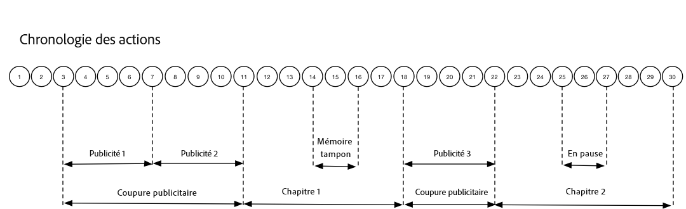

# Chronologie 3 : Chapitres {#timeline-3-chapters}

## VOD, publicités preroll, mise en pause, mise en mémoire tampon, affichage du contenu jusqu’à la fin


Les diagrammes suivants illustrent la chronologie du curseur de lecture et la chronologie correspondante des actions d’un utilisateur. Les détails de chaque action et des demandes qui l’accompagnent sont présentés ci-dessous.








## Détails de l’action


### Action 1 - Démarrage de la session {#Action-1}

| Action | Chronologie d’actions (secondes) | Position du curseur de lecture (secondes) | Requête client |
| --- | :---: | :---: | --- |
| Bouton de lecture automatique ou de lecture enfoncé, la vidéo commence à se charger. | 0 | 0 | `/api/v1/sessions` |

**Détails de mise en œuvre**

Cet appel signale _l’intention de l’utilisateur de lire_ une vidéo. Il renvoie un ID de session (`{sid}`) au client, utilisé pour identifier tous les appels de suivi suivants dans la session. L’état du lecteur n’est pas encore « lecture », mais à la place, « démarrage ». Les [paramètres de session obligatoires](/help/media-collection-api/mc-api-ref/mc-api-sessions-req.md) doivent être inclus dans la carte `params` du corps de la requête.  Sur le serveur principal, cet appel génère un appel de lancement d’Adobe Analytics.

**Exemple de corps de requête**

```
{
    playerTime: {
        playhead: 0,
        ts: <timestamp>
    },
    eventType:sessionStart, params: {
        "media.playerName": "sample-html5-api-player",
        "analytics.trackingServer": "[ _YOUR-TS_ ]",
        "analytics.reportSuite": "[ _YOUR_RSID_ ]",
        "analytics.visitorId": "[ _YOUR_VISITOR_ID_ ]",
        "media.contentType": "VOD",
        "media.length": 60.3333333333333,
        "media.id": "VA API Sample Player",
        "visitor.marketingCloudOrgId": "[YOUR_MCID]",
        "media.name": "ClickMe",
        "media.channel": "sample-channel",
        "media.sdkVersion": "va-api-0.0.0",
        "analytics.enableSSL": false
    }
}
```

### Action 2 - Démarrage du minuteur de ping {#Action-2}

| Action | Chronologie d’actions (secondes) | Position du curseur de lecture (secondes) | Requête client |
| --- | :---: | :---: | --- |
| L’application commence à envoyer un ping au minuteur d’événement | 0 | 0 |  |

**Détails de mise en œuvre**

Démarrez votre minuteur de ping. Le premier événement ping doit alors se déclencher après 1 seconde en cas de publicités preroll ou après 10 secondes dans le cas contraire.

### Action 3 - Début de la coupure publicitaire {#Action-3}

| Action | Chronologie d’actions (secondes) | Position du curseur de lecture (secondes) | Requête client |
| --- | :---: | :---: | --- |
| Suivez le démarrage de la coupure publicitaire preroll | 0 | 0 | `/api/v1/sessions/{sid}/events` |

**Détails de mise en œuvre**

Les publicités ne peuvent être suivies que dans une coupure publicitaire.

**Exemple de corps de requête**

```
{
    playerTime: {
        playhead: 0,
        ts: <timestamp>
    },
    eventType:adBreakStart, params: {
        "media.ad.podFriendlyName": "ad_pod1",
        "media.ad.podIndex": 0, "media.ad.podSecond": 0
    }
}
```

### Action 4 - Démarrage de la publicité {#Action-4}

| Action | Chronologie d’actions (secondes) | Position du curseur de lecture (secondes) | Requête client |
| --- | :---: | :---: | --- |
| Suivez le démarrage de la publicité preroll #1 | 0 | 0 | `/api/v1/sessions/{sid}/events` |

**Détails de mise en œuvre**

Démarrez le suivi de la première publicité preroll, qui dure 15 secondes. Incluez des métadonnées personnalisées avec ce `adStart` .

**Exemple de corps de requête**

```
{
    playerTime: {
        playhead: 0,
        ts: <timestamp>
    },
    eventType:adStart, params: {
        "media.ad.podFriendlyName": "ad_pod1",
        "media.ad.name": "Ad 1",
        "media.ad.id": "001",
        "media.ad.length": 15,
        "media.ad.podPosition": 1,
        "media.ad.playerName": "Sample Player",
        "media.ad.advertiser": "Ad Guys",
        "media.ad.campaignId": "1",
        "media.ad.creativeId": "42",
        "media.ad.siteId": "XYZ",
        "media.ad.creativeURL": "https://xyz_creative.com",
        "media.ad.placementId": "sample_placement"
    },
    customMetadata: {
        "myCustomData1": "CustomData1",
        "myCustomData2": "CustomData2"
    }
}
```

### Action 5 - Pings de publicité {#Action-5}

| Action | Chronologie d’actions (secondes) | Position du curseur de lecture (secondes) | Requête client |
| --- | :---: | :---: | --- |
| L’application envoie un événement ping | 10 | 0 | `/api/v1/sessions/{sid}/events` |

**Détails de mise en œuvre**

Envoyez un ping au serveur principal toutes les secondes. (Les pings de publicité suivants ne sont pas montrés par souci de concision.)

**Exemple de corps de requête**

```
{
    playerTime: {
        playhead: 0,
        ts: <timestamp>
    },
    eventType:ping
}
```

### Action 6 - Fin de la publicité {#Action-6}

| Action | Chronologie d’actions (secondes) | Position du curseur de lecture (secondes) | Requête client |
| --- | :---: | :---: | --- |
| Suivez la fin de la publicité preroll #1 | 15 | 0 | `/api/v1/sessions/{sid}/events` |

**Détails de mise en œuvre**

Suivez la fin de la première publicité preroll.

**Exemple de corps de requête**

```
{
    playerTime: {
        playhead: 0,
        ts: <timestamp>
    },
    eventType:adComplete
}
```

### Action 7 - Démarrage de la publicité {#Action-7}

| Action | Chronologie d’actions (secondes) | Position du curseur de lecture (secondes) | Requête client |
| --- | :---: | :---: | --- |
| Suivez le démarrage de la publicité preroll #2 | 15 | 0 | `/api/v1/sessions/{sid}/events` |

**Détails de mise en œuvre**

Suivez le début de la seconde publicité preroll, qui dure 7 secondes.

**Exemple de corps de requête**

```
{
    playerTime: {
        playhead: 0,
        ts: <timestamp>
    },
    eventType:adStart, params: {
        "media.ad.podFriendlyName": "ad_pod1",
        "media.ad.name": "Ad 2",
        "media.ad.id": "002",
        "media.ad.length": 7,
        "media.ad.podPosition": 1,
        "media.ad.playerName": "Sample Player",
        "media.ad.advertiser": "Ad Guys",
        "media.ad.campaignId": "2",
        "media.ad.creativeId": "44",
        "media.ad.siteId": "XYZ",
        "media.ad.creativeURL": "https://xyz_creative.com",
        "media.ad.placementId": "sample_placement2"
    },
}
```

### Action 8 - Pings de publicité {#Action-8}

| Action | Chronologie d’actions (secondes) | Position du curseur de lecture (secondes) | Requête client |
| --- | :---: | :---: | --- |
| L’application envoie un événement ping | 16 | 0 | `/api/v1/sessions/{sid}/events` |

**Détails de mise en œuvre**

Envoyez un ping au serveur principal toutes les secondes. (Les pings de publicité suivants ne sont pas montrés par souci de concision.)

**Exemple de corps de requête**

```
{
    playerTime: {
        playhead: 0,
        ts: <timestamp>
    },
    eventType:ping
}
```

### Action 9 - Fin de la publicité {#Action-9}

| Action | Chronologie d’actions (secondes) | Position du curseur de lecture (secondes) | Requête client |
| --- | :---: | :---: | --- |
| Suivez la fin de la publicité preroll #2 | 22 | 0 | `/api/v1/sessions/{sid}/events` |

**Détails de mise en œuvre**

Suivez la fin de la seconde publicité preroll.

**Exemple de corps de requête**

```
{
    playerTime: {
        playhead: 0,
        ts: <timestamp>
    },
    eventType:adComplete
}
```

### Action 10 - Fin de la coupure publicitaire {#Action-10}

| Action | Chronologie d’actions (secondes) | Position du curseur de lecture (secondes) | Requête client |
| --- | :---: | :---: | --- |
| Suivez la fin de la coupure publicitaire preroll | 22 | 0 | `/api/v1/sessions/{sid}/events` |

**Détails de mise en œuvre**

La coupure publicitaire est terminée. Du début à la fin de la coupure publicitaire, l’état de lecture est resté sur « lecture ».

**Exemple de corps de requête**

```
{
    playerTime: {
        playhead: 0,
        ts: <timestamp>
    },
    eventType:adBreakComplete
}
```

### Action 11 - Lecture du contenu {#Action-11}

| Action | Chronologie d’actions (secondes) | Position du curseur de lecture (secondes) | Requête client |
| --- | :---: | :---: | --- |
| Suivez l’événement de lecture | 22 | 0 | `/api/v1/sessions/{sid}/events` |

**Détails de mise en œuvre**

Après l’événement `adBreakComplete`, placez le lecteur dans l’état « lecture » à l’aide de l’événement `play`.

**Exemple de corps de requête**

```
{
    playerTime: {
        playhead: 0,
        ts: <timestamp>
    },
    eventType:play
}
```

### Action 12 - Début du chapitre {#Action-12}

| Action | Chronologie d’actions (secondes) | Position du curseur de lecture (secondes) | Requête client |
| --- | :---: | :---: | --- |
| Suivez l’événement de démarrage de chapitre | 23 | 1 | `/api/v1/sessions/{sid}/events` |

**Détails de mise en œuvre**

Après l’événement de lecture, suivez le début du premier chapitre.

**Exemple de corps de requête**

```
{
    playerTime: {
        playhead: 0,
        ts: <timestamp>
    },
    eventType:chapterStart, params: {
        "media.chapter.index": 1,
        "media.chapter.offset": 0, "media.chapter.length": 20, "media.chapter.friendlyName": "Chapter Uno"
    },
}
```

### Action 13 - Ping {#Action-13}

| Action | Chronologie d’actions (secondes) | Position du curseur de lecture (secondes) | Requête client |
| --- | :---: | :---: | --- |
| L’application envoie un événement ping | 30 | 8 | `/api/v1/sessions/{sid}/events` |

**Détails de mise en œuvre**

Envoyez un ping au serveur principal toutes les 10 secondes.

**Exemple de corps de requête**

```
{
    playerTime: {
        playhead: 8,
        ts: <timestamp>
    },
    eventType:ping
}
```

### Action 14 - Début de la mémoire tampon {#Action-14}

| Action | Chronologie d’actions (secondes) | Position du curseur de lecture (secondes) | Requête client |
| --- | :---: | :---: | --- |
| Un événement de début de mise en mémoire tampon s’est produit | 33 | 11 | `/api/v1/sessions/{sid}/events` |

**Détails de mise en œuvre**

Suivez le déplacement à l’état « mise en mémoire tampon ».

**Exemple de corps de requête**

```
{
    playerTime: {
        playhead: 11,
        ts: <timestamp>
    },
    eventType:bufferStart
}
```

### Action 15 - Fin de la mémoire tampon (lecture) {#Action-15}

| Action | Chronologie d’actions (secondes) | Position du curseur de lecture (secondes) | Requête client |
| --- | :---: | :---: | --- |
| Mise en mémoire tampon terminée, l’application suit la reprise du contenu. | 36 | 11 | `/api/v1/sessions/{sid}/events` |

**Détails de mise en œuvre**

La mise en mémoire tampon se terminant au bout de 3 secondes, replacez le lecteur à l’état « lecture ». Vous devez envoyer un autre événement de suivi de lecture provenant de la mise en mémoire tampon.  **L’appel`play`après un`bufferStart`impliquant un appel « bufferEnd » au serveur principal,** un événement `bufferEnd` n’est pas nécessaire.

**Exemple de corps de requête**

```
{
    playerTime: {
        playhead: 11,
        ts: <timestamp>
    },
    eventType:play
}
```

### Action 16 - Ping {#Action-16}

| Action | Chronologie d’actions (secondes) | Position du curseur de lecture (secondes) | Requête client |
| --- | :---: | :---: | --- |
| L’application envoie un événement ping | 40 | 15 | `/api/v1/sessions/{sid}/events` |

**Détails de mise en œuvre**

Envoyez un ping au serveur principal toutes les 10 secondes.

**Exemple de corps de requête**

```
{
    playerTime: {
        playhead: 15,
        ts: <timestamp>
    },
    eventType:ping
}
```

### Action 17 - Fin du chapitre {#Action-17}

| Action | Chronologie d’actions (secondes) | Position du curseur de lecture (secondes) | Requête client |
| --- | :---: | :---: | --- |
| Fin du suivi du chapitre par l’application | 45 | 20 | `/api/v1/sessions/{sid}/events` |

**Détails de mise en œuvre**

Le premier chapitre se termine, juste avant la seconde coupure publicitaire.

**Exemple de corps de requête**

```
{
    playerTime: {
        playhead: 20,
        ts: <timestamp>
    },
    eventType:chapterEnd
}
```

### Action 18 - Début de la coupure publicitaire {#Action-18}

| Action | Chronologie d’actions (secondes) | Position du curseur de lecture (secondes) | Requête client |
| --- | :---: | :---: | --- |
| Suivez le démarrage de la coupure publicitaire mid-roll | 46 | 21 | `/api/v1/sessions/{sid}/events` |

**Détails de mise en œuvre**

Publicité mid-roll d’une durée de 8 secondes : envoyez `adBreakStart` .

**Exemple de corps de requête**

```
{
    playerTime: {
        playhead: 21,
        ts: <timestamp>
    },
    eventType:adBreakStart, params: {
        "media.ad.podFriendlyName": "ad_pod2",
        "media.ad.podIndex": 1, "media.ad.podSecond": 21
    }
}
```

### Action 19 - Démarrage de la publicité {#Action-19}

| Action | Chronologie d’actions (secondes) | Position du curseur de lecture (secondes) | Requête client |
| --- | :---: | :---: | --- |
| Suivez le démarrage de la publicité mid-roll #3 | 46 | 21 | `/api/v1/sessions/{sid}/events` |

**Détails de mise en œuvre**

Suivez la publicité mid-roll.

**Exemple de corps de requête**

```
{
    playerTime: {
        playhead: 21,
        ts: <timestamp>
    },
    eventType:adStart, params: {
        "media.ad.podFriendlyName": "ad_pod2",
        "media.ad.name": "Ad 3",
        "media.ad.id": "003",
        "media.ad.length": 8,
        "media.ad.podPosition": 2,
        "media.ad.playerName": "Sample Player",
        "media.ad.advertiser": "Ad Guys",
        "media.ad.campaignId": "7",
        "media.ad.creativeId": "40",
        "media.ad.siteId": "XYZ",
        "media.ad.creativeURL": "https://xyz_creative.com",
        "media.ad.placementId": "sample_placement2"
    },
}
```

### Action 20 - Pings de publicité {#Action-20}

| Action | Chronologie d’actions (secondes) | Position du curseur de lecture (secondes) | Requête client |
| --- | :---: | :---: | --- |
| L’application envoie un événement ping | 47 | 21 | `/api/v1/sessions/{sid}/events` |

**Détails de mise en œuvre**

Envoyez un ping au serveur principal toutes les secondes. (Les pings de publicité suivants ne sont pas montrés par souci de concision.)

**Exemple de corps de requête**

```
{
    playerTime: {
        playhead: 21,
        ts: <timestamp>
    },
    eventType:ping
}
```

### Action 21 - Fin de la publicité {#Action-21}

| Action | Chronologie d’actions (secondes) | Position du curseur de lecture (secondes) | Requête client |
| --- | :---: | :---: | --- |
| Suivez la fin de la publicité mid-roll #1 | 54 | 21 | `/api/v1/sessions/{sid}/events` |

**Détails de mise en œuvre**

La publicité mid-roll est terminée.

**Exemple de corps de requête**

```
{
    playerTime: {
        playhead: 21,
        ts: <timestamp>
    },
    eventType:adComplete
}
```

### Action 22 - Fin de la coupure publicitaire {#Action-22}

| Action | Chronologie d’actions (secondes) | Position du curseur de lecture (secondes) | Requête client |
| --- | :---: | :---: | --- |
| Suivez la fin de la coupure publicitaire mid-roll | 54 | 21 | `/api/v1/sessions/{sid}/events` |

**Détails de mise en œuvre**

La coupure publicitaire est terminée.

**Exemple de corps de requête**

```
{
    playerTime: {
        playhead: 21,
        ts: <timestamp>
    },
    eventType:adBreakComplete
}
```

### Action 23 - Début du chapitre {#Action-23}

| Action | Chronologie d’actions (secondes) | Position du curseur de lecture (secondes) | Requête client |
| --- | :---: | :---: | --- |
| Suivez le début du chapitre 2 | 55 | 22 | `/api/v1/sessions/{sid}/events` |

**Détails de mise en œuvre**


**Exemple de corps de requête**

```
{
    playerTime: {
        playhead: 22,
        ts: <timestamp>
    },
    eventType:chapterStart, params: {
        "media.chapter.index": 2,
        "media.chapter.offset": 22, "media.chapter.length": 22, "media.chapter.friendlyName": "Chapter Dos"
    },
}
```

### Action 24 - Ping {#Action-24}

| Action | Chronologie d’actions (secondes) | Position du curseur de lecture (secondes) | Requête client |
| --- | :---: | :---: | --- |
| L’application envoie un événement ping | 60 | 27 | `/api/v1/sessions/{sid}/events` |

**Détails de mise en œuvre**

Envoyez un ping au serveur principal toutes les 10 secondes.

**Exemple de corps de requête**

```
{
    playerTime: {
        playhead: 27,
        ts: <timestamp>
    },
    eventType:ping
}
```

### Action 25 - Pause {#Action-25}

| Action | Chronologie d’actions (secondes) | Position du curseur de lecture (secondes) | Requête client |
| --- | :---: | :---: | --- |
| L’utilisateur a appuyé sur Pause | 64 | 31 | `/api/v1/sessions/{sid}/events` |

**Détails de mise en œuvre**

L’action de l’utilisateur déplace l’état de lecture sur « pause ».

**Exemple de corps de requête**

```
{
    playerTime: {
        playhead: 31,
        ts: <timestamp>
    },
    eventType:pauseStart
}
```

### Action 26 - Ping {#Action-26}

| Action | Chronologie d’actions (secondes) | Position du curseur de lecture (secondes) | Requête client |
| --- | :---: | :---: | --- |
| L’application envoie un événement ping | 70 | 31 | `/api/v1/sessions/{sid}/events` |

**Détails de mise en œuvre**

Envoyez un ping au serveur principal toutes les 10 secondes. Le lecteur est toujours dans l’état « mise en mémoire tampon » ; l’utilisateur est bloqué à 20 secondes de contenu. Fuming...

**Exemple de corps de requête**

```
{
    playerTime: {
        playhead: 31,
        ts: <timestamp>
    },
    eventType:ping
}
```

### Action 27 - Lecture du contenu {#Action-27}

| Action | Chronologie d’actions (secondes) | Position du curseur de lecture (secondes) | Requête client |
| --- | :---: | :---: | --- |
| L’utilisateur a appuyé sur Lecture pour reprendre le contenu principal. | 74 | 31 | `/api/v1/sessions/{sid}/events` |

**Détails de mise en œuvre**

Déplacez l’état de lecture sur « lecture ».  **L’appel`play`après un événement`pauseStart`impliquant un appel « resume » au serveur principal**, un événement `resume` n’est pas nécessaire.

**Exemple de corps de requête**

```
{
    playerTime: {
        playhead: 31,
        ts: <timestamp>
    },
    eventType:play
}
```

### Action 28 - Ping {#Action-28}

| Action | Chronologie d’actions (secondes) | Position du curseur de lecture (secondes) | Requête client |
| --- | :---: | :---: | --- |
| L’application envoie un événement ping | 80 | 37 | `/api/v1/sessions/{sid}/events` |

**Détails de mise en œuvre**

Envoyez un ping au serveur principal toutes les 10 secondes.

**Exemple de corps de requête**

```
{
    playerTime: {
        playhead: 37,
        ts: <timestamp>
    },
    eventType:ping
}
```

### Action 29 - Fin du chapitre {#Action-29}

| Action | Chronologie d’actions (secondes) | Position du curseur de lecture (secondes) | Requête client |
| --- | :---: | :---: | --- |
| Le chapitre 2 se termine | 87 | 44 | `/api/v1/sessions/{sid}/events` |

**Détails de mise en œuvre**

Suivez la fin du second chapitre et du dernier chapitre.

**Exemple de corps de requête**

```
{
    playerTime: {
        playhead: 0,
        ts: <timestamp>
    },
    eventType:chapterEnd
}
```

### Action 30 - Fin de la session {#Action-30}

| Action | Chronologie d’actions (secondes) | Position du curseur de lecture (secondes) | Requête client |
| --- | :---: | :---: | --- |
| L’utilisateur termine de regarder le contenu jusqu’à la fin. | 88 | 45 | `/api/v1/sessions/{sid}/events` |

**Détails de mise en œuvre**

Envoyez `sessionComplete` au serveur principal pour indiquer que l’utilisateur a fini de regarder le contenu entier.

**Exemple de corps de requête**

```
{
    playerTime: {
        playhead: 45,
        ts: <timestamp>
    },
    eventType:sessionComplete
}
```


>[!NOTE]
>
>**Aucun événement de recherche ? -** Il n’y a pas de prise en charge explicite des événements `seekStart` ou `seekComplete` dans l’API Media Collection. En effet, certains lecteurs génèrent une grande quantité de ces événements lorsque l’utilisateur final fait défiler le contenu, et plusieurs centaines d’utilisateurs pourraient facilement bloquer la bande passante réseau d’un service principal. Adobe s’efforce d’assurer une prise en charge explicite des événements de recherche en calculant la durée des pulsations selon l’horodatage de l’appareil plutôt que selon la position du curseur de lecture.

