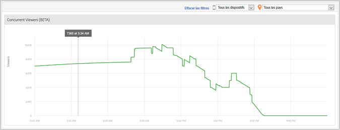

# Visionneuses simultanées de médias{#media-concurrent-viewers}

Le tableau de bord des visionneuses simultanées de médias affiche les visiteurs simultanés pendant une journée. Les données peuvent être filtrées par contenu, type de périphérique ou pays.

>[!TIP]
>
> Ce rapport est basé sur des sessions de médias actives simultanées.  Pour afficher les observateurs simultanés par visiteur unique, avec les fonctionnalités supplémentaires d’application d’un segment, de ventilation et de comparaison, utilisez le [Panneau Observateurs simultanés de médias dans Analysis Workspace](https://experienceleague.adobe.com/docs/analytics/analyze/analysis-workspace/panels/media-concurrent-viewers.html?lang=fr).

## Fonctionnalités du rapport {#report-features}

Voici quelques caractéristiques de ce rapport :

* Il n’est pas en temps réel. Il présente une latence normale dans Adobe Analytics.
* Le rapport couvre une période de 24 heures. L’axe X est l’heure de la journée en fonction du fuseau horaire de la suite de rapports.
* Cette option affiche les vues simultanées avec une granularité par minute.
* Il existe un rapport *Visionneuses simultanées de médias* qui montre le nombre de visiteurs qui regardent ou écoutent tout le contenu.
* Le rapport *Détails du média* contient un rapport Visionneuses simultanées qui indique le nombre de visiteurs qui regardent ou écoutent un élément multimédia spécifique.
* Le rapport ne fonctionne que sur une seule journée.
* Le client peut examiner les rapports de visionneuses simultanées historiques (limités à un seul jour).

## Limites {#limitations}

Voici quelques limites de ce rapport :

* Aucune donnée ne s’affiche si l’intervalle sélectionné n’est pas un jour entier.
* Vous ne pouvez pas exporter les données, telles que ReportBuilder.
* Vous ne pouvez pas présenter les données sous forme de tableau.
* Vous ne pouvez pas envoyer de rapport par email.
* Même si vous n’effectuez pas le suivi des publicités, vous devez réactiver le suivi des médias et sélectionner le module Media Ad.
* Cette fonctionnalité fournit des données précises lors de l’utilisation d’une bibliothèque de pulsations dotée de fonctionnalités de suivi Pause.
