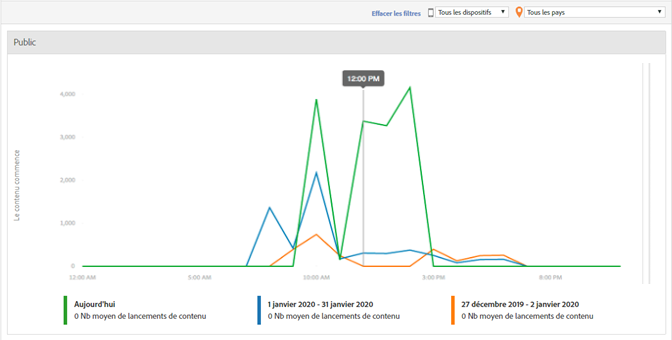

# Tranche horaire du média {#media-daypart}

Le tableau de bord Tranche horaire du média affiche les démarrages de contenu par tranche horaire afin de vous permettre de déterminer le moment où votre audience est engagée.  
