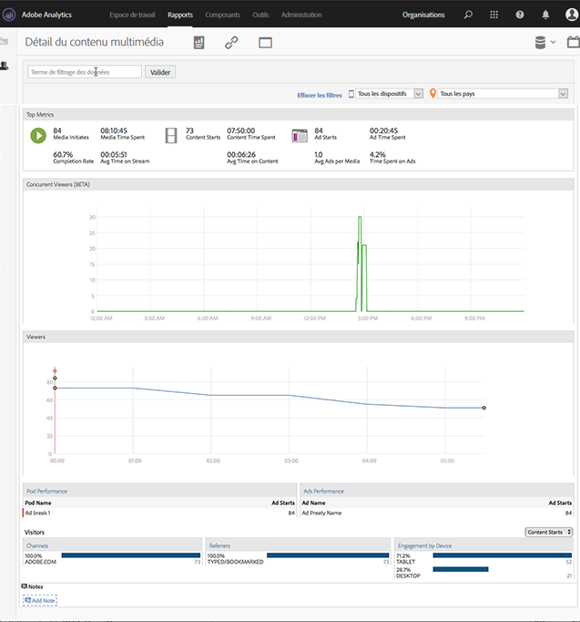

# Détails du média{#media-detail}

Le tableau de bord Détails du média affiche des mesures détaillées pour tout le contenu, notamment les observateur ou les auditeurs simultanés, les démarrages de contenu, le taux d’achèvement, la durée de consommation et les démarrages de publicités.

