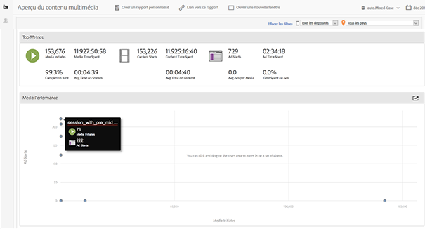
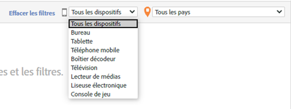
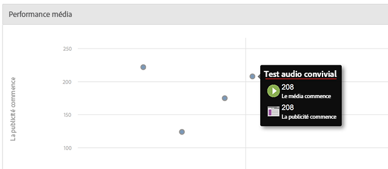

# Présentation multimédia{#media-overview}

Le tableau de bord Présentation multimédia est conçu pour vous permettre de contrôler les médias sur votre site. L’affichage Présentation multimédia montre plusieurs mesures consolidées afin de vérifier rapidement que les médias fonctionnent comme prévu. Un graphique affiche les démarrages de contenu en regard des démarrages de publicités pour vous donner un aperçu rapide de ces mesures pour chaque élément multimédia.

{width = « 672 px »}

## Filtres rapides {#section_8DF3E4A6734145B082657C6BECFA0BBE}

Affiche rapidement les mesures multimédia par appareil ou pays géographique :

{width = « 400 px »}

## Performances multimédia {#section_288FB476EDA44761BB8A86551F0A110C}

Effectuez un cliquer-glisser pour zoomer, puis survolez des médias spécifiques pour afficher des mesures granulaires. Cliquez sur  

pour réinitialiser la vue après un zoom.

{width = « 400 px »}

