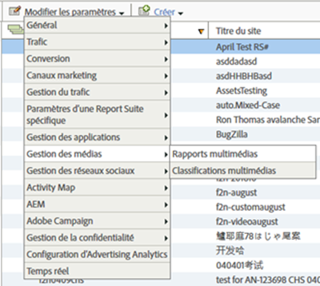

# Activation des rapports multimédia{#media-reports-enablement}

Chaque suite de rapports qui collecte des mesures de média doit être configurée avant l’envoi des données de média.

>[!TIP]
>
>Pour tirer parti des nouvelles fonctionnalités, les clients Media Analytics existants doivent réactiver le suivi des médias pour leurs RSID.

1. In [Reports &amp; Analytics](https://my.omniture.com/login/) click **[!UICONTROL Admin &gt; Report Suites].**
1. Select the report suite(s) where you are collecting media data and click **[!UICONTROL Edit Settings &gt; Media Management &gt; Media Reporting].**

   {width="400px"}

1. On the **[!UICONTROL Media Reporting]** page, enable **[!UICONTROL Media Core],** and optionally enable **[!UICONTROL Media Ads],** **[!UICONTROL Media Chapters],** and **[!UICONTROL Media Quality].**

   La mesure multimédia inclut les modules suivants :

   * **Noyau multimédia**

      La mesure des médias principaux est utilisée pour le contenu multimédia. Les eVars de solution (ou personnalisées) permettent de suivre le contenu, le type de contenu, le nom du lecteur de contenu et le canal de contenu. Les événements de solution (ou personnalisés) seront utilisés pour les démarrages de médias, les démarrages de contenu, les fins de contenu et le temps passé sur le contenu.

   * **Publicités du contenu multimédia**

      La mesure des publicités multimédia est utilisée pour la mesure des publicités dans le contenu multimédia. Elle utilise les eVars de solution pour mesurer la publicité, le nom du lecteur de publicités, la capsule et la position de la publicité dans la capsule. Les événements de solution serviront pour les démarrages et les fins de publicités, ainsi que le temps passé sur la publicité et la vidéo.

   * **Chapitres du contenu multimédia**

      La mesure des chapitres vidéo sert à mesurer les chapitres. Un chapitre est une sous-division du contenu au sein d’un média unique. Cette mesure utilise une eVar de solution pour stocker l’identifiant de chapitre. Les événements de solution seront utilisés pour les démarrages de chapitres, les chapitres terminés et le temps passé par chapitre. Les métadonnées de chapitre supplémentaires, de nom et de position seront fournies comme des classifications de l’identifiant de chapitre.

   * **Qualité du contenu multimédia**

      La mesure de la qualité vidéo sert à mesurer la qualité de la lecture du contenu. Elle utilise les eVars de solution pour stocker le temps jusqu’au début, les événements de mémoire tampon, la durée totale de la mémoire tampon, les permutations de débit, le débit moyen, les erreurs et les pertes d’images. Les événements de solution seront utilisés pour le temps jusqu’au début, les pertes avant le début, les diffusions touchées par la mémoire tampon, les événements de mémoire tampon, la durée totale de la mémoire tampon, les diffusions touchées par les changements de débit, les changements de débit, le débit moyen, les diffusions touchées par les erreurs, les événements d’erreur, les diffusions touchées par les images perdues et les pertes d’images.

   * **Métadonnées vidéo et de publicité vidéo**

      Les métadonnées peuvent être jointes à un média et/ou à une publicité pour décrire et classer ces médias/publicités par catégorie. Les métadonnées normalisées des médias et des publicités seront collectées par le biais des variables et des classifications de solution. Les valeurs comprennent : Programme, Saison, Épisode, ID de ressource, Genre, Date de première diffusion, Date de première distribution numérique, Évaluation du contenu, Émetteur, Réseau, Type de programme, Chargements de publicité, MVPD, Autorisé, Partie de la journée, ID de session multimédia, Annonceur, ID de campagne et ID d’élément créatif.

   * **Métadonnées de contenu audio et de publicité audio**

      Des métadonnées peuvent être associées à un contenu audio et/ou à une publicité pour la décrire et la classer. Les métadonnées normalisées de contenu audio et de publicité seront collectées par le biais des classifications et des variables de solution. Les valeurs à inclure sont les suivantes : Artiste, Album, Libellé, Auteur, Éditeur, Station, Programme, Saison, Épisode, ID de ressource, Genre, Première date de diffusion, Première date numérique, Évaluation du contenu, Émetteur, Type de programme, Chargements de publicité, Partie de la journée, ID de session multimédia, Annonceur, ID de campagne et ID d’élément créatif.
   L’activation de chaque module réserve une série de variables et crée une nouvelle série de rapports. À l’exception de la qualité, les rapports ne contiendront aucune donnée, à moins que la mise en œuvre correspondante n’ait été effectuée. La mise en œuvre du module noyau met également en œuvre le module de qualité si vous l’activez.

   Si vous n’effectuez pas encore de suivi de publicités, de chapitres ou de qualité de lecture, vous pouvez activer des options supplémentaires à tout moment.

1. Cliquez sur **[!UICONTROL Enregistrer].**

   If this report suite is already configured to collect media data, after you click **[!UICONTROL Save]**, an additional configuration page is displayed. Si la page **[!UICONTROL Mesure Noyau multimédia]s’affiche, passez à l’étape suivante.**

1. (Conditional) On the **[!UICONTROL Media Core measurement]** page, choose to continue using custom variables or choose to use solution variables.

   | Option | Remarques |
   | --- | --- |
   | Continuer à utiliser les variables personnalisées | Avantages et inconvénients :<ul> <li> **Avantages** : La tendance Contenu fonctionne toujours après la migration. </li> <li> **** Cons : Vous oblige à conserver deux eVars personnalisées et trois événements personnalisés alloués au média. Vous retrouvez l’usage d’une eVar personnalisée et d’un événement personnalisé. </li> </ul> Continuer à utiliser les variables personnalisées : <ol> <li>Select **[!UICONTROL Use Custom Variables,]** then click **[!UICONTROL Save.]** </li> <li>When prompted, map your current custom eVars and events and then click **[!UICONTROL Save:]** </li> </ol> |
   | Migrez vers les variables de solution | Avantages et inconvénients :<ul> <li> **Avantages** : Vous retrouvez l’usage de trois eVar personnalisées et de quatre événements personnalisés. </li> <li> **Inconvénients** : Vous perdez **toutes** les tendances historiques et la comparaison des rapports multimédia. Cela signifie que vous ne pouvez pas suivre les affichages de contenu ou la durée de lecture du contenu pour les dates antérieures à votre migration vers Heartbeats. </li> </ul> **Restriction :** Ne migrez pas vers des variables de solution à moins d’être sûr que vous ne voulez pas conserver ces tendances. Tous les clients doivent utiliser les variables de solution et les règles de traitement pour affecter les données multimédia aux props et eVars existants uniquement s’ils souhaitent conserver une continuité historique. Pour migrer vers des variables de solution : Sélectionnez **[!UICONTROL Utiliser les variables]** de solution et cliquez sur **[!UICONTROL Enregistrer].**    IMPORTANT : La migration vers des variables de solution entraîne la perte de **toutes les** tendances historiques et de la comparaison pour les rapports sur les médias. |

>[!IMPORTANT]
>
>Ne modifiez pas les noms de classification des variables répertoriées dans les tableaux Mesures et métadonnées (paramètres audio et vidéo, par exemple) qui y sont décrites sous Variable de création de rapports/réservée comme "classification". Les classifications des médias sont définies lorsqu’une suite de rapports est activée pour le suivi des médias. De temps à autre, Adobe ajoute de nouvelles propriétés. Dans ce cas, les clients doivent réactiver leurs suites de rapports pour accéder aux nouvelles propriétés du média. Au cours du processus de mise à jour, Adobe détermine si les classifications sont activées en vérifiant les noms des variables. Si l’un d’eux est manquant, Adobe en rajoute de nouveau.
