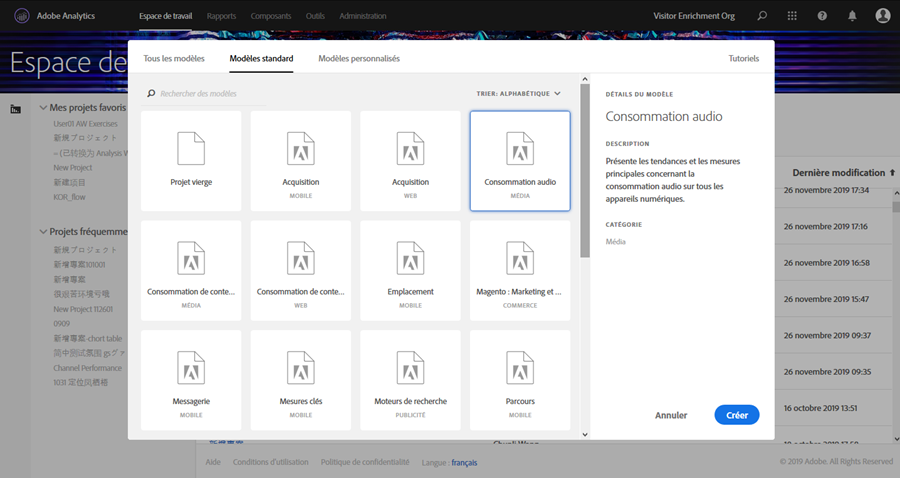
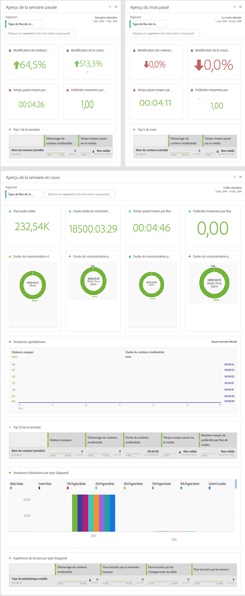

# Modèles d’espaces de travail multimédia{#media-workspace-templates}

Adobe Analytics Workspace vous permet de configurer rapidement des tableaux de bord pour analyser vos données de suivi. Lorsque vous créez un projet, ou lorsque vous accédez à Workspace pour gérer un projet existant, vous pouvez choisir entre des modèles standard qui couvrent les scénarios de suivi général courants, par exemple Acquisition, Consommation des médias en flux continu, et plus encore. Vous pouvez également créer, modifier et enregistrer vos propres modèles personnalisés.

Vous utilisez des modèles de l’onglet Workspace dans Adobe Analytics lorsque vous créez ou gérez un projet. Dans un premier temps, lorsque vous accédez à Workspace, les options de création d’un projet ou d’ouverture d’un projet existant s’affichent :

* **Créer un nouveau projet -** Lorsque vous cliquez sur le bouton **[!UICONTROL Créer un nouveau projet]** dans Workspace, une boîte de dialogue s’affiche et vous permet de sélectionner un modèle parmi votre collection (dont Standard et Personnalisé) :

   

   Par exemple, si vous choisissez le modèle **[!UICONTROL Consommation audio]**, un projet avec le tableau de bord suivant axé sur le contenu audio s’affiche :

   

* **Gérer des projets -** Dans un projet existant, vous pouvez modifier la présentation des données et utiliser l’option « Enregistrer sous » pour créer votre propre collection de modèles personnalisés.
