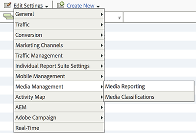

# Activation des rapports multimédia {#media-reports-enablement}

Chaque suite de rapports qui collecte des mesures multimédia doit être configurée avant que les données multimédia ne soient envoyées.

Les clients expérimentés peuvent utiliser les panneaux de médias dans Analysis Workspace seulement après que Media Core et le suivi ont été activés pour [Qualité d’expérience](/help/use-cases/track-qos/track-qos-overview.md).

>[!TIP]
>
>Pour tirer parti des nouvelles fonctionnalités, les clients de médias en flux continu existants doivent réactiver le suivi multimédia pour leurs RSID.

1. Dans [Reports &amp; Analytics](https://my.omniture.com/login/) cliquez sur **[!UICONTROL Administration > Suites de rapports].**
1. Sélectionnez la ou les suite(s) de rapports à l’emplacement où vous effectuez la collecte de données multimédia, puis cliquez sur **[!UICONTROL Modifier les paramètres > Gestion des médias > Création de rapports multimédia].**

   

1. Sur la page **[!UICONTROL Création de rapports multimédia]**, activez **[!UICONTROL Noyau multimédia]** et éventuellement **[!UICONTROL Publicités multimédia],** **[!UICONTROL Chapitres multimédia],** et **[!UICONTROL Qualité multimédia].**

   La mesure multimédia inclut les modules suivants :

   * **Noyau multimédia**

     La mesure des médias principaux est utilisée pour le contenu multimédia. Celle-ci utilise des eVars de solution (ou personnalisées) pour suivre le contenu, le type de contenu, le nom du lecteur de contenu et le canal de contenu. Les événements de solution (ou personnalisés) serviront pour les démarrages de média, les démarrages et les fins de contenu et le temps passé sur le contenu.

   * **Publicités du contenu multimédia**

     La mesure Publicités multimédia est utilisée pour la mesure des publicités dans le contenu multimédia. Elle utilise les eVars de solution pour mesurer la publicité, le nom du lecteur de publicités, la capsule et la position de la publicité dans la capsule. Les événements de solution serviront pour les démarrages et les fins de publicités, ainsi que le temps passé sur la publicité et la vidéo.

   * **Chapitres du contenu multimédia**

     La mesure Chapitres multimédia sert à mesurer les chapitres. Un chapitre est une sous-section de contenu dans un média. Cette mesure utilise une eVar de solution pour stocker l’identifiant de chapitre. Les événements de solution seront utilisés pour les démarrages de chapitres, les chapitres terminés et le temps passé par chapitre. Les métadonnées de chapitre supplémentaires, de nom et de position seront fournies comme des classifications de l’identifiant de chapitre.

   * **Qualité du contenu multimédia**

     La mesure Qualité vidéo sert à mesurer la qualité de lecture du contenu. Elle utilise les eVars de solution pour stocker le temps jusqu’au début, les événements de mémoire tampon, la durée totale de la mémoire tampon, les permutations de débit, le débit moyen, les erreurs et les pertes d’images. Les événements de solution seront utilisés pour le temps jusqu’au début, les pertes avant le début, les diffusions touchées par la mémoire tampon, les événements de mémoire tampon, la durée totale de la mémoire tampon, les diffusions touchées par les changements de débit, les changements de débit, le débit moyen, les diffusions touchées par les erreurs, les événements d’erreur, les diffusions touchées par les images perdues et les pertes d’images.

   * **Métadonnées vidéo et de publicité vidéo**

     Des métadonnées peuvent être liées à un média et/ou une publicité pour apporter des détails supplémentaires et attribuer une catégorie à ce média ou cette publicité. Des métadonnées normalisées et des métadonnées de publicité sont collectées à l’aide de classifications et de variables de solution. Les valeurs comprennent : Programme, Saison, Épisode, ID de ressource, Genre, Date de première diffusion, Date de première distribution numérique, Évaluation du contenu, Émetteur, Réseau, Type de programme, Chargements de publicité, MVPD, Autorisé, Partie de la journée, ID de session multimédia, Annonceur, ID de campagne et ID d’élément créatif.

   * **Métadonnées de contenu audio et de publicité audio**

     Des métadonnées peuvent être associées à un contenu audio et/ou à une publicité pour la décrire et la classer. Les métadonnées normalisées de contenu audio et de publicité seront collectées par le biais des classifications et des variables de solution. Les valeurs à inclure sont les suivantes : Artiste, Album, Libellé, Auteur, Éditeur, Station, Programme, Saison, Épisode, ID de ressource, Genre, Première date de diffusion, Première date numérique, Évaluation du contenu, Émetteur, Type de programme, Chargements de publicité, Partie de la journée, ID de session multimédia, Annonceur, ID de campagne et ID d’élément créatif.

   L’activation de chaque module réserve une série de variables et crée une nouvelle série de rapports. À l’exception de la qualité, les rapports ne contiendront aucune donnée, à moins que la mise en œuvre correspondante n’ait été effectuée. La mise en œuvre du module Core met également en œuvre le module de qualité si vous l’activez.

   Si vous n’effectuez pas encore de suivi de publicités, de chapitres ou de qualité de lecture, vous pouvez activer des options supplémentaires à tout moment.

1. Cliquez sur **[!UICONTROL Enregistrer].**

   Si cette suite de rapports est déjà configurée pour collecter les données multimédia, une fois que vous avez cliqué sur **[!UICONTROL Enregistrer]**, une page de configuration supplémentaire s’affiche. Si la page **[!UICONTROL Mesure Noyau multimédia]** s’affiche, passez à l’étape suivante.

1. (Facultatif) Sur la page **[!UICONTROL Mesure Noyau multimédia]**, choisissez si vous souhaitez continuer à utiliser les variables personnalisées ou si vous souhaitez utiliser des variables de solution.

   | Option | Notes |
   | --- | --- |
   | Continuer à utiliser les variables personnalisées | Avantages et inconvénients :<ul> <li> **Avantages** : La tendance Contenu fonctionne toujours après la migration. </li> <li> **Inconvénients :** Vous devez garder deux eVars personnalisées et trois événements personnalisés qui sont attribués au média. Vous retrouvez l’usage d’une eVar personnalisée et d’un événement personnalisé. </li> </ul> Pour continuer à utiliser les variables personnalisées : <ol> <li>Sélectionnez **[!UICONTROL Utiliser des variables personnalisées]**, puis cliquez sur **[!UICONTROL Enregistrer.]** </li> <li>Lorsque vous y êtes invité, mappez les eVars et événements personnalisés, puis cliquez sur **[!UICONTROL Enregistrer]** : </li> </ol> |
   | Migrez vers les variables de solution | Avantages et inconvénients :<ul> <li> **Avantages :** vous retrouvez l’usage de trois eVar personnalisées et de quatre événements personnalisés. </li> <li> **Inconvénients :** vous perdez **toutes** les tendances historiques et la comparaison des rapports multimédia. Cela signifie que vous ne pouvez pas suivre les affichages de contenu ou la durée de lecture du contenu pour les dates antérieures à votre migration vers Heartbeats. </li> </ul> **Restriction :** Ne migrez pas vers des variables de solution à moins d’être sûr que vous ne voulez pas conserver ces tendances. Tous les clients doivent utiliser les variables de solution et les règles de traitement pour affecter les données multimédia aux props et eVars existants uniquement s’ils souhaitent conserver une continuité historique. Pour migrer vers des variables de solution : sélectionnez **[!UICONTROL Utiliser les variables de solution]** et cliquez sur **[!UICONTROL Enregistrer].**    IMPORTANT : la migration vers des variables de solution vous fait perdre **toutes** les tendances historiques et la comparaison des rapports multimédia. |

>[!IMPORTANT]
>
>Ne modifiez pas les noms de classification des variables répertoriées dans les tableaux Mesures et métadonnées (par exemple, [Paramètres audio et vidéo](/help/implementation/variables/audio-video-parameters.md)) qui sont décrits comme « classification » sous Variable de création de rapports/réservée. Les classifications des médias sont définies lorsqu’une suite de rapports est activée pour le suivi multimédia. De temps à autre, Adobe ajoute de nouvelles propriétés. Dans ce cas, les clients doivent réactiver leurs suites de rapports pour accéder aux nouvelles propriétés du média. Au cours du processus de mise à jour, Adobe détermine si les classifications sont activées en vérifiant les noms des variables. Si l’un d’eux manque, Adobe l’ajoute à nouveau.
