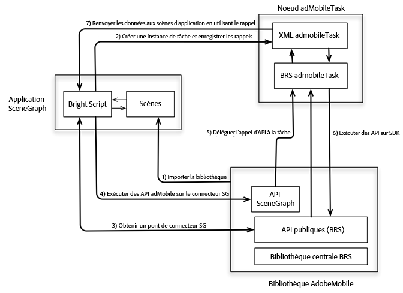

# Suivi dans SceneGraph (Roku){#tracking-in-scenegraph-roku}

## Introduction {#section_vfr_zcz_y2b}

Roku a introduit une nouvelle structure de programmation pour le développement d’applications : la structure de programmation SceneGraph XML. Cette nouvelle structure propose deux nouveaux concepts clés :

* Rendu SceneGraph des écrans d’application
* Configuration XML des écrans SceneGraph

Le kit Adobe Mobile SDK for Roku est écrit en BrightScript. Le kit SDK utilise de nombreux composants qui ne sont pas disponibles pour une application s’exécutant sur SceneGraph (par exemple, les threads). Par conséquent, un développeur d’applications Roku souhaitant utiliser la structure SceneGraph ne peut pas appeler les API du kit SDK Adobe Mobile (ces dernières sont identiques à celles disponibles dans les applications BrightScript existantes).

## Architecture {#section_dj5_1dz_y2b}

Pour ajouter la prise en charge de SceneGraph au kit SDK AdobeMobile, Adobe a ajouté une nouvelle API qui crée un pont de connecteur entre le kit SDK AdobeMobile et `adbmobileTask`. Le second est un nœud SceneGraph utilisé pour l’exécution de l’API du kit SDK. (L’utilisation d’`adbmobileTask` est expliquée en détail dans tout le reste de ce document.)

Le pont de connecteur est conçu pour effectuer les opérations suivantes :

* Le pont renvoie une instance compatible avec SceneGraph du kit SDK AdobeMobile. Le SDK compatible avec SceneGraph comporte toutes les API prises en charge par le kit SDK existant.
* Vous utilisez les API du kit SDK AdobeMobile dans SceneGraph presque comme vous utilisiez les API existantes.
* Le pont expose également un mécanisme pour écouter les rappels des API qui renvoient certaines données.



## Composants {#section_jwl_wqx_1bb}

**Application SceneGraph :**

* Utilise les `AdobeMobileLibrary`API   via les API de pont de connecteur SceneGraph.
* Enregistre les rappels de réponse sur `adbmobileTask` pour les variables de données de sortie attendues.

**AdobeMobileLibrary:**

* Expose un ensemble d’API publiques (existantes), y compris l’API de pont de connecteur.
* Renvoie une instance de connecteur SceneGraph qui englobe toutes les API publiques existantes.
* Communique avec un nœud SceneGraph `adbmobileTask` pour l’exécution des API.

**Nœud adbmobileTask :**

* Nœud de tâche SceneGraph qui exécute les `AdobeMobileLibrary`API   sur un thread d’arrière-plan.
* Agit en tant que délégué pour renvoyer des données aux scènes d’application.

## API SceneGraph publiques {#section_jyd_hdz_y2b}

### ADBMobileConnector

| Catégorie | Nom de méthode | Description |
|---|---|---|
| **Constantes** |  |  |
|  | `sceneGraphConstants` | Returns an object containing `SceneGraphConstants`. Reportez-vous au tableau ci-dessus pour plus de détails. |
|  |  |  |
| **Journalisation de débogage** |  |  |
|  | `setDebugLogging` | API SceneGraph permettant de définir la journalisation de débogage sur le kit SDK ADBMobile. |
|  | `getDebugLogging` | API SceneGraph permettant d’obtenir la journalisation de débogage du kit SDK ADBMobile. |
|  | Pour plus d’informations, reportez-vous à la section Journalisation de débogage du kit SDK hérité. |  |
|  |  |  |
| **État de désinscription/confidentialité** |  |  |
|  | `setPrivacyStatus` | API SceneGraph permettant de définir l’état de confidentialité sur le kit SDK ADBMobile. |
|  | `getPrivacyStatus` | API SceneGraph permettant d’obtenir l’état de confidentialité du kit SDK ADBMobile. |
|  | Pour plus d’informations, reportez-vous à la section État de désinscription/confidentialité du kit SDK hérité. |  |
|  |  |  |
|  **Analytics** |  |  |
|  | `trackState` | API SceneGraph permettant de suivre l’état sur le kit SDK ADBMobile. |
|  | `trackAction` | API SceneGraph permettant de suivre l’action sur le kit SDK ADBMobile. |
|  | `trackingIdentifier` | API SceneGraph permettant d’obtenir un identifiant de suivi à partir du kit SDK ADBMobile. |
|  | `userIdentifier` | API SceneGraph permettant d’obtenir un identifiant d’utilisateur du kit SDK ADBMobile. |
|  | `setUserIdentifier` | API SceneGraph permettant de définir l’identifiant d’utilisateur sur le kit SDK ADBMobile. |
|  | `getAllIdentifiers` | L’API SceneGraph récupère toutes les identités d’utilisateur connues et conservées par le kit SDK Roku. |
|  | Pour plus d’informations, reportez-vous à la section Analytics du kit SDK hérité. |  |
|  |  |  |
| **Experience Cloud** |  |  |
|  | `visitorSyncIdentifiers` | API SceneGraph permettant de synchroniser les identifiants Experience Cloud sur le kit SDK ADBMobile. |
|  | `visitorMarketingCloudID` | API SceneGraph permettant d’obtenir l’Experience Cloud ID de visiteur depuis le kit SDK ADBMobile. |
|  | Pour plus d’informations, reportez-vous à la section Experience Cloud du kit SDK hérité. |  |
|  |  |  |
| **Audience Manager** |  |  |
|  | `audienceSubmitSignal` | API SceneGraph permettant d’envoyer un signal de gestion de l’audience avec caractéristique. |
|  | `audienceVisitorProfile` | API SceneGraph permettant d’obtenir un profil de visiteur Audience Manager du kit SDK ADBMobile. |
|  | `audienceDpid` | API SceneGraph permettant d’obtenir un DPID d’audience du kit SDK ADBMobile. |
|  | `audienceDpuuid` | API SceneGraph permettant d’obtenir un DPUUID d’audience du kit SDK ADBMobile. |
|  | `audienceSetDpidAndDpuuid` | API SceneGraph permettant de définir le DPID et le DPUUID d’audience sur le kit SDK ADBMobile. |
|  | Pour plus d’informations, reportez-vous à la section Audience Manager du kit SDK hérité. |  |
|  |  |  |
| **MediaHeartbeat** |  |  |
|  | `mediaTrackLoad` | API SceneGraph permettant de charger du contenu vidéo pour le suivi MediaHeartbeat. |
|  | mediaTrackStart | API SceneGraph permettant de démarrer la session de suivi vidéo à l’aide de MediaHeartbeat. |
|  | `mediaTrackUnload` | API SceneGraph permettant de décharger le contenu vidéo depuis le suivi MediaHeartbeat. |
|  | `mediaTrackPlay` | API SceneGraph permettant de suivre la lecture du contenu vidéo. |
|  | mediaTrackPause | API SceneGraph permettant de suivre le contenu vidéo en pause. |
|  | `mediaTrackComplete` | API SceneGraph permettant de suivre la fin du contenu vidéo. |
|  | `mediaTrackError` | API SceneGraph permettant de suivre les erreurs de lecture. |
|  | mediaTrackEvent | API SceneGraph permettant de suivre les événements de lecture au cours du suivi. Par exemple : Publicités, chapitres. |
|  | `mediaUpdatePlayhead` | API SceneGraph permettant d’envoyer des mises à jour playhead à MediaHeartbeat pendant le suivi vidéo. |
|  | `mediaUpdateQoS` | API SceneGraph permettant d’envoyer des mises à jour QoS à MediaHeartbeat pendant le suivi vidéo. |
|  | Pour plus d’informations, reportez-vous à la section MediaHeartbeat du kit SDK hérité. |  |

### SceneGraphConstants

| Nom de constante | Description |
|---|---|
| `API_RESPONSE` | Used to retrieve the response object from `adbmobileTask` node's `adbmobileApiResponse` field |
| `DEBUG_LOGGING` | Used as `apiName` for `getDebugLogging` |
| `PRIVACY_STATUS` | Used as `apiName` for `getPrivacyStatus` |
| `TRACKING_IDENTIFIER` | Used as `apiName` for `trackingIdentifier` |
| `USER_IDENTIFIER` | Used as `apiName` for `userIdentifier` |
| `VISITOR_MARKETING_CLOUD_ID` | Used as `apiName` for `visitorMarketingCloudID` |
| `AUDIENCE_VISITOR_PROFILE` | Used as `apiName` for `audienceVisitorProfile` |
| `AUDIENCE_DPID` | Used as `apiName` for `audienceDpid` |
| `AUDIENCE_DPUUID` | Used as `apiName` for `audienceDpuuid` |

### Nœud adbmobileTask

<table>
<thead>
<tr>
<td> Champ </td><td> Type </td><td> Par défaut </td><td> Utilisation </td>
</tr>
</thead>
<tbody>
<tr>
<td> adbmobileApiCall </td>
<td> assocarray </td>
<td> Non valide </td>
<td> Ne modifiez PAS ce champ ou laissez l’application l’utiliser. Ce champ est utilisé par le composant SceneGraphConnector ADBMobile pour acheminer les appels API via les nœuds SceneGraph et pour récupérer les réponses. Par conséquent, cette clé/ce champ est réservé(e) à la compatibilité AdobeMobileSDK pour SceneGraph. <b>Important :</b> Une modification apportée à ce champ peut entraîner un mauvais fonctionnement d’AdobeMobileSDK.</td>
</tr>
<tr>
<td> adbmobileApiResponse </td>
<td> assocarray </td>
<td> Non valide </td>
<td> En lecture seule Toutes les API exécutées sur adobemobilesdk renvoient des réponses sur ce champ. Enregistrez un rappel pour écouter les mises à jour de ce champ afin de recevoir les objets de réponse. Le format de l’objet de réponse est le suivant :  
<codeblock>
response = {« apiname » : &lt; Scenegraphconstants.
 API_ NAME &gt; 
 « Returnvalue : &lt; API_ RESPONSE &gt;} 
</codeblock>
Une instance de cet objet de réponse sera envoyée pour tout appel API sur AdobeMobileSDK qui doit renvoyer une valeur conformément au guide de référence d’API. Par exemple, un appel d'API pour visitormarketingcloudid () renvoie l'objet de réponse suivant : 
<codeblock>
response = {« apiname » : m.
 adbmobileconstants.
 VISITOR_ MARKETING_ CLOUD_ ID 
 « Returnvalue : « 07050 x 25671 x 33760 x 72644 x 14 »} 
</codeblock>
OU, les données de réponse peuvent également être non valides : 
<codeblock>
response = { 
 « Apiname » : m.
 adbmobileconstants.
 VISITOR_ MARKETING_ CLOUD_ ID 
 « Returnvalue : invalid} 
</codeblock>
</td>
</tr>
</tbody>
</table>

### `adbmobile.brs`

#### `getADBMobileConnectorInstance`

Signature API: `ADBMobile().getADBMobileConnectorInstance()`\
Input: `adbmobileTask`
Return Type: `ADBMobileConnector`

#### `sgConstants`

API Signature: `ADBMobile().sgConstants()`
Input: None\
Type de retour: `SceneGraphConstants`

>[!NOTE]
>Refer to the `ADBMobileConnector` API reference for details.

### Constantes ADBMobile

|  Fonctionnalité  | Nom de constante | Description   |
|---|---|---|
| Contrôle de version | `version` | Constante permettant de récupérer les informations de version AdobeMobileLibrary |
| Confidentialité/désinscription | `PRIVACY_STATUS_OPT_IN` | Constante pour l’état de confidentialité choisi |
|  | `PRIVACY_STATUS_OPT_OUT` | Constante pour l’état de confidentialité abandonné |
| Constantes MediaHeartbeat | Consultez les constantes de cette page : <br/><br/>[Méthodes Media Heartbeat.](../../sdk-implement/track-av-playback/track-core/track-core-roku.md) | Utilisation de ces constantes avec les API mediaheartbeat |
| Métadonnées standard | Reportez-vous aux constantes de cette page : <br/><br/>[Paramètres de métadonnées standard.](../../sdk-implement/track-av-playback/impl-std-metadata/impl-std-metadata-roku.md) | Utilisez ces constantes pour joindre des métadonnées de type vidéo/publicitaire standard dans des API MediaHeartbeat |

Globally defined utility `MediaHeartbeat` APIs on the legacy AdobeMobileLibrary are accessible *as is* in the SceneGraph enviromnent because they do not use any Brightscript components that are unavailable in SceneGraph nodes. Pour plus d’informations sur ces méthodes, consultez le tableau ci-dessous :

### Méthodes globales pour MediaHeartbeat

| Méthode | Description |
| --- | --- |
| `adb_media_init_mediainfo` | Cette méthode renvoie un objet d’informations de média initialisé.`Function adb_media_init_mediainfo(name As String, id As String, length As Double, streamType As String) As Object` |
| `adb_media_init_adinfo` | Cette méthode renvoie un objet d’informations de publicité initialisé `Function adb_media_init_adinfo(name As String, id As String, position As Double, length As Double) As Object` |
| `adb_media_init_chapterinfo` | Cette méthode renvoie l’objet d’informations de chapitre initialisé.  `Function adb_media_init_adbreakinfo(name As String, startTime as Double, position as Double) As Object` |
| `adb_media_init_adbreakinfo` | Cette méthode renvoie l’objet Informations de l’AdBreak initialisé.  `Function adb_media_init_chapterinfo(name As String, position As Double, length As Double, startTime As Double) As Object` |
| `adb_media_init_qosinfo` | Cette méthode renvoie un objet d’informations QoS initialisé.  `Function adb_media_init_qosinfo(bitrate As Double, startupTime as Double, fps as Double, droppedFrames as Double) As Object` |

## Implémentation {#section_dbz_ydz_y2b}

1. **Télécharger la bibliothèque Roku -** Téléchargez la [dernière bibliothèque Roku.](https://github.com/Adobe-Marketing-Cloud/media-sdks/releases/tag/roku-v2.2.0)

1. **Configuration de votre environnement de développement**

   1. Copy `adbmobile.brs` (AdobeMobileLibrary) into your `pkg:/source/` directory.

   1. For Scene Graph support, copy `adbmobileTask.brs` and `adbMobileTask.xml` into your `pkg:/components/` directory.

1. **Initialisation**

   1. Import `adbmobile.brs` into your Scene.

      ```
      <script type="text/brightscript" uri="pkg:/source/adbmobile.brs" />
      ```

   1. Créez une occurrence du nœud `adbmobileTask` dans votre scène.

      ```
      m.adbmobileTask = createObject("roSGNode", "adbmobileTask")
      ```

   1. Obtenez une instance du connecteur `adbmobile` pour SceneGraph à l’aide de l’occurrence `adbmobileTask`.

      ```
      m.adbmobile = ADBMobile().getADBMobileConnectorInstance(m.adbmobileTask)
      ```

   1. Get `adbmobile` SG constants.

      ```
      m.adbmobileConstants = m.adbmobile.sceneGraphConstants()
      ```

   1. Enregistrez un rappel pour recevoir l’objet de réponse pour tous les appels de l’API `AdbMobile`.

      ```
      m.adbmobileTask.ObserveField(m.adbmobileConstants.API_RESPONSE,  
                                   "onAdbmobileApiResponse") 
      
      ' Sample implementation of the callback 
      ' Listen for all the constants for which API calls are made on the SDK 
      function onAdbmobileApiResponse() as void 
          responseObject = m.adbmobileTask[m.adbmobileConstants.API_RESPONSE] 
      
          if responseObject <> invalid 
              methodName = responseObject.apiName 
              retVal = responseObject.returnValue 
      
              if methodName = m.adbmobileConstants.DEBUG_LOGGING 
                  if retVal 
                      print "API Response: DEBUG LOGGING: " + "True" 
                  else 
                      print "API Response: DEBUG LOGGING: " + "False" 
                  endif 
              else if methodName = m.adbmobileConstants.PRIVACY_STATUS 
                  print "API Response: PRIVACY STATUS: " + retVal 
              else if methodName = m.adbmobileConstants.TRACKING_IDENTIFIER 
                  if retVal <> invalid 
                      print "API Response: TRACKING IDENTIFIER: " + retVal 
                  else 
                      print "API Response: TRACKING IDENTIFIER: " + "invalid" 
                  endif 
              else if methodName = m.adbmobileConstants.USER_IDENTIFIER 
                  if retVal <> invalid 
                      print "API Response: USER IDENTIFIER: " + retVal 
                  else 
                      print "API Response: USER IDENTIFIER: " + "invalid" 
                  endif 
              else if methodName = m.adbmobileConstants.VISITOR_MARKETING_CLOUD_ID 
                  if retVal <> invalid 
                      print "API Response: MCID: " + retVal 
                  else 
                      print "API Response: MCID: " + "invalid" 
                  endif 
              else if methodName = m.adbmobileConstants.AUDIENCE_DPID 
                  if retVal <> invalid 
                      print "API Response: AUDIENCE DPID: " + retVal 
                  else 
                      print "API Response: AUDIENCE DPID: " + "invalid" 
                  endif 
              else if methodName = m.adbmobileConstants.AUDIENCE_DPUUID 
                  if retVal <> invalid 
                      print "API Response: AUDIENCE DPUUID: " + retVal 
                  else 
                      print "API Response: AUDIENCE DPUUID: " + "invalid" 
                  endif 
              else if methodName = m.adbmobileConstants.AUDIENCE_VISITOR_PROFILE 
                  if retVal <> invalid 
                      print "API Response: AUDIENCE VISITOR PROFILE: Valid Object" 
                  else 
                      print "API Response: AUDIENCE VISITOR PROFILE: " + "invalid" 
                  endif 
              endif 
          endif 
      end function 
      ```

## Exemple de mise en œuvre {#section_mld_lfz_y2b}

### Exemples d’appels d’API sur le kit SDK hérité

```
'get an instance of SDK 
m.adbmobile = ADBMobile() 
   
'execute setter APIs 
m.adbmobile.setDebugLogging(true) 
   
'execute getter APIs 
debugLogging = m.adbmobile.getDebugLogging()
```

### Exemples d’appels d’API sur le kit SDK SG

```
'create adbmobileTask instance 
m.adbmobileTask = createObject("roSGNode", "adbmobileTask") 
   
'get an instance of SDK using task instance 
m.adbmobile =  
  ADBMobile().getADBMobileConnectorInstace(m.adbmobileTask) 
m.adbmobileConstants = m.adbmobile.sceneGraphConstants() 
'execute setter APIs 
m.adbmobile.setDebugLogging(true) 
  
'execute getter APIs 
m.adbmobileTask.ObserverField(m.adbConstants.API_RESPONSE,  
                              "onAdbmobileApiResponse") 
m.adbmobile.getDebugLogging() 
   
'listen for return data in registered callbacks 
function onAdbmobileApiResponse() as void 
    responseObject = m.adbmobileTask[m.adbmobileConstants.API_RESPONSE] 
  
        if responseObject <> invalid 
            methodName = responseObject.apiName 
            retVal = responseObject.returnValue 
  
        if methodName = m.adbmobileConstants.DEBUG_LOGGING 
            if retVal 
                print "API Response: DEBUG LOGGING: " + "True" 
            else 
                print "API Response: DEBUG LOGGING: " + "False" 
         endif 
    endif 
end function
```

