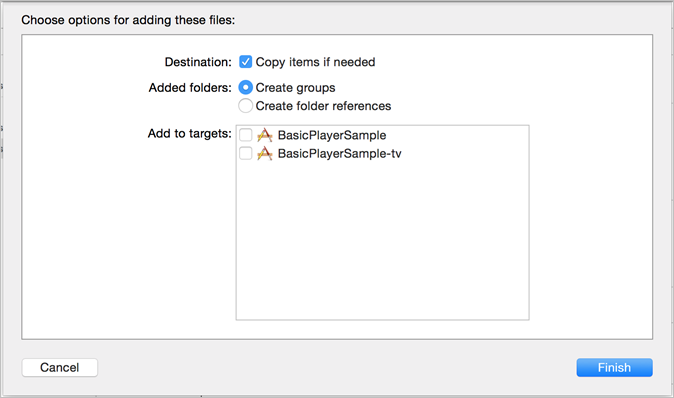

# Configuration d’iOS {#set-up-ios}

## Conditions préalables

* **Obtention de paramètres de configuration valides pour le SDK Media** Vous pouvez vous procurer ces paramètres auprès d’un représentant Adobe après avoir configuré votre compte Analytics.
* **Mise en œuvre d’ADBMobile pour iOS dans votre application** Pour plus d’informations sur la documentation du kit SDK Adobe Mobile, reportezvous à la rubrique [Kit SDK iOS 4.x pour les solutions Experience Cloud.](https://docs.adobe.com/content/help/fr-FR/mobile-services/ios/overview.html)

   >[!IMPORTANT]
   >
   >À partir d’iOS 9, Apple a introduit une fonction appelée ATS (App Transport Security). Cette fonctionnalité vise à améliorer la sécurité du réseau en veillant à ce que vos applications utilisent uniquement des protocoles et des algorithmes de chiffrement standard. Cette fonctionnalité est activée par défaut, mais vous disposez d’options de configuration vous permettant d’effectuer des choix quant à l’utilisation d’ATS. Pour plus d’informations sur ATS, voir [Sécurité du transport des applications.](https://docs.adobe.com/content/help/en/mobile-services/ios/config-ios/app-transport-security.html)

* **Fournissez les informations suivantes à votre lecteur multimédia :**

   * _Une API pour vous abonner aux événements du lecteur_ - Le SDK Media exige d’appeler un ensemble d’API simples lorsque des événements se produisent dans votre lecteur.
   * _Une API qui fournit des informations au lecteur_ - Ces informations incluent des éléments tels que le nom du média et la position de la tête de lecture.

## Implémentation du SDK

1. Ajoutez le SDK Media que vous avez [téléchargé](/help/sdk-implement/download-sdks.md#download-2x-sdks) à votre projet.

   1. Vérifiez que le répertoire `libs` contient les composants logiciels suivants :

      * `ADBMediaHeartbeat.h` : fichier d’en-tête Objective-C utilisé pour les API de suivi de la pulsation iOS.
      * `ADBMediaHeartbeatConfig.h` : fichier d’en-tête Objective-C utilisé pour la configuration du kit SDK.
      * `MediaSDK.a` : binaire gras en bytecode contenant les versions de bibliothèque pour les appareils (armv7, armv7s et arm64) et les simulateurs (i386 et x86_64) iOS.

         Ce binaire doit être lié lorsque la cible est destinée à une application iOS.

      * `MediaSDK_TV.a` : binaire gras en bytecode contenant les versions de bibliothèque pour les nouveaux appareils (arm64) et le nouveau simulateur (x86_64) Apple TV.

         Ce binaire doit être lié lorsque la cible est destinée à une application Apple TV (tvOS).
   1. Ajoutez la bibliothèque à votre projet :

      1. Lancez Xcode IDE et ouvrez votre application.
      1. In **[!UICONTROL Project Navigator]**, drag the `libs` directory and drop it under your project.

      1. Ensure that the **[!UICONTROL Copy Items if Needed]** checkbox is selected, the **[!UICONTROL Create Groups]** is selected, and none of the checkboxes in **[!UICONTROL Add to Target]** are selected.

         

      1. Cliquez sur **[!UICONTROL Finish]**.
      1. In **[!UICONTROL Project Navigator]**, select your app and select your targets.
      1. Link the required frameworks and libraries in the **[!UICONTROL Linked Frameworks]** and **[!UICONTROL Libraries]** section on the **[!UICONTROL General]** tab.

         **Cibles d’une application iOS :**

         * **AdobeMobileLibrary.a**
         * **MediaSDK.a**
         * **libsqlite3.0.tbd**
         **Cibles d’une application Apple TV (tvOS) :**

         * **AdobeMobileLibrary_TV.a**
         * **MediaSDK_TV.a**
         * **libsqlite3.0.tbd**
         * **SystemConfiguration.framework**
      1. Vérifiez qu’aucune erreur n’est générée lors de la création de votre application.


1. Importez la bibliothèque.

   ```
   #import "ADBMediaHeartbeat.h" 
   #import "ADBMediaHeartbeatConfig.h" 
   ```

1. Créez une instance `ADBMediaHeartbeatConfig`.

   Cette section vous aide à comprendre les paramètres de configuration `MediaHeartbeat` et à définir les bonnes valeurs de configuration sur votre instance `MediaHeartbeat` pour un suivi précis.

   Voici un exemple d’ `ADBMediaHeartbeatConfig` initialisation :

   ```
   // Media Heartbeat Initialization 
   ADBMediaHeartbeatConfig *config = [[ADBMediaHeartbeatConfig alloc] init]; 
   config.trackingServer = <SAMPLE_HEARTBEAT_TRACKING_SERVER>; 
   config.channel        = <SAMPLE_HEARTBEAT_CHANNEL>; 
   config.appVersion     = <SAMPLE_HEARTBEAT_SDK_VERSION>; 
   config.ovp            = <SAMPLE_HEARTBEAT_OVP_NAME>; 
   config.playerName     = <SAMPLE_PLAYER_NAME>; 
   config.ssl            = <YES/NO>; 
   config.debugLogging   = <YES/NO>; 
   ```

1. Mettez en œuvre le protocole `ADBMediaHeartbeatDelegate`.

   ```
   @interface VideoAnalyticsProvider : NSObject <ADBMediaHeartbeatDelegate> 
   
   @end 
   
   @implementation VideoAnalyticsProvider 
   
   // Replace <bitrate>, <startuptime>, <fps> and <droppeFrames>  
   // with the current playback QoS values. 
   - (ADBMediaObject *)getQoSObject { 
       return [ADBMediaHeartbeat createQoSObjectWithBitrate:<bitrate>  
                                 startupTime:<startuptime>   
                                 fps:<fps>  
                                 droppedFrames:<droppedFrames>]; 
   } 
   
   // Return the current video player playhead position. 
   // Replace <currentPlaybackTime> with the video player current playback time 
   - (NSTimeInterval)getCurrentPlaybackTime { 
       return <currentPlaybackTime>; 
   } 
   
   @end
   ```

1. Utilisez les instances `ADBMediaHeartBeatConfig` et `ADBMediaHeartBeatDelegate` pour créer l’instance `ADBMediaHeartbeat`.

   ```
   //Replace <ADBMediaHeartBeatDelegate> with your delegate instance 
   _mediaHeartbeat = [[ADBMediaHeartbeat alloc] initWithDelegate: 
     <ADBMediaHeartBeatDelegate> config:config];
   ```

   >[!IMPORTANT]
   >
   >Assurez-vous que votre instance `ADBMediaHeartbeat` est accessible et *reste attribuée jusqu’à la fin de la session*. Cette instance sera utilisée pour tous les événements de suivi suivants.

## Migration de la version 1.x vers 2.x sur iOS {#migrate-to-two-x}

Dans la version 2.x, toutes les méthodes publiques sont consolidées dans la classe `ADBMediaHeartbeat` pour faciliter le travail des développeurs. Toutes les configurations ont été consolidées dans la classe `ADBMediaHeartbeatConfig`.

Pour en savoir plus sur la migration de la version 1.x vers 2.x, consultez la rubrique [Migration de VHL 1.x vers 2.x.](/help/sdk-implement/va-1x-to-2x/mig-1x-2x-overview.md)

## Configuration d’une application native pour tvOS

Avec la sortie de la nouvelle Apple TV, vous pouvez désormais créer des applications s’exécutant dans l’environnement natif de tvOS. Vous pouvez soit créer une application complètement native, à l’aide des différentes structures disponibles dans iOS, soit créer votre application à l’aide de modèles XML et de JavaScript. La version 2.0 du SDK Media prend désormais en charge tvOS. Pour en savoir plus sur tvOS, consultez le [site du développeur tvOS.](https://developer.apple.com/tvos/)

Effectuez les étapes suivantes dans votre projet Xcode. Ce guide est rédigé en supposant que votre projet dispose d’une cible qui est une application Apple TV ciblant tvOS :

1. Faites glisser le fichier de bibliothèque `VideoHeartbeat_TV.a` dans le dossier `lib` de votre projet.

1. In the **[!UICONTROL Build Phases]** tab of your tvOS app’s target, expand the **[!UICONTROL Link Binary with Libraries]** section and add the following libraries:

   * `MediaSDK_TV.a`
   * `AdobeMobileLibrary_TV.a`
   * `libsqlite3.0.tbd`
   * `SystemConfiguration.framework`

