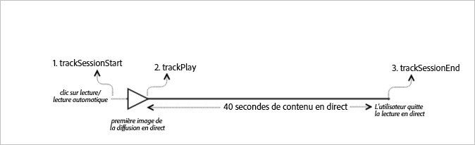

# Contenu principal en direct{#live-main-content}

## Scénario {#section_13BD203CBF7546D2A6AD0129B1EEB735}

Dans ce scénario, une ressource en direct sans publicité est lue pendant les 40 secondes suivant l’accès à la diffusion en direct.

| Déclencheur | Méthode Heartbeat | Appels réseau | Remarques   |
|---|---|---|---|
| User clicks **[!UICONTROL Play]** | `trackSessionStart` | Analytics Content Start, Heartbeat Content Start | Il peut s’agir d’un utilisateur qui clique sur **[!UICONTROL Lecture]ou d’un événement de lecture automatique.** |
| La première image du média est lue. | `trackPlay` | Heartbeat Content Play | Cette méthode déclenche le minuteur. Des pulsations sont envoyées toutes les 10 secondes pendant la lecture. |
| Le contenu est lu. |  | Content Heartbeats |  |
| La session est terminée. | `trackSessionEnd` |  | `SessionEnd` correspond à la fin d’une session de visionnage. Cette API doit être appelée même si l'utilisateur n'utilise pas le support à terminer. |

## Paramètres {#section_D52B325B99DA42108EF560873907E02C}

Un grand nombre de ces valeurs que vous pouvez voir dans les appels Adobe Analytics Content Start sont également présentes dans les appels Heartbeat Content Start. D'autres paramètres qu'Adobe utilise pour remplir les différents rapports Media dans Adobe Analytics s'affichent également. Nous ne les aborderons pas tous ici, mais seuls les plus importants.

### Heartbeat Content Start

| Paramètre | Valeur | Remarques |
|---|---|---|
| `s:sc:rsid` | &lt;Identifiant de votre suite de rapports Adobe&gt; |  |
| `s:sc:tracking_serve` | &lt;URL de votre serveur de suivi Analytics&gt; |  |
| `s:user:mid` | `s:user:mid` | Doit correspondre à la valeur intermédiaire de l’appel Adobe Analytics Content Start. |
| `s:event:type` | "start" |  |
| `s:asset:type` | "main" |  |
| `s:asset:mediao_id` | &lt; Nom de votre média &gt; |  |
| `s:stream:type` | live |  |
| `s:meta:*` | facultatif | Métadonnées personnalisées définies sur le support |

## Content Heartbeats {#section_7B387303851A43E5993F937AE2B146FE}

Lors de la lecture du média, un minuteur envoie une ou plusieurs pulsations (ou plages) toutes les 10 secondes pour le contenu principal et toutes les secondes pour les publicités. Ces pulsations contiennent des informations concernant entre autres la lecture, les publicités et la mise en mémoire tampon. Le présent document ne traite pas du contenu exact de chaque pulsation, mais il faut retenir ici que celles-ci sont déclenchées de façon continue au fil de la lecture.

Dans les pulsations du contenu, recherchez certains éléments spécifiques :

| Paramètre | Valeur | Remarques |
|---|---|---|
| `s:event:type` | "play" |  |
| `l:event:playhead` | &lt;position du curseur de lecture&gt; par exemple, 50, 60, 70 | Cela doit indiquer la position actuelle du curseur de lecture. |

## Heartbeat Content Complete {#section_2CA970213AF2457195901A93FC9D4D0D}

Il n'y aura pas d'appel complete dans ce scénario, car le flux en direct n'a jamais été terminé.

## Paramètres de valeur du curseur de lecture

Pour les flux en direct, vous devez définir la tête de lecture sur un décalage par rapport au moment où la programmation démarre, de sorte que dans les rapports, les analystes puissent déterminer à quel point les utilisateurs rejoignent et quittent le flux EN DIRECT dans une vue de 24 heures.

### Au début

Pour les médias en DIRECT, lorsqu'un utilisateur commence à lire le flux, vous devez définir `l:event:playhead` le décalage actuel, en secondes. Contrairement à VOD, vous pouvez définir la tête de lecture sur 0.

Par exemple, supposons qu'un événement de diffusion en flux continu DIRECT commence à minuit et s'exécute pendant 24 heures (`a.media.length=86400`; `l:asset:length=86400`). Supposons ensuite qu'un utilisateur commence à lire ce flux en direct à 12 h 00. Dans ce scénario, vous devez définir `l:event:playhead` 43200 (12 heures dans le flux).

### En pause

La même logique de « tête de lecture dynamique » appliquée au début de la lecture doit être appliquée lorsqu'un utilisateur interrompt la lecture. Lorsque l'utilisateur revient à la lecture du flux en direct, vous devez définir `l:event:playhead` la valeur sur la position de la nouvelle position du curseur de lecture, _et non_ sur le point où l'utilisateur a mis en pause le flux EN DIRECT.

## Exemple de code {#section_vct_j2j_x2b}



### Android

Voici la commande API prévue :

```java
// Set up mediaObject 
MediaObject mediaInfo = MediaHeartbeat.createMediaObject( 
  Configuration.MEDIA_NAME,  
  Configuration.MEDIA_ID,  
  Configuration.MEDIA_LENGTH,  
  MediaHeartbeat.StreamType.LIVE 
); 

HashMap<String, String> mediaMetadata = new HashMap<String, String>(); 
mediaMetadata.put(CUSTOM_VAL_1, CUSTOM_KEY_1); 
mediaMetadata.put(CUSTOM_VAL_2, CUSTOM_KEY_2); 

// 1. Call trackSessionStart() when the user clicks Play or if autoplay is used,  
//    i.e., there is an intent to start playback.  
_mediaHeartbeat.trackSessionStart(mediaInfo, mediaMetadata); 

...... 
...... 

// 2. Call trackPlay() when the playback actually starts, i.e., when the first  
//    frame of main content is rendered on the screen. 
_mediaHeartbeat.trackPlay(); 

....... 
....... 

// 3. Call trackSessionEnd() when user ends the playback session.  
//    Since the user does not watch live media to completion, there  
//    is no need to call trackComplete().  
_mediaHeartbeat.trackSessionEnd(); 
....... 
....... 
```

### iOS

Voici la commande API prévue :

```
// Set up mediaObject 
ADBMediaObject *mediaObject =  
[ADBMediaHeartbeat createMediaObjectWithName:MEDIA_NAME  
                   length:MEDIA_LENGTH  
                   streamType:ADBMediaHeartbeatStreamTypeLIVE]; 
 
NSMutableDictionary *mediaContextData = [[NSMutableDictionary alloc] init]; 
[mediaContextData setObject:CUSTOM_VAL_1 forKey:CUSTOM_KEY_1]; 
[mediaContextData setObject:CUSTOM_VAL_2 forKey:CUSTOM_KEY_2]; 
 
// 1. Call trackSessionStart when the user clicks Play or if autoplay is used,  
//    i.e., there is an intent to start playback. 
[_mediaHeartbeat trackSessionStart:mediaObject data:mediaContextData]; 
...... 
...... 
 
// 2. Call trackPlay when the playback actually starts, i.e., when the first  
//    frame of the main content is rendered on the screen. 
[_mediaHeartbeat trackPlay]; 
....... 
....... 
 
// 3. Call trackSessionEnd when user ends the playback session. Since the user  
//    does not watch live media to completion, there is no need to call  
//    trackComplete. 
[_mediaHeartbeat trackSessionEnd]; 
........ 
........ 
```

### JavaScript

Voici la commande API prévue :

```js
// Set up mediaObject 
var mediaInfo =  
MediaHeartbeat.createMediaObject(Configuration.MEDIA_NAME,  
                                 Configuration.MEDIA_ID,  
                                 Configuration.MEDIA_LENGTH,  
                                 MediaHeartbeat.StreamType.VOD); 

var mediaMetadata = { 
  CUSTOM_KEY_1 : CUSTOM_VAL_1,  
  CUSTOM_KEY_2 : CUSTOM_VAL_2,  
  CUSTOM_KEY_3 : CUSTOM_VAL_3 
}; 

// 1. Call trackSessionStart() when Play is clicked or if autoplay  
//    is used, i.e., there's an intent to start playback. 
this._mediaHeartbeat.trackSessionStart(mediaInfo, mediaMetadata); 

...... 
...... 

// 2. Call trackPlay() when the playback actually starts, i.e., when the  
//    first frame of media is rendered on the screen. 
this._mediaHeartbeat.trackPlay(); 

....... 
....... 

// 3. Call trackSessionEnd() when user ends the playback session.  
//    Since user does not watch live media to completion, there is  
//    no need to call trackComplete(). 
this._mediaHeartbeat.trackSessionEnd(); 

........ 
........ 
```

