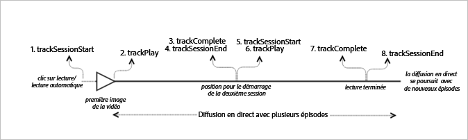

# Contenu principal en direct avec suivi séquentiel {#live-main-content-with-sequential-tracking}

## Scénario {#scenario}

Dans ce scénario, une ressource en direct sans publicité est lue pendant les 40 secondes suivant l’accès à la diffusion en direct.

Il s’agit du même scénario que [Lecture VOD sans publicité](/help/sdk-implement/tracking-scenarios/vod-no-intrs-details.md), mais une partie du contenu est parcourue manuellement et une recherche est effectuée d’un point à un autre du contenu principal.

| Déclencheur | Méthode Heartbeat |  Appels réseau  |  Remarques   |
| --- | --- | --- | --- |
| L’utilisateur clique sur [!UICONTROL Lecture]. | trackSessionStart | Analytics Content Start, Heartbeat Content Start | Étant donné que la bibliothèque de mesures ignore la présence d’une publicité preroll, ces appels réseau sont identiques au scénario [Lecture VOD sans publicité](/help/sdk-implement/tracking-scenarios/vod-no-intrs-details.md). |
| La première image du contenu s’affiche. | trackPlay | Heartbeat Content Play | Lorsque le contenu du chapitre est lu avant le contenu principal, les pulsations démarrent dès que le chapitre démarre. |
| Lecture du contenu |  | Content Heartbeats | Il s’agit du même appel réseau que le scénario [Lecture VOD sans publicité](/help/sdk-implement/tracking-scenarios/vod-no-intrs-details.md). |
| Fin de la session (fin de l’épisode 1) | trackComplete / trackSessionEnd | Heartbeat Content Complete | Complete signifie que la session 1 du 1er épisode a été terminée et visionnée jusqu’au bout. Cette session doit être terminée avant de démarrer celle de l’épisode suivant. |
| Démarrage de l’épisode 2 (démarrage de la session 2) | trackSessionStart | Analytics Content Start Heartbeat Content Start | Cela se produit lorsqu’un utilisateur a visionné un premier épisode suivi d’un autre épisode. |
| 1re image du média | trackPlay | Heartbeat Content Play | Cette méthode déclenche le minuteur et, dès lors, des pulsations sont envoyées toutes les 10 secondes pendant toute la durée de la lecture. |
| Lecture du contenu |  | Content Heartbeats |  |
| Fin de la session (fin de l’épisode 2) | trackComplete / trackSessionEnd | Heartbeat Content Complete | Complete signifie que la session 2 du 2e épisode a été terminée et visionnée jusqu’au bout. Cette session doit être terminée avant de démarrer celle de l’épisode suivant. |

## Paramètres {#parameters}

### Heartbeat Content Start

| Paramètre | Valeur | Remarques |
|---|---|---|
| `s:sc:rsid` | &lt;Identifiant de votre suite de rapports Adobe&gt; |  |
| `s:sc:tracking_serve` | &lt;URL de votre serveur de suivi Analytics&gt; |  |
| `s:user:mid` | `s:user:mid` | Doit correspondre à la valeur intermédiaire de l’appel Adobe Analytics Content Start. |
| `s:event:type` | `"start"` |  |
| `s:asset:type` | `"main"` |  |
| `s:asset:media_id` | &lt;Nom de votre média&gt; |  |
| `s:stream:type` | `live` |  |
| `s:meta:*` | *facultatif* | Métadonnées personnalisées définies sur le média |

## Heartbeat Content Play {#heartbeat-content-play}

Il semble presque identique à l’appel Heartbeat Content Start, mais la différence majeure réside dans le paramètre s:event:type. Tous les paramètres doivent rester en place ici.

| Paramètre | Valeur | Remarques |
|---|---|---|
| `s:event:type` | `"play"` |  |
| `s:asset:type` | `"main"` |  |

## Content Heartbeats {#content-heartbeats}

Pendant la lecture du média, un minuteur envoie une ou plusieurs pulsations toutes les 10 secondes pour le contenu principal et toutes les secondes pour les publicités. Ces pulsations contiennent des informations concernant entre autres la lecture, les publicités et la mise en mémoire tampon. Le présent document ne traite pas du contenu exact de chaque pulsation, mais il faut retenir ici que celles-ci sont déclenchées de façon continue au fil de la lecture.

Dans les pulsations du contenu, recherchez certains éléments spécifiques :

| Paramètre | Valeur | Remarques |
|---|---|---|
| `s:event:type` | `"play"` |  |
| `l:event:playhead` | &lt;position du curseur de lecture&gt; par exemple, 50, 60, 70 | Cela doit indiquer la position actuelle du curseur de lecture. |

## Heartbeat Content Complete {#heartbeat-content-complete}

Un appel Heartbeat Content Complete est envoyé à l’issue de la lecture d’un épisode donné (le curseur de lecture franchit la limite de l’épisode). Celui-ci ressemble aux autres appels Heartbeat, mais se différencie par certains éléments spécifiques :

| Paramètre | Valeur | Remarques |
|---|---|---|
| `s:event:type` | `"complete"` |  |
| `s:asset:type` | `"main"` |  |

## Exemple de code {#sample-code}



### Android

Voici la commande API prévue :

```java
// Set up mediaObject 
MediaObject mediaInfo = MediaHeartbeat.createMediaObject( 
  Configuration.MEDIA_NAME,  
  Configuration.MEDIA_ID,  
  Configuration.MEDIA_LENGTH,  
  MediaHeartbeat.StreamType.LIVE 
); 

HashMap<String, String> mediaMetadata = new HashMap<String, String>(); 
mediaMetadata.put(CUSTOM_VAL_1, CUSTOM_KEY_1); 
mediaMetadata.put(CUSTOM_VAL_2, CUSTOM_KEY_2); 

// 1. Call trackSessionStart() when the user clicks Play or if autoplay is used,  
//    i.e., when there is an intent to start playback.  
_mediaHeartbeat.trackSessionStart(mediaInfo, mediaMetadata); 

...... 
...... 

// 2. Call trackPlay() when the playback actually starts, i.e., when the first  
//    frame of main content is rendered on the screen.  
_mediaHeartbeat.trackPlay(); 

....... 
....... 

// 3. Call trackComplete() when the playback reaches the end of session,  
//    i.e., when the media completes and finishes playing 1st episode/session.  
_mediaHeartbeat.trackComplete(); 

........ 
........ 

// 4. Call trackSessionEnd() to end session 1 
_mediaHeartbeat.trackSessionEnd(); 

........ 
........ 

// Start tracking session 2 /episode 2 of the same live stream.  
// There is no need to reinstantiate a mediaHeartbeat instance for tracking sesison 2. 
// Set up mediaObject 
MediaObject mediaInfo = MediaHeartbeat.createMediaObject( 
  Configuration.MEDIA_NAME,  
  Configuration.MEDIA_ID,  
  Configuration.MEDIA_LENGTH,  
  MediaHeartbeat.StreamType.LIVE 
); 

HashMap<String, String> mediaMetadata = new HashMap<String, String>(); 
mediaMetadata.put(CUSTOM_VAL_1, CUSTOM_KEY_1); 
mediaMetadata.put(CUSTOM_VAL_2, CUSTOM_KEY_2); 

// 5. Call trackSessionStart() when the playhead reaches a point that denotes the 
//    start of session 2 
_mediaHeartbeat.trackSessionStart(mediaInfo, mediaMetadata); 

...... 
...... 

// 6. Call trackPlay() to start tracking session 2 playback  
_mediaHeartbeat.trackPlay(); 

....... 
....... 

// 7. Call trackComplete() when the playback reaches the end of session 2,  
//    i.e., the media completes and finishes playing.  
_mediaHeartbeat.trackComplete(); 

........ 
........ 

// 8. Call trackSessionEnd() to end session 2 
_mediaHeartbeat.trackSessionEnd(); 

........ 
........ 

// Continue similarly tracking further sessions in the live stream if required 
```

### iOS

Voici la commande API prévue :

```
// Set up mediaObject 
ADBMediaObject *mediaObject =  
[ADBMediaHeartbeat createMediaObjectWithName:MEDIA_NAME  
                   length:MEDIA_LENGTH  
                   streamType:ADBMediaHeartbeatStreamTypeLIVE]; 
  
NSMutableDictionary *mediaContextData = [[NSMutableDictionary alloc] init]; 
[mediaContextData setObject:CUSTOM_VAL_1 forKey:CUSTOM_KEY_1]; 
[mediaContextData setObject:CUSTOM_VAL_2 forKey:CUSTOM_KEY_2]; 
  
// 1. Call trackSessionStart when the user clicks Play or if autoplay is used,  
//    i.e., there is an intent to start playback. 
[_mediaHeartbeat trackSessionStart:mediaObject data:mediaContextData]; 
...... 
...... 
  
// 2. Call trackPlay when the playback actually starts, i.e., when the first  
//    frame of main content is rendered on the screen. 
[_mediaHeartbeat trackPlay]; 
....... 
....... 

// 3. Call trackComplete when the playback reaches the end of session,  
//    i.e., when the media completes and finishes playing the first 
//    episode/session. 
[_mediaHeartbeat trackComplete]; 
....... 
....... 

// 4. Call trackSessionEnd to end session 1 
[_mediaHeartbeat trackSessionEnd]; 
........ 
........ 

// Start tracking session 2 / episode 2 of the same live stream, No need to  
// reinstantiate mediaHeartbeat instance for tracking sesison 2. 

// Set up mediaObject 
ADBMediaObject *mediaObject =  
[ADBMediaHeartbeat createMediaObjectWithName:MEDIA_NAME  
                   length:MEDIA_LENGTH  
                   streamType:ADBMediaHeartbeatStreamTypeLIVE]; 
 
NSMutableDictionary *mediaContextData = [[NSMutableDictionary alloc] init]; 
[mediaContextData setObject:CUSTOM_VAL_1 forKey:CUSTOM_KEY_1]; 
[mediaContextData setObject:CUSTOM_VAL_2 forKey:CUSTOM_KEY_2]; 
 
// 5. Call trackSessionStart when the playhead reaches a point that denotes  
//    start of session 2 
[_mediaHeartbeat trackSessionStart:mediaObject data:mediaContextData]; 
...... 
...... 
 
// 6. Call trackPlay to start tracking session 2 playback 
[_mediaHeartbeat trackPlay]; 
....... 
....... 
 
// 7. Call trackComplete when the playback reaches the end of session 2,  
//    i.e., when the media completes and finishes playing. 
[_mediaHeartbeat trackComplete]; 
........ 
........ 
 
// 8. Call trackSessionEnd to end the session 2 
[_mediaHeartbeat trackSessionEnd]; 
........ 
........ 

// Continue tracking further sessions in live stream similarly if required 
```

### JavaScript

Voici la commande API prévue :

```js
// Set up mediaObject 

var mediaInfo = MediaHeartbeat.createMediaObject( 
  Configuration.MEDIA_NAME,  
  Configuration.MEDIA_ID,  
  Configuration.MEDIA_LENGTH,  
  MediaHeartbeat.StreamType.VOD 
); 

var mediaMetadata = { 
  CUSTOM_KEY_1 : CUSTOM_VAL_1,  
  CUSTOM_KEY_2 : CUSTOM_VAL_2,  
  CUSTOM_KEY_3 : CUSTOM_VAL_3 
}; 

// 1. Call trackSessionStart() when Play is clicked or if autoplay is used,  
//    i.e., there's an intent to start playback. 
this._mediaHeartbeat.trackSessionStart(mediaInfo, mediaMetadata); 

...... 
...... 

// 2. Call trackPlay() when the playback actually starts, i.e., when the  
//    first frame of media is rendered on the screen. 
this._mediaHeartbeat.trackPlay(); 

....... 
....... 

// 3. Call trackComplete() when the playback reaches the end of a session,  
//    i.e., whn playback completes and finishes playing the 1st episode/session. 
this._mediaHeartbeat.trackComplete(); 

........ 
........ 

// 4. Call trackSessionEnd() to end session 1 
this._mediaHeartbeat.trackSessionEnd(); 

........ 
........ 

// Start tracking session 2/episode 2 of the same live stream. There is no need  
// to reinstantiate a mediaHeartbeat instance for tracking sesison 2. 

// Set up mediaObject 
var mediaInfo2 = MediaHeartbeat.createMediaObject( 
  Configuration.MEDIA_NAME,  
  Configuration.MEDIA_ID,  
  Configuration.MEDIA_LENGTH,  
  MediaHeartbeat.StreamType.LIVE 
); 

var mediaMetadata2 = { 
  CUSTOM_KEY_1 : CUSTOM_VAL_1,  
  CUSTOM_KEY_2 : CUSTOM_VAL_2,  
  CUSTOM_KEY_3 : CUSTOM_VAL_3 
}; 

// 5. Call trackSessionStart() when the playhead reaches a point that denotes  
//    the start of session 2 
this._mediaHeartbeat.trackSessionStart(mediaInfo2, mediaMetadata2); 

...... 
...... 

// 6. Call trackPlay() to start tracking session 2 playback 
this._mediaHeartbeat.trackPlay(); 

....... 
....... 

// 7. Call trackComplete() when the playback reaches the end of session 2,  
//    i.e., playback completes and finishes playing. 
this._mediaHeartbeat.trackComplete(); 

........ 
........ 

// 8. Call trackSessionEnd() to end session 2 
this._mediaHeartbeat.trackSessionEnd(); 

........ 
........ 

// Continue tracking further sessions in live stream similarly if required 
```

