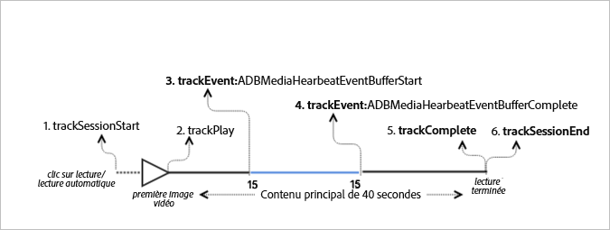

# Lecture VOD avec mise en mémoire tampon {#vod-playback-with-buffering}

## Scénario {#scenario}

Dans ce scénario, une mise en mémoire tampon a lieu lors de la lecture de contenu VOD.

Sauf indication contraire, les appels réseau dans ce scénario sont identiques à ceux du scénario [Lecture VOD sans publicité](/help/sdk-implement/tracking-scenarios/vod-no-intrs-details.md).

| Déclencheur   | Méthode Heartbeat   | Appels réseau   | Remarques   |
|---|---|---|---|
| L’utilisateur clique sur **[!UICONTROL Lecture]**. | `trackSessionStart` | Analytics Content Start, Heartbeat Content Start | Il peut s’agir d’un utilisateur qui clique sur **[!UICONTROL Lecture]** ou d’un événement de lecture automatique. |
| La première image de la vidéo s’affiche. | `trackPlay` | Heartbeat Content Play | Cette méthode déclenche le minuteur. Des pulsations sont envoyées toutes les 10 secondes pendant la lecture. |
| Le contenu est lu. |  | Content Heartbeats |  |
| La mise en mémoire tampon commence. | `trackEvent:BufferStart` | Heartbeat Buffer |  |
| Le contenu est mis en mémoire tampon. |  | Content Heartbeats |  |
| La mise en mémoire tampon est terminée. | `trackEvent:BufferComplete` | Heartbeat Buffer, Heartbeat Play |  |
| Le contenu est lu. |  | Content Heartbeats |  |
| La lecture du contenu est terminée. | `trackComplete` | Heartbeat Content Complete | Le curseur de lecture a atteint la fin de sa course. |
| La session est terminée. | `trackSessionEnd` |  | `SessionEnd` correspond à la fin d’une session de visionnage. Cette API doit être appelée même si l’utilisateur ne regarde pas la vidéo jusqu’à la fin. |

## Paramètres {#parameters}

### Heartbeat Buffer

| Paramètre | Valeur | Remarques |
|---|---|---|
| `s:event:type` | `"buffer"` |  |

## Exemple de code {#sample-code}

Dans ce scénario, la mise en mémoire tampon survient lors de la lecture de contenu VOD.



### Android

Pour afficher ce scénario dans Android, configurez le code suivant :

```java
// Set up mediaObject 

MediaObject mediaInfo = MediaHeartbeat.createMediaObject( 
  Configuration.MEDIA_NAME,  
  Configuration.MEDIA_ID,  
  Configuration.MEDIA_LENGTH,  
  MediaHeartbeat.StreamType.VOD 

); 

HashMap<String, String> videoMetadata = new HashMap<String, String>(); 
videoMetadata.put(CUSTOM_KEY_1, CUSTOM_VAL_1); 
videoMetadata.put(CUSTOM_KEY_2, CUSTOM_VAL_2); 

// 1. Call trackSessionStart() when the user clicks Play or if autoplay is used,  
//    i.e., there is an intent to start playback. 
_mediaHeartbeat.trackSessionStart(mediaInfo, videoMetadata); 

...... 
...... 

// 2. Call trackPlay() when the playback actually starts, i.e., when the first  
//    frame of the main content is rendered on the screen. 
_mediaHeartbeat.trackPlay(); 

....... 
....... 

// 3. Track the MediaHeartbeat.Event.BufferStart event when the video player  
//    goes into the buffering state and begins to buffer content. 
_mediaHeartbeat.trackEvent(MediaHeartbeat.Event.BufferStart, null, null); 

....... 
....... 

// 4. Track the MediaHeartbeat.Event.BufferComplete event when the video player  
//    goes into the buffering state and begins to buffer content. 
_mediaHeartbeat.trackEvent(MediaHeartbeat.Event.BufferComplete, null, null); 

....... 
....... 

// 5. Call trackComplete() when the playback reaches the end, i.e., when the 
//    video completes and finishes playing. 
_mediaHeartbeat.trackComplete(); 

........ 
........ 

// 6. Call trackSessionEnd() when the playback session is over. This method must  
//    be called even if the user does not watch the video to completion. 
_mediaHeartbeat.trackSessionEnd(); 

........ 
```

### iOS

Pour afficher ce scénario dans iOS, configurez le code suivant :

```
// Set up mediaObject 
ADBMediaObject *mediaObject =  
[ADBMediaHeartbeat createMediaObjectWithName:MEDIA_NAME  
                   length:MEDIA_LENGTH  
                   streamType:ADBMediaHeartbeatStreamTypeVOD]; 
 
NSMutableDictionary *videoContextData = [[NSMutableDictionary alloc] init]; 
[videoContextData setObject:CUSTOM_VAL_1 forKey:CUSTOM_KEY_1]; 
[videoContextData setObject:CUSTOM_VAL_2 forKey:CUSTOM_KEY_2]; 

// 1. Call trackSessionStart when the user clicks Play or if autoplay is used,  
//    i.e., there is an intent to start playback. 
[_mediaHeartbeat trackSessionStart:mediaObject data:videoContextData]; 
....... 
....... 

// 2. Call trackPlay when the playback actually starts, i.e., when the first  
//    frame of the main content is rendered on the screen. 
[_mediaHeartbeat trackPlay];  
....... 
....... 

// 3. Track the trackEvent:ADBMediaHeartbeatEventBufferStart event when the  
//    video player goes in buffering state and begins to buffer content. 
[_mediaHeartbeat trackEvent:ADBMediaHeartbeatEventBufferStart  
               mediaObject:nil  
               data:nil]; 
....... 
....... 

// 4. Track the trackEvent:ADBMediaHeartbeatEventBufferComplete event when  
//    the video player goes in buffering state and begins to buffer content. 
[_mediaHeartbeat trackEvent:ADBMediaHeartbeatEventBufferComplete  
               mediaObject:nil  
               data:nil]; 
....... 
....... 

// 5. Call trackComplete when the playback reaches the end, i.e., when the 
//    video completes and finishes playing. 
[_mediaHeartbeat trackComplete]; 
....... 
....... 

// 6. Call trackSessionEnd when the playback session is over. This method must  
//    be called even if the user does not watch the video to completion. 
[_mediaHeartbeat trackSessionEnd]; 
....... 
....... 
```

### JavaScript

Pour afficher ce scénario, saisissez le texte suivant :

```js
// Set up mediaObject 

var mediaInfo = MediaHeartbeat.createMediaObject( 
  Configuration.MEDIA_NAME,  
  Configuration.MEDIA_ID,  
  Configuration.MEDIA_LENGTH,  
  MediaHeartbeat.StreamType.VOD 

); 

var videoMetadata = { 
  CUSTOM_KEY_1 : CUSTOM_VAL_1,  
  CUSTOM_KEY_2 : CUSTOM_VAL_2,  
  CUSTOM_KEY_3 : CUSTOM_VAL_3 
}; 

// 1. Call trackSessionStart() when Play is clicked or if autoplay is used,  
//    i.e., there's an intent to start playback. 
this._mediaHeartbeat.trackSessionStart(mediaInfo, videoMetadata); 

...... 
...... 

// 2. Call trackPlay() when the playback actually starts, i.e., when the  
//    first frame of the ad video is rendered on the screen. 
this._mediaHeartbeat.trackPlay(); 

....... 
....... 

// 3. Track event MediaHeartbeat.Event.BufferStart when the video player  
//    goes into the buffering state and begins to buffer content. 
this._mediaHeartbeat.trackEvent(MediaHeartbeat.Event.BufferStart); 

....... 
....... 

// 4. Track the MediaHeartbeat.Event.BufferComplete event when the  
//    video player goes into the buffering state and begins to buffer content. 
this._mediaHeartbeat.trackEvent(MediaHeartbeat.Event.BufferComplete); 

....... 
....... 

// 5. Call trackComplete() when the playback reaches the end, i.e.,  
//    when playback completes and finishes playing. 
this._mediaHeartbeat.trackComplete(); 

........ 
........ 

// 6. Call trackSessionEnd() when the playback session is over. This method must  
//    be called even if the user does not watch the video to completion. 
this._mediaHeartbeat.trackSessionEnd(); 

........ 
........ 
```

