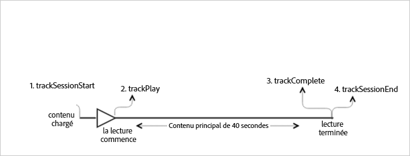

# Lecture VOD sans publicité{#vod-playback-with-no-ads}

## Scénario {#section_E4B558253AD84ED59256EDB60CED02AE}

Ce scénario comprend une ressource VOD, sans publicité, qui est lue une fois du début jusqu’à la fin.

| Déclencheur | Méthode Heartbeat | Appels réseau | Remarques   |
|---|---|---|---|
| User clicks **[!UICONTROL Play]** | `trackSessionStart` | Analytics Content Start, Heartbeat Content Start | Il peut s’agir d’un utilisateur qui clique sur Lecture ou d’un événement de lecture automatique. |
| Première image du média | `trackPlay` | Heartbeat Content Play | Cette méthode déclenche le minuteur et, dès lors, des pulsations sont envoyées toutes les 10 secondes pendant toute la durée de la lecture. |
| Lecture du contenu |  | Content Heartbeats |  |
| Contenu terminé | `trackComplete` | Heartbeat Content Complete | *Complete* signifie que le curseur de lecture a atteint la fin de sa course. |

## Paramètres {#section_45D7B10031524411B91E2C569F7818B0}

Un grand nombre de ces valeurs que vous pouvez voir dans les appels Heartbeat est également présent dans les appels `Content Start`Content Start d’Adobe Analytics. Adobe utilise de nombreux paramètres pour remplir les différents rapports multimédia, mais seuls les paramètres les plus importants sont répertoriés dans le tableau suivant :

### Heartbeat Content Start

| Paramètre | Valeur | Remarques   |
|---|---|---|
| `s:sc:rsid` | &lt;Identifiant de votre suite de rapports Adobe&gt; |  |
| `s:sc:tracking_server` | &lt;URL de votre serveur de suivi Analytics&gt; |  |
| `s:user:mid` | à définir | Should match the mid value on the `Adobe Analytics Content Start` call. |
| `s:event:type` | `"start"` |  |
| `s:asset:type` | `"main"` |  |
| `s:asset:media_id` | &lt; Nom de votre média &gt; |  |
| `s:meta:*` | facultatif | Métadonnées personnalisées définies sur le support. |

## Heartbeat Content Play {#section_2ABBD51D3A6D45ABA92CC516E414417A}

These parameters should look nearly identical to the `Heartbeat Content Start` call, but the key difference is the `s:event:type` parameter. Tous les autres paramètres doivent toujours exister.

| Paramètre | Valeur | Remarques   |
|---|---|---|
| `s:event:type` | `"play"` |  |
| `s:asset:type` | `"main"` |  |

## Content Heartbeats {#section_3B5945336E464160A94518231CEE8F53}

Lors de la lecture multimédia, un minuteur envoie au moins une pulsation toutes les 10 secondes. Ces pulsations contiennent des informations concernant la lecture, les publicités, la mise en mémoire tampon, etc. Le présent document ne traite pas du contenu exact de chaque pulsation, mais il faut retenir ici que celles-ci sont déclenchées de façon continue au fil de la lecture.

Dans les pulsations du contenu, recherchez les paramètres suivants :

| Paramètres | Valeur | Remarques   |
|---|---|---|
| `s:event:type` | `"play"` |  |
| `l:event:playhead` | &lt;position du curseur de lecture&gt; par exemple, 50,60,70 | Ce paramètre indique la position actuelle du curseur de lecture. |

## Heartbeat Content Complete {#section_33BCC4C3181940C39446A57C25D82179}

Une fois la lecture terminée, c’est-à-dire lorsque le curseur de lecture a atteint la fin de sa course, un appel `Heartbeat Content Complete` est envoyé. Celui-ci ressemble aux autres appels Heartbeat, mais se différencie par certains paramètres spécifiques :

| Paramètres | Valeur | Remarques   |
|---|---|---|
| `s:event:type` | `"complete"` |  |
| `s:asset:type` | `"main"` |  |

## Exemple de code {#section_glq_vw3_x2b}

Dans ce scénario, le contenu dure 40 secondes. Il est lu jusqu’à la fin sans aucune interruption.



### Android

```java
// Set up  mediaObject 
MediaObject mediaInfo = MediaHeartbeat.createMediaObject( 
  Configuration.MEDIA_NAME,  
  Configuration.MEDIA_ID,  
  Configuration.MEDIA_LENGTH,  
  MediaHeartbeat.StreamType.VOD 
); 

HashMap<String, String> mediaMetadata = new HashMap<String, String>(); 
mediaMetadata.put(CUSTOM_VAL_1, CUSTOM_KEY_1); 
mediaMetadata.put(CUSTOM_VAL_2, CUSTOM_KEY_2); 

// 1. Call trackSessionStart() when the user clicks Play or if autoplay  
//    is used, i.e., there's an intent to start playback.  
_mediaHeartbeat.trackSessionStart(mediaInfo, mediaMetadata); 

...... 
...... 

// 2. Call trackPlay() when the playback actually starts,  
//    i.e., the first frame of media is rendered on the screen.  
_mediaHeartbeat.trackPlay(); 

....... 
....... 

// 3. Call trackComplete() when the playback reaches the end,  
//    i.e., when the media completes and finishes playing.  
_mediaHeartbeat.trackComplete(); 

........ 
........ 

// 4. Call trackSessionEnd() when the playback session is over.  
//    This method must be called even if the user does not watch  
//    the media to completion.  
_mediaHeartbeat.trackSessionEnd(); 

........ 
........ 
```

### iOS

```
when the user clicks Play 
ADBMediaObject *mediaObject =  
[ADBMediaHeartbeat createMediaObjectWithName:MEDIA_NAME  
                   length:MEDIA_LENGTH  
                   streamType:ADBMediaHeartbeatStreamTypeVOD]; 

NSMutableDictionary *mediaContextData = [[NSMutableDictionary alloc] init]; 
[mediaContextData setObject:CUSTOM_VAL_1 forKey:CUSTOM_KEY_1]; 
[mediaContextData setObject:CUSTOM_VAL_2 forKey:CUSTOM_KEY_2]; 

// 1. Call trackSessionStart when the user clicks Play or if autoplay is used,  
//    i.e., there's an intent to start playback. 
[_mediaHeartbeat trackSessionStart:mediaObject data:mediaContextData]; 
...... 
...... 

// 2. Call trackPlay when the playback actually starts, i.e., when the  
//    first frame of main content is rendered on the screen. 
[_mediaHeartbeat trackPlay]; 
....... 
....... 

// 3. Call trackComplete when the playback reaches the end, i.e.,  
//    when the media completes and finishes playing. 
[_mediaHeartbeat trackComplete]; 
........ 
........ 

// 4. Call trackSessionEnd when the playback session is over. This method  
//    must be called even if the user does not watch the media to completion. 
[_mediaHeartbeat trackSessionEnd]; 
........ 
........ 
```

### JavaScript

```js
// Set up mediaObject 

var mediaInfo = MediaHeartbeat.createMediaObject(Configuration.MEDIA_NAME, Configuration.MEDIA_ID,  
Configuration.MEDIA_LENGTH,MediaHeartbeat.StreamType.VOD); 
var mediaMetadata = { 
  CUSTOM_KEY_1 : CUSTOM_VAL_1,  
  CUSTOM_KEY_2 : CUSTOM_VAL_2,  
  CUSTOM_KEY_3 : CUSTOM_VAL_3 

}; 

// 1. Call trackSessionStart() when the user clicks play, or when autoplay is used,  
//    i.e., there's an intent to start playback. 
this._mediaHeartbeat.trackSessionStart(mediaInfo, mediaMetadata); 

...... 
...... 

// 2. Call trackPlay() when the main content starts, i.e.,  
//    the first frame of the media content is rendered on the screen. 
this._mediaHeartbeat.trackPlay(); 

....... 
....... 

// 3. Call trackComplete() when the playback reaches the end,  
    i.e., the media completes and finishes playing. 
this._mediaHeartbeat.trackComplete(); 

........ 
........ 

// 4. Call trackSessionEnd() when the playback session is over.  
//    This method must be called even if the user does not  
//    watch the media to completion. 
this._mediaHeartbeat.trackSessionEnd(); 

........ 
........
```

