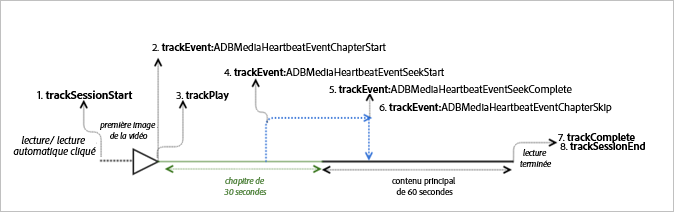

# Lecture VOD avec saut de chapitre{#vod-playback-with-a-skipped-chapter}

## Scénario {#scenario}

Dans ce scénario, l’utilisateur saute un chapitre dans le contenu principal.

Il s’agit du même scénario que la lecture [VOD avec un chapitre](/help/sdk-implement/tracking-scenarios/vod-one-chapter.md), sauf que l’utilisateur dans ce cas a l’intention de rechercher un élément du chapitre, le sautant ainsi pour accéder au contenu principal.

| Déclencheur | Méthode Heartbeat | Appels réseau   | Remarques |
|---|---|---|---|
| L’utilisateur clique sur **[!UICONTROL Lecture]**. | `trackSessionStart` | Analytics Content Start, Heartbeat Content Start | La bibliothèque de mesures ignore l’existence d’une publicité preroll. Ces appels réseau sont identiques à ceux du scénario [Lecture sans interruptions dans un scénario iOS](vod-no-intrs-details.md). |
| Le chapitre démarre. | `trackEvent:ChapterStart` | Heartbeat Chapter Start |  |
| La première image du chapitre s’affiche. | `trackPlay` | Heartbeat Chapter Play | Lorsque le contenu d’un chapitre est lu avant le contenu principal, nous voulons commencer les pulsations lorsque le chapitre commence. |
| Le chapitre est lu. |  | Chapter Heartbeats |  |
| La recherche commence à ignorer le premier chapitre. | `trackEvent:trackSeekStart` |  | Aucune pulsation pendant la recherche |
| La recherche est terminée. | `trackEvent:trackSeekComplete` |  | Les pulsations reprendraient après cela. |
| L’application réalise que l’utilisateur a effectué une recherche en dehors de la limite normale du chapitre. | `trackEvent:trackChapterSkip` |  |  |
| Le contenu est lu. |  | Content Heartbeats |  |
| La lecture du contenu est terminée. | `trackComplete` | Heartbeat Content Complete | Il s’agit du même appel réseau que le scénario [Lecture interruption sur iOS](vod-no-intrs-details.md). |
| La session est terminée. | `trackSessionEnd` |  | `SessionEnd` correspond à la fin d’une session de visionnage. Cette API doit être appelée même si l’utilisateur n’utilise pas le média jusqu’à la fin. |

## Paramètres {#parameters}

Les paramètres utilisés pendant la lecture de ce chapitre sont identiques à ceux du scénario [Lecture VOD avec un chapitre](/help/sdk-implement/tracking-scenarios/vod-one-chapter.md), mais il n’est pas question d’appel réseau de fin du chapitre.

## Exemple de code {#sample-code}



### Android

Pour afficher ce scénario dans Android, configurez le code suivant :

```java
// Set up mediaObject 
MediaObject mediaInfo = MediaHeartbeat.createMediaObject( 
  Configuration.MEDIA_NAME,  
  Configuration.MEDIA_ID,  
  Configuration.MEDIA_LENGTH,  
  MediaHeartbeat.StreamType.VOD 

); 

HashMap<String, String> mediaMetadata = new HashMap<String, String>(); 
mediaMetadata.put(CUSTOM_KEY_1, CUSTOM_VAL_1); 
mediaMetadata.put(CUSTOM_KEY_2, CUSTOM_VAL_2); 

// 1. Call trackSessionStart() when the user clicks Play or if autoplay is used,  
//    i.e., there is an intent to start playback.  
_mediaHeartbeat.trackSessionStart(mediaInfo, mediaMetadata); 

...... 
...... 

// Chapter 
HashMap<String, String> chapterMetadata = new HashMap<String, String>(); 
chapterMetadata.put(CUSTOM_KEY_1, CUSTOM_VAL_1); 
MediaObject chapterDataInfo =  
MediaHeartbeat.createChapterObject(CHAPTER_NAME,  
                                   CHAPTER_POSITION,  
                                   CHAPTER_LENGTH,  
                                   CHAPTER_START_TIME); 

// 2. Track the MediaHeartbeat.Event.ChapterStart event when the chapter starts to play.  
_mediaHeartbeat.trackEvent(MediaHeartbeat.Event.ChapterStart,  
                         chapterDataInfo,  
                         chapterMetadata); 

....... 
....... 

// 3. Call trackPlay() when the playback actually starts, i.e., when the first frame  
//    of the main content is rendered on the screen.  
_mediaHeartbeat.trackPlay(); 

....... 
....... 

// 4. Track the MediaHeartbeat.Event.SeekStart event when the user begins to seek out  
//    of the chapter with the intent to skip it.  
_mediaHeartbeat.trackEvent(MediaHeartbeat.Event.SeekStart, null, null); 

....... 
....... 

// 5. Track the MediaHeartbeat.Event.SeekComplete event when the user seeks out of the  
//    chapter with the intent to skip it.  
_mediaHeartbeat.trackEvent(MediaHeartbeat.Event.SeekComplete, null, null); 

....... 
....... 

// 6. Track the MediaHeartbeat.Event.ChapterSkip event because the user skipped the  
//    chapter by seeking out of it in the steps above.  
_mediaHeartbeat.trackEvent(MediaHeartbeat.Event.ChapterSkip, null, null); 

....... 
....... 

// 7. Call trackComplete() when the playback reaches the end, i.e., when the media 
//    completes and finishes playing.  
_mediaHeartbeat.trackComplete(); 

........ 

........ 

// 8. Call trackSessionEnd() when the playback session is over. This method must be  
//    called even if the user does not watch the media to completion.  
_mediaHeartbeat.trackSessionEnd(); 

........ 
........ 
```

### iOS

Pour afficher ce scénario dans iOS, configurez le code suivant :

```
// Set up mediaObject 
ADBMediaObject *mediaObject =  
[ADBMediaHeartbeat createMediaObjectWithName:MEDIA_NAME  
                   length:MEDIA_LENGTH  
                   streamType:ADBMediaHeartbeatStreamTypeVOD]; 
 
NSMutableDictionary *mediaContextData = [[NSMutableDictionary alloc] init]; 
[mediaContextData setObject:CUSTOM_VAL_1 forKey:CUSTOM_KEY_1]; 
[mediaContextData setObject:CUSTOM_VAL_2 forKey:CUSTOM_KEY_2]; 

// 1. Call trackSessionStart when the user clicks Play or if autoplay is used,  
//    i.e., there's an intent to start playback. 
[_mediaHeartbeat trackSessionStart:mediaObject data:mediaContextData]; 
....... 
....... 
 
// Chapter 
NSMutableDictionary *chapterContextData = [[NSMutableDictionary alloc] init]; 
[chapterContextData setObject:CONTEXT_DATA_VALUE forKey:CONTEXT_DATA_KEY]; 
 
id chapterInfo =  
[ADBMediaHeartbeat createChapterObjectWithName:CHAPTER_NAME  
                   position:CHAPTER_POSITION  
                   length:CHAPTER_LENGTH  
                   startTime:CHAPTER_START_TIME]; 
    
// 2. Track the ADBMediaHeartbeatEventChapterStart event when the chapter starts. 
[_mediaHeartbeat trackEvent:ADBMediaHeartbeatEventChapterStart  
               mediaObject:chapterInfo  
               data:chapterContextData]; 
....... 
....... 

// 3. Call trackPlay when the playback actually starts, i.e., when the first  
//    frame of the main content is rendered on the screen. 
[_mediaHeartbeat trackPlay]; 
....... 
....... 

// 4. Track the trackEvent:ADBMediaHeartbeatEventSeekStart event when the user  
//    begins to seek out of the chapter with the intent to skip it. 
[_mediaHeartbeat trackEvent:ADBMediaHeartbeatEventSeekStart mediaObject:nil data:nil]; 
....... 
....... 

// 5. Track the trackEvent:ADBMediaHeartbeatEventSeekComplete event when the  
//    user seeks out of the chapter with the intent to skip it. 
[_mediaHeartbeat trackEvent:ADBMediaHeartbeatEventSeekComplete mediaObject:nil data:nil]; 
....... 
....... 

// 6. Track the trackEvent:ADBMediaHeartbeatEventChapterSkip event because the  
//    user skipped the chapter by seeking out of it in the steps above. 
[_mediaHeartbeat trackEvent:ADBMediaHeartbeatEventChapterSkip  
               mediaObject:chapterInfo  
               data:chapterContextData]; 
....... 
....... 
 
// 7. Call trackComplete when the playback reaches the end, i.e., when the media 
//    completes and finishes playing. 
[_mediaHeartbeat trackComplete]; 
....... 
....... 

// 8. Call trackSessionEnd when the playback session is over. This method must  
//    be called even if the user does not watch the media to completion. 
[_mediaHeartbeat trackSessionEnd]; 
....... 
....... 
```

### JavaScript

Pour afficher ce scénario dans JavaScript, saisissez le texte suivant :

```js
// Set up mediaObject 
var mediaInfo = MediaHeartbeat.createMediaObject( 
  Configuration.MEDIA_NAME,  
  Configuration.MEDIA_ID,  
  Configuration.MEDIA_LENGTH,  
  MediaHeartbeat.StreamType.VOD 
); 

var mediaMetadata = { 
  CUSTOM_KEY_1 : CUSTOM_VAL_1,  
  CUSTOM_KEY_2 : CUSTOM_VAL_2,  
  CUSTOM_KEY_3 : CUSTOM_VAL_3 

}; 

// 1. Call trackSessionStart() when Play is clicked or if autoplay is used,  
//    i.e., there's an intent to start playback. 
this._mediaHeartbeat.trackSessionStart(mediaInfo, mediaMetadata); 

...... 
...... 

// Chapter 
var chapterMetadata = { 
  CUSTOM_KEY_1 : CUSTOM_VAL_1 
}; 

var chapterDataInfo =  
MediaHeartbeat.createChapterObject(CHAPTER_NAME,  
                                  CHAPTER_POSITION,  
                                  CHAPTER_LENGTH,  
                                  CHAPTER_START_TIME); 

// 2. Track the MediaHeartbeat.Event.ChapterStart event when the chapter starts to play. 
this._mediaHeartbeat.trackEvent(MediaHeartbeat.Event.ChapterStart,  
                              chapterDataInfo,  
                              chapterMetadata); 

....... 
....... 

// 3. Call trackPlay() when the playback actually starts, i.e., when the  
//    first frame of the main content is rendered on the screen. 
this._mediaHeartbeat.trackPlay(); 

....... 
....... 

// 4. Track the MediaHeartbeat.Event.SeekStart event when the user begins  
//    to seek out of the chapter with the intent to skip it. 
this._mediaHeartbeat.trackEvent(MediaHeartbeat.Event.SeekStart); 

....... 
....... 

// 5. Track the MediaHeartbeat.Event.SeekComplete event when the user seeks  
//    out of the chapter with the intent to skip it. 
this._mediaHeartbeat.trackEvent(MediaHeartbeat.Event.SeekComplete); 

....... 
....... 

// 6. Track the MediaHeartbeat.Event.ChapterSkip event because the user  
//    skipped the chapter by seeking out of it in the steps above. 
this._mediaHeartbeat.trackEvent(MediaHeartbeat.Event.ChapterSkip); 

....... 
....... 

// 7. Call trackComplete() when the playback reaches the end, i.e., completes  
//    and finishes playing. 
this._mediaHeartbeat.trackComplete(); 

........ 
........ 

// 8. Call trackSessionEnd() when the playback session is over. This method must be  
//    called even if the user does not watch the media to completion. 
this._mediaHeartbeat.trackSessionEnd(); 

........ 
........ 
```
