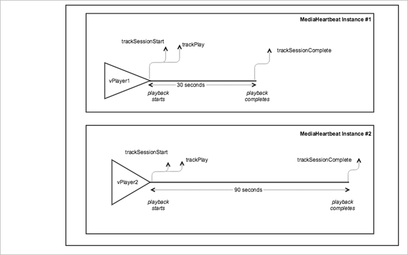

# Plusieurs dispositifs de suivi VOD en parallèle{#vod-multiple-trackers-in-parallel}

## Scénario {#scenario}

Dans ce scénario, deux sessions sont exécutées en parallèle pour deux médias séparés à l’aide de deux instances distinctes de `MediaHeartbeat`.

Ce scénario est identique au scénario de [lecture VOD sans publicité](/help/use-cases/tracking-scenarios/vod-no-intrs-details.md), à l’exception des deux sessions exécutées en parallèle pour deux médias séparés. Chacune de ces sessions utilise une instance séparée de `MediaHeartbeat`.

Sauf indication, les appels réseau sont identiques à ceux du scénario de [lecture VOD sans publicité](/help/use-cases/tracking-scenarios/vod-no-intrs-details.md).

## Paramètres {#parameters}

### Session de pulsation

| Paramètre | Valeur | Remarques   |
|---|---|---|
| `s:event:sid` | ID de session unique | Identifiant de session unique présent dans tous les appels réseau de pulsation jusqu’à ce que la méthode `trackSessionEnd` soit appelée. |

## Exemple de code {#sample-code}



### Android

```java
public class MediaAnalyticsProvider implements MediaHeartbeatDelegate { 
  private MediaPlayer _player; 
  private MediaHeartbeat _heartbeat; 

  public MediaAnalyticsProvider(MediaPlayer player) { 
      if (player == null) { 
          throw new IllegalArgumentException("Player reference cannot be null."); 

      } 
      _player = player;  
      _player.addObserver(this); 

      // Media Heartbeat initialization 
      MediaHeartbeatConfig config = new MediaHeartbeatConfig(); 
      config.trackingServer = HEARTBEAT_TRACKING_SERVER; 
      config.channel = HEARTBEAT_CHANNEL; 
      config.appVersion = HEARTBEAT_SDK; 
      config.ovp = HEARTBEAT_OVP; 
      config.playerName = PLAYER_NAME; 
      config.ssl = false; 
      config.debugLogging = true;  

      _heartbeat = new MediaHeartbeat(this, config); 
  } 

  @Override 
  public MediaObject getQoSObject() { 
      return MediaHeartbeat.createQoSObject(BITRATE,  
                                            STARTUP_TIME,  
                                            FPS,  
                                            DROPPED_FRAMES); 
  } 

  @Override 
  public Double getCurrentPlaybackTime() { 
      return _player.getCurrentPlaybackTime(); 
  } 
} 
```

```java
@Override 
protected void onCreate(Bundle savedInstanceState) { 
  super.onCreate(savedInstanceState); 
  setContentView(R.layout.activity_main); 

  // Bootstrap the AdobeMobile library.  
  Config.setContext(this.getApplicationContext()); 

  // Create first MediaPlayer instance.  
  _player1 = new MediaPlayer(); 

  // Create first MediaAnalyticsProvider instance and 
  // attach it to the MediaPlayer instance.  
  _analyticsProvider1 = new MediaAnalyticsProvider(_player1); 

  // Load the main media content.  
  Uri uri =  
    Uri.parse("android.resource://" + getPackageName() + "/" + R.raw.media1);  
  _player1.loadContent(uri); 

  // Create second MediaPlayer instance.  
  _player2 = new MediaPlayer(); 

  // Create second MediaAnalyticsProvider instance and 
  // attach it to the MediaPlayer instance.  
  _analyticsProvider2 = new MediaAnalyticsProvider(_player2); 

  // Load the main media content.  
  Uri uri =  
    Uri.parse("android.resource://" + getPackageName() + "/" + R.raw.media2);  
  _player2.loadContent(uri); 
} 
```

Les deux instances de `MediaAnalyticsProvider` et `MediaHeartbeat` effectuent le suivi de deux sessions séparées, chacune disposant de son propre ID de session unique. Les deux sessions de l’outil de débogage Charles ou des journaux de débogage peuvent être identifiées à l’aide de la valeur ID de session. Pour afficher ce scénario dans Android, configurez le code suivant :

```java
// Set up mediaObject 
MediaObject mediaInfo = MediaHeartbeat.createMediaObject( 
  Configuration.MEDIA_NAME,  
  Configuration.MEDIA_ID, 
  Configuration.MEDIA_LENGTH,  
  MediaHeartbeat.StreamType.VOD 
); 

HashMap<String, String> mediaMetadata = new HashMap<String, String>(); 
mediaMetadata.put(CUSTOM_VAL_1, CUSTOM_KEY_1); 
mediaMetadata.put(CUSTOM_VAL_2, CUSTOM_KEY_2); 

// 1. Call trackSessionStart() when the user clicks Play or if autoplay is used,  
//    i.e., there is an intent to start playback. 
_mediaHeartbeat.trackSessionStart(mediaInfo, mediaMetadata); 

...... 
...... 

// 2. Call trackPlay() when the playback actually starts, i.e., when the first  
//    frame of main content is rendered on the screen.  
_mediaHeartbeat.trackPlay(); 

....... 
....... 

// 3. Call trackComplete() when the playback reaches the end, i.e., when the 
//    media completes and finishes playing.  
_mediaHeartbeat.trackComplete(); 

........ 
........ 

// 4. Call trackSessionEnd() when the playback session is over. This method must  
//    be called even if the user does not watch the media to completion. 
_mediaHeartbeat.trackSessionEnd(); 

........ 
........ 
```

### iOS

```
@interface MediaAnalyticsProvider : NSObject <ADBMediaHeartbeatDelegate> 

@end    

@implementation { 
  MediaPlayer *_player; 
} 

- (instancetype)initWithPlayer:(AVPlayer *)player { 
  if (self = [super init]) { 
      _player = player; 

      ADBMediaHeartbeatConfig *config =  
        [[ADBMediaHeartbeatConfig alloc] init]; 
      config.trackingServer = HEARTBEAT_TRACKING_SERVER; 
      config.channel = HEARTBEAT_CHANNEL; 
      config.appVersion = HEARTBEAT_SDK_VERSION; 
      config.playerName = PLAYER_NAME; 
      config.ssl = SSL_SETTING; 
      config.debugLogging = DEBUG_SETTING; 

      ADBMediaHeartbeatConfig *config =  
        [[ADBMediaHeartbeatConfig alloc] init];       
      _mediaHeartbeat =  
        [[ADBMediaHeartbeat alloc] initWithDelegate:self config:config]; 
        
      [self setupPlayerNotifications]; 
  } 

  return self; 
} 

- (ADBMediaObject *)getQoSInfo { 
  return [ADBMediaHeartbeat createQoSObjectWithBitrate:CURRENT_BITRATE_VALUE  
                            startupTime:CALCULATED_STARTED_TIME  
                            fps:CALCULATED_FPS  
                            droppedFrames:DROPPED_FRAMES_COUNT]; 
} 

- (NSTimeInterval)getCurrentPlaybackTime { 
  return CMTimeGetSeconds(_player.currentTime); 
} 

@end 

- (void)viewDidAppear:(BOOL)animated { 
  [super viewDidAppear:animated]; 
  [ADBMobile setDebugLogging:YES]; 

  // Setup the first media player 
  NSURL *streamUrl = [NSURL URLWithString:CONTENT_URL_1]; 

  if (!self.mediaPlayer1) { 
      self.mediaPlayer1 = [[MediaPlayer alloc] initWithContentURL:streamUrl]; 
      //setup player 
  } 

  // Create the MediaAnalyticsProvider instance and attach it to the first  
  // MediaPlayer instance. 
  if (!self.mediaAnalyticsProvider1) { 
      self.mediaAnalyticsProvider1 =  
        [[MediaAnalyticsProvider alloc] initWithPlayerDelegate:self.mediaPlayer1]; 
  } 

  // Setup the second media player 
  NSURL *streamUrl2 = [NSURL URLWithString:CONTENT_URL_2]; 

  if (!self.mediaPlayer2) { 
      self.mediaPlayer2 = [[MediaPlayer alloc] initWithContentURL:streamUrl2]; 
      //setup player 
  } 

  // Create the MediaAnalyticsProvider instance and attach it to the second  
  // MediaPlayer instance. 
  if (!self.mediaAnalyticsProvider2) { 
      self.mediaAnalyticsProvider2 =  
        [[MediaAnalyticsProvider alloc] initWithPlayerDelegate:self.mediaPlayer2]; 
  } 
} 
```

```
- (void)viewDidAppear:(BOOL)animated { 
  [super viewDidAppear:animated]; 
  [ADBMobile setDebugLogging:YES]; 

  // Setup the first media player 
  NSURL *streamUrl = [NSURL URLWithString:CONTENT_URL_1]; 

  if (!self.mediaPlayer1) { 
      self.mediaPlayer1 = [[MediaPlayer alloc] initWithContentURL:streamUrl]; 
      //setup player 
  } 

  // Create the MediaAnalyticsProvider instance and attach it to the first  
  // MediaPlayer instance. 
  if (!self.mediaAnalyticsProvider1) { 
      self.mediaAnalyticsProvider1 =  
        [[MediaAnalyticsProvider alloc] initWithPlayerDelegate:self.mediaPlayer1]; 
  } 

  // Setup the second media player 
  NSURL *streamUrl2 = [NSURL URLWithString:CONTENT_URL_2]; 

  if (!self.mediaPlayer2) { 
      self.mediaPlayer2 = [[MediaPlayer alloc] initWithContentURL:streamUrl2]; 
      //setup player 
  } 

  // Create the MediaAnalyticsProvider instance and attach it to the second MediaPlayer instance. 
  if (!self.mediaAnalyticsProvider2) { 
      self.mediaAnalyticsProvider2 =  
        [[MediaAnalyticsProvider alloc] initWithPlayerDelegate:self.mediaPlayer2]; 
  } 
} 
```

Les deux instances de `MediaAnalyticsProvider` et `ADBMediaHeartbeat` effectuent le suivi de deux sessions séparées, chacune disposant de son propre ID de session unique. Les deux sessions de l’outil de débogage Charles ou des journaux de débogage peuvent être identifiées à l’aide de la valeur ID de session.

Pour afficher ce scénario dans iOS, configurez le code suivant :

```
// Set up mediaObject 
ADBMediaObject *mediaObject =  
[ADBMediaHeartbeat createMediaObjectWithName:MEDIA_NAME  
                   length:MEDIA_LENGTH  
                   streamType:ADBMediaHeartbeatStreamTypeVOD]; 
  
NSMutableDictionary *mediaContextData = [[NSMutableDictionary alloc] init]; 
[mediaContextData setObject:CUSTOM_VAL_1 forKey:CUSTOM_KEY_1]; 
[mediaContextData setObject:CUSTOM_VAL_2 forKey:CUSTOM_KEY_2]; 
 
// 1. Call trackSessionStart when the user clicks Play or if autoplay is used,  
//    i.e., there is an intent to start playback. 
[_mediaHeartbeat trackSessionStart:mediaObject data:mediaContextData]; 
....... 
....... 

// 2. Call trackPlay when the playback actually starts, i.e., when the first  
//    frame of the main content is rendered on the screen. 
[_mediaHeartbeat trackPlay]; 
....... 
....... 

// 3. Call trackComplete when the playback reaches the end, i.e., when the 
//    media completes and finishes playing. 
[_mediaHeartbeat trackComplete]; 
....... 
....... 
 
// 4. Call trackSessionEnd when the playback session is over. This method  
//    must be called even if the user does not watch the media to completion. 
[_mediaHeartbeat trackSessionEnd]; 
....... 
....... 
```

### JavaScript

```js
var MediaHeartbeat = ADB.va.MediaHeartbeat; 
var MediaHeartbeatConfig = ADB.va.MediaHeartbeatConfig; 
var MediaHeartbeatDelegate = ADB.va.MediaHeartbeatDelegate; 

function MediaAnalyticsProvider(player) { 
  if (!player) { 
      throw new Error("Illegal argument. Player reference cannot be null.") 

  } 
  this._player = player; 

  //Media Heartbeat initialization 
  var mediaConfig = new MediaHeartbeatConfig(); 
  mediaConfig.trackingServer = Configuration.HEARTBEAT.TRACKING_SERVER; 
  mediaConfig.playerName = Configuration.PLAYER.NAME; 
  mediaConfig.channel = Configuration.HEARTBEAT.CHANNEL; 
  mediaConfig.debugLogging = true; 
  mediaConfig.appVersion = Configuration.HEARTBEAT.SDK; 
  mediaConfig.ssl = false; 
  mediaConfig.ovp = Configuration.HEARTBEAT.OVP; 

  var mediaDelegate = new MediaHeartbeatDelegate(); 

  mediaDelegate.getCurrentPlaybackTime = function() { 
      return player.getCurrentPlaybackTime(); 
  }; 

  mediaDelegate.prototype.getQoSObject = function() { 
      return player.getQoSInfo(); 
  }; 

  this._mediaHeartbeat =  
    new MediaHeartbeat(mediaDelegate, mediaConfig, appMeasurement); 
} 
```

```js
// Create first MediaPlayer instance.  
var _player1 = new MediaPlayer(); 

// Create the first MediaAnalyticsProvider instance  
// and attach it to the MediaPlayer instance.  
analyticsProvider1 = new MediaAnalyticsProvider(_player1); 

// Load the main media content.  
_player1.loadContent(URL_TO_MEDIA_1); 

// Create second MediaPlayer instance.  
var _player2 = new MediaPlayer(); 

// Create second MediaAnalyticsProvider instance and 
// attach it to the MediaPlayer instance.  
analyticsProvider2 = new MediaAnalyticsProvider(_player2); 

// Load the main media content for the 2nd player.  
_player2.loadContent(URL_TO_MEDIA_2); 
```

Les deux instances de `MediaAnalyticsProvider` et `MediaHeartbeat` effectuent le suivi de deux sessions séparées, chacune disposant de son propre ID de session unique. Vous pouvez voir les deux sessions dans l’outil de débogage Charles.
