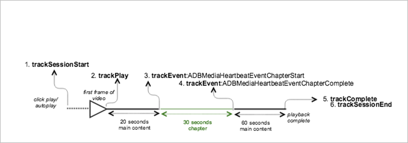

# Lecture VOD avec un chapitre{#vod-playback-with-one-chapter}

## Scénario {#scenario}

Dans ce scénario, une partie du contenu VOD est marquée comme un chapitre.

Sauf indication contraire, les appels réseau dans ce scénario sont identiques à ceux du scénario [Lecture VOD sans publicité](/help/use-cases/tracking-scenarios/vod-no-intrs-details.md). L’appel réseau se produit simultanément, mais la charge utile est différente.

| Déclencheur   | Méthode Heartbeat   | Appels réseau   | Remarques   |
|---|---|---|---|
| L’utilisateur clique sur **[!UICONTROL Lecture]**. | `trackSessionStart` | Analytics Content Start, Heartbeat Content Start | Nous n’avons pas encore indiqué à la bibliothèque de mesures qu’il existe une publicité preroll. Ces appels réseau sont donc exactement identiques à ceux du scénario VoD unique. |
| Le chapitre démarre. | `trackEvent:ChapterStart` | Heartbeat Chapter Start |  |
| La première image du chapitre s’affiche. | `trackPlay` | Heartbeat Content Play | Lorsque le contenu du chapitre est lu avant le contenu principal, le Heartbeats commence lorsque le chapitre commence. |
| Le chapitre est lu. |  | Chapter Heartbeats |  |
| Le chapitre est terminé. | `trackEvent:trackChapterComplete` | Heartbeat Chapter Complete | La fin du chapitre est atteinte. |
| Le contenu est lu. |  | Content Heartbeats | Il s’agit du même appel réseau que le scénario [Lecture VOD sans publicité](/help/use-cases/tracking-scenarios/vod-no-intrs-details.md). |
| Le contenu est terminé. | `trackComplete` | Heartbeat Content Complete | Il s’agit du même appel réseau que le scénario [Lecture VOD sans publicité](/help/use-cases/tracking-scenarios/vod-no-intrs-details.md). |
| La session est terminée. | `trackSessionEnd` |  | `SessionEnd` signifie que la fin de la session de visionnage a été atteinte. Cette API doit être appelée même si l’utilisateur n’utilise pas le média jusqu’à la fin. |

## Paramètres {#parameters}

Lorsque la lecture du chapitre démarre, un appel `Heartbeat Chapter Start` est envoyé. Si le début du chapitre ne correspond pas au minuteur de 10 secondes, l’appel `Heartbeat Chapter Start` est retardé pendant quelques secondes pour être envoyé lors de l’intervalle de 10 secondes suivant.

Dans ce cas, un appel `Content Heartbeat` est envoyé au cours de ce même intervalle. Vous pouvez différencier les deux en examinant le type d’événement et de ressource :

### Heartbeat Chapter Start

| Paramètre | Valeur | Remarques |
|---|---|---|
| `s:event:type` | `"chapter_start"` |  |
| `s:asset:type` | `"main"` |  |
| `s:stream:chapter_*` |  | Informations de diffusion spécifiques aux données du chapitre. |
| `s:meta:*` |  | Chapitre comportant des données contextuelles spécifiques. |

## Exemple de code, chapitre au milieu {#sample-code-chapter-in-the-middle}

Dans ce scénario, une partie du contenu VOD est un chapitre.



### Android

Pour afficher ce scénario dans Android, configurez le code suivant :

```java
// Set up mediaObject 
MediaObject mediaInfo = MediaHeartbeat.createMediaObject( 
  Configuration.MEDIA_NAME,  
  Configuration.MEDIA_ID,  
  Configuration.MEDIA_LENGTH,  
  MediaHeartbeat.StreamType.VOD 
); 

HashMap<String, String> mediaMetadata = new HashMap<String, String>(); 
mediaMetadata.put(CUSTOM_KEY_1, CUSTOM_VAL_1); 
mediaMetadata.put(CUSTOM_KEY_2, CUSTOM_VAL_2); 

// 1. Call trackSessionStart() when the user clicks Play or if autoplay is used,  
//    i.e., there is an intent to start playback.  
_mediaHeartbeat.trackSessionStart(mediaInfo, mediaMetadata); 

...... 
...... 

// 2. Call trackPlay() when the playback actually starts, i.e., first frame of the  
//    ad media is rendered on the screen. 
_mediaHeartbeat.trackPlay(); 

....... 
....... 

// Chapter 
HashMap<String, String> chapterMetadata = new HashMap<String, String>(); 
chapterMetadata.put(CUSTOM_KEY_1, CUSTOM_VAL_1); 
MediaObject chapterDataInfo =  
MediaHeartbeat.createChapterObject(CHAPTER_NAME,  
                                   CHAPTER_POSITION,  
                                   CHAPTER_LENGTH,  
                                   CHAPTER_START_TIME); 

// 3. Track the MediaHeartbeat.Event.ChapterStart event when the chapter starts to play.  
_mediaHeartbeat.trackEvent(MediaHeartbeat.Event.ChapterStart, chapterDataInfo, chapterMetadata); 

....... 
....... 

// 4. Track the MediaHeartbeat.Event.ChapterComplete event when the chapter finishes playing. 
_mediaHeartbeat.trackEvent(MediaHeartbeat.Event.ChapterComplete, null, null); 

....... 
....... 

// 5. Call trackComplete() when the playback reaches the end, i.e., completes and finishes playing. 
_mediaHeartbeat.trackComplete(); 

........ 
........ 

// 6. Call trackSessionEnd() when the playback session is over. This method must be called even  
//    if the user does not watch the media to completion.  
_mediaHeartbeat.trackSessionEnd(); 

........ 
........ 
```

### iOS

Pour afficher ce scénario dans iOS, configurez le code suivant :

```
when the user clicks Play 
ADBMediaObject *mediaObject =  
[ADBMediaHeartbeat createMediaObjectWithName:MEDIA_NAME  
                   length:MEDIA_LENGTH  
                   streamType:ADBMediaHeartbeatStreamTypeVOD]; 
  
NSMutableDictionary *mediaContextData = [[NSMutableDictionary alloc] init]; 
[mediaContextData setObject:CUSTOM_VAL_1 forKey:CUSTOM_KEY_1]; 
[mediaContextData setObject:CUSTOM_VAL_2 forKey:CUSTOM_KEY_2]; 
 
// 1. Call trackSessionStart when the user clicks Play or if autoplay is used,  
//    i.e., when there is an intent to start playback. 
[_mediaHeartbeat trackSessionStart:mediaObject data:mediaContextData]; 
....... 
....... 

// 2. Call trackPlay when the playback actually starts, i.e., when the  
//    first frame of the main content is rendered on the screen. 
[_mediaHeartbeat trackPlay]; 
....... 
....... 

// Chapter 
NSMutableDictionary *chapterContextData = [[NSMutableDictionary alloc] init]; 
[chapterContextData setObject:CONTEXT_DATA_VALUE forKey:CONTEXT_DATA_KEY]; 

id chapterInfo =  
[ADBMediaHeartbeat createChapterObjectWithName:CHAPTER_NAME  
                   position:CHAPTER_POSITION  
                   length:CHAPTER_LENGTH  
                   startTime:CHAPTER_START_TIME]; 
    
// 3. Track the ADBMediaHeartbeatEventChapterStart event when the chapter  
//    starts to play. 
[_mediaHeartbeat trackEvent:ADBMediaHeartbeatEventChapterStart  
               mediaObject:chapterInfo  
               data:chapterContextData]; 
....... 
....... 

// 4. Track the ADBMediaHeartbeatEventChapterComplete event when the chapter  
//    finishes playing. 
[_mediaHeartbeat trackEvent:ADBMediaHeartbeatEventChapterComplete  
               mediaObject:nil  
               data:nil];  
....... 
....... 
// 5. Call trackComplete when the playback reaches the end, i.e., when the  
//    media completes and finishes playing. 
[_mediaHeartbeat trackComplete]; 
....... 
....... 
// 6. Call trackSessionEnd when the playback session is over. This method must  
//    be called even if the user does not watch the media to completion. 
[_mediaHeartbeat trackSessionEnd]; 
....... 
....... 
```

### JavaScript

Pour afficher ce scénario dans JavaScript, saisissez le texte suivant :

```js
// Set up mediaObject 
var mediaInfo = MediaHeartbeat.createMediaObject( 
 Configuration.MEDIA_NAME,  
 Configuration.MEDIA_ID,  
 Configuration.MEDIA_LENGTH,  
 MediaHeartbeat.StreamType.VOD 

); 

var mediaMetadata = { 
  CUSTOM_KEY_1 : CUSTOM_VAL_1,  
  CUSTOM_KEY_2 : CUSTOM_VAL_2,  
  CUSTOM_KEY_3 : CUSTOM_VAL_3 
}; 

// 1. Call trackSessionStart when Play is clicked or if autoplay is used,  
//    i.e., when there's an intent to start playback. 
this._mediaHeartbeat.trackSessionStart(mediaInfo, mediaMetadata); 

...... 
...... 

// Chapter 
var chapterMetadata = { 
  CUSTOM_KEY_1 : CUSTOM_VAL_1 
}; 

var chapterDataInfo =  
MediaHeartbeat.createChapterObject(CHAPTER_NAME,  
                                   CHAPTER_POSITION,  
                                   CHAPTER_LENGTH,  
                                   CHAPTER_START_TIME); 

// 2. Track the MediaHeartbeat.Event.ChapterStart event when the chapter  
//    starts to play. 
this._mediaHeartbeat.trackEvent(MediaHeartbeat.Event.ChapterStart,  
                              chapterDataInfo,  
                              chapterMetadata); 

....... 
....... 

// 3. Call trackPlay() when the playback actually starts, i.e., when the first  
//    frame of the main content is rendered on the screen. 
this._mediaHeartbeat.trackPlay(); 

....... 
....... 

// 4. Track the MediaHeartbeat.Event.ChapterComplete event when the chapter  
//    finishes playing. 
this._mediaHeartbeat.trackEvent(MediaHeartbeat.Event.ChapterComplete); 

....... 
....... 

// 5. Call trackComplete() when the playback reaches the end, i.e., when playback   
//    completes and finishes playing. 
this._mediaHeartbeat.trackComplete(); 

........ 
........ 

// 6. Call trackSessionEnd() when the playback session is over. This method must be  
//    called even if the user does not watch the media to completion. 
this._mediaHeartbeat.trackSessionEnd(); 

........ 
........ 
```

## Exemple de code, chapitre au début {#sample-code-chapter-at-the-beginning}

Dans ce scénario, le contenu VOD est lu avec un chapitre au début de la lecture.


### Android

Pour afficher ce scénario dans Android, configurez le code suivant :

```java
// Set up mediaObject 
MediaObject mediaInfo = MediaHeartbeat.createMediaObject( 
  Configuration.MEDIA_NAME,  
  Configuration.MEDIA_ID,  
  Configuration.MEDIA_LENGTH,  
  MediaHeartbeat.StreamType.VOD 
); 

HashMap<String, String> mediaMetadata = new HashMap<String, String>(); 
mediaMetadata.put(CUSTOM_KEY_1, CUSTOM_VAL_1); 
mediaMetadata.put(CUSTOM_KEY_2, CUSTOM_VAL_2); 

// 1. Call trackSessionStart() when the user clicks Play or if autoplay is used,  
//    i.e., there is an intent to start playback.  
_mediaHeartbeat.trackSessionStart(mediaInfo, mediaMetadata); 

...... 
...... 

// 2. Call trackPlay() when the playback actually starts, i.e., first frame of the  
//    main content is rendered on the screen. 
_mediaHeartbeat.trackPlay(); 

....... 
....... 

// Chapter 
HashMap<String, String> chapterMetadata = new HashMap<String, String>(); 
chapterMetadata.put(CUSTOM_KEY_1, CUSTOM_VAL_1); 
MediaObject chapterDataInfo =  
MediaHeartbeat.createChapterObject(CHAPTER_NAME,  
                                   CHAPTER_POSITION,  
                                   CHAPTER_LENGTH,  
                                   CHAPTER_START_TIME); 

// 3. Track the MediaHeartbeat.Event.ChapterStart event when the chapter starts to play.  
_mediaHeartbeat.trackEvent(MediaHeartbeat.Event.ChapterStart, chapterDataInfo, chapterMetadata); 

....... 
....... 

// 4. Track the MediaHeartbeat.Event.ChapterComplete event when the chapter finishes playing. 
_mediaHeartbeat.trackEvent(MediaHeartbeat.Event.ChapterComplete, null, null); 

....... 
....... 

// 5. Call trackComplete() when the playback reaches the end, i.e., when the media completes  
//    and finishes playing. 
_mediaHeartbeat.trackComplete(); 

........ 
........ 

// 6. Call trackSessionEnd() when the playback session is over. This method must be called even  
//    if the user does not watch the media to completion.  
_mediaHeartbeat.trackSessionEnd(); 

........ 
........ 
```

### iOS

Pour afficher ce scénario dans iOS, configurez le code suivant :

```
when the user clicks Play 
ADBMediaObject *mediaObject =  
[ADBMediaHeartbeat createMediaObjectWithName:MEDIA_NAME  
                   length:MEDIA_LENGTH  
                   streamType:ADBMediaHeartbeatStreamTypeVOD]; 
 
NSMutableDictionary *mediaContextData = [[NSMutableDictionary alloc] init]; 
[mediaContextData setObject:CUSTOM_VAL_1 forKey:CUSTOM_KEY_1]; 
[mediaContextData setObject:CUSTOM_VAL_2 forKey:CUSTOM_KEY_2]; 

// 1. Call trackSessionStart when the user clicks Play or if autoplay is used,  
//    i.e., there is an intent to start playback. 
[_mediaHeartbeat trackSessionStart:mediaObject data:mediaContextData]; 
....... 
....... 

// Chapter 
NSMutableDictionary *chapterContextData = [[NSMutableDictionary alloc] init]; 
[chapterContextData setObject:CONTEXT_DATA_VALUE forKey:CONTEXT_DATA_KEY]; 

id chapterInfo =  
[ADBMediaHeartbeat createChapterObjectWithName:CHAPTER_NAME  
                   position:CHAPTER_POSITION  
                   length:CHAPTER_LENGTH  
                   startTime:CHAPTER_START_TIME]; 
    
// 2. Call ADBMediaHeartbeatEventChapterStart when the chapter starts. 
[_mediaHeartbeat trackEvent:ADBMediaHeartbeatEventChapterStart  
               mediaObject:chapterInfo  
               data:chapterContextData]; 
....... 
....... 

// 3. Call trackPlay when the playback actually starts, i.e., when the 
//    first frame of the main content is rendered on the screen. 
[_mediaHeartbeat trackPlay];  
....... 
....... 

// 4. Call ADBMediaHeartbeatEventChapterComplete when the chapter starts. 
[_mediaHeartbeat trackEvent:ADBMediaHeartbeatEventChapterComplete  
               mediaObject:nil  
               data:nil];  
....... 
....... 

// 5. Call trackComplete when the playback reaches the end, i.e., when the 
//    media completes and finishes playing. 
[_mediaHeartbeat trackComplete]; 
....... 
....... 

// 6. Call trackSessionEnd when the playback session is over. This method  
//    must be called even if the user does not watch the media to completion. 
[_mediaHeartbeat trackSessionEnd]; 
....... 
....... 
```

### JavaScript

Pour afficher ce scénario dans JavaScript, saisissez le texte suivant :

```js
// Set up mediaObject 
var mediaInfo = MediaHeartbeat.createMediaObject( 
 Configuration.MEDIA_NAME,  
 Configuration.MEDIA_ID,  
 Configuration.MEDIA_LENGTH,  
 MediaHeartbeat.StreamType.VOD 

); 

var mediaMetadata = { 
  CUSTOM_KEY_1 : CUSTOM_VAL_1,  
  CUSTOM_KEY_2 : CUSTOM_VAL_2,  
  CUSTOM_KEY_3 : CUSTOM_VAL_3 
}; 

// 1. Call trackSessionStart() when Play is clicked or if autoplay is used,  
//    i.e., when there's an intent to start playback. 
this._mediaHeartbeat.trackSessionStart(mediaInfo, mediaMetadata); 

...... 
...... 

// Chapter 
var chapterMetadata = { 
  CUSTOM_KEY_1 : CUSTOM_VAL_1 
}; 

var chapterDataInfo =  
MediaHeartbeat.createChapterObject(CHAPTER_NAME,  
                                   CHAPTER_POSITION,  
                                   CHAPTER_LENGTH,  
                                   CHAPTER_START_TIME); 

// 2. Track the MediaHeartbeat.Event.ChapterStart event when the chapter starts to play. 
this._mediaHeartbeat.trackEvent(MediaHeartbeat.Event.ChapterStart,  
                              chapterDataInfo,  
                              chapterMetadata); 

....... 
....... 

// 3. Call trackPlay() when the playback actually starts, i.e., when the first  
//    frame of the main content is rendered on the screen. 
this._mediaHeartbeat.trackPlay(); 

....... 
....... 

// 4. Track the MediaHeartbeat.Event.ChapterComplete event when the chapter  
//    finishes playing. 
this._mediaHeartbeat.trackEvent(MediaHeartbeat.Event.ChapterComplete); 

....... 
....... 

// 5. Call trackComplete() when the playback reaches the end, i.e., when playback   
//    completes and finishes playing. 
this._mediaHeartbeat.trackComplete(); 

........ 
........ 

// 6. Call trackSessionEnd() when the playback session is over. This method must be  
//    called even if the user does not watch the media to completion. 
this._mediaHeartbeat.trackSessionEnd(); 

........ 
........ 
```
