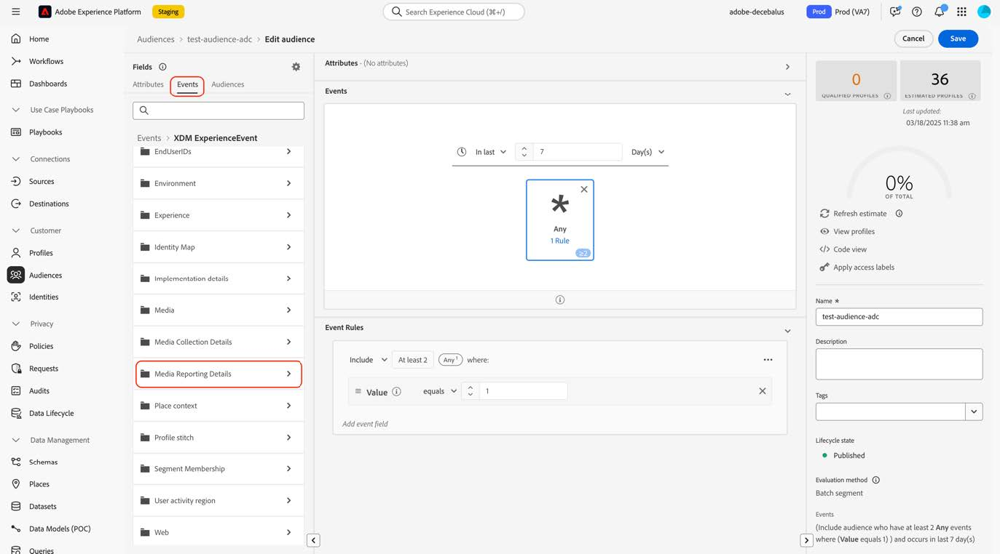
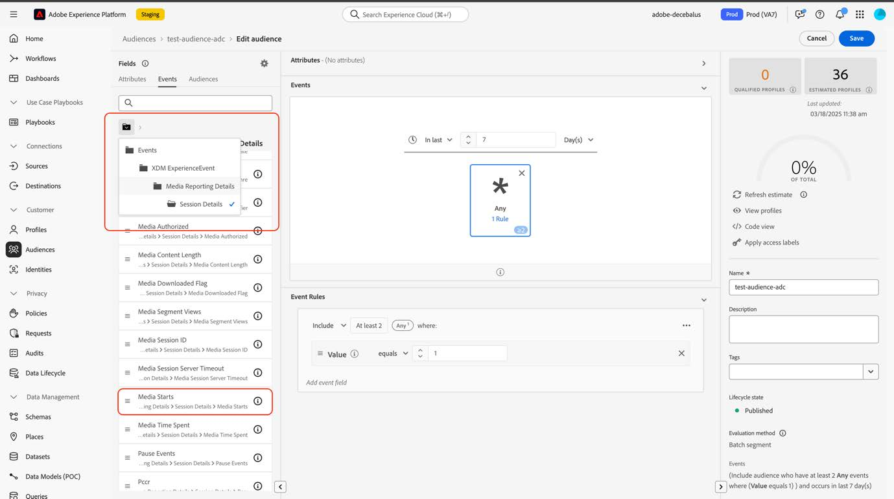

# Migrer les audiences vers les nouveaux champs de streaming multimédia

Ce document décrit comment une audience qui utilise des champs du type de données de services de streaming multimédia d’Adobe appelé « Media » doit être migrée pour utiliser le nouveau type de données correspondant appelé « [Détails de création de rapports multimédia](https://experienceleague.adobe.com/en/docs/experience-platform/xdm/data-types/media-reporting-details) ».

## Migration d’une audience

Pour migrer une audience de l’ancien type de données appelé « Media » vers le nouveau type de données appelé « [Détails des rapports sur les médias](https://experienceleague.adobe.com/en/docs/experience-platform/xdm/data-types/media-reporting-details) », vous devez modifier l’audience et, dans chaque règle, remplacer l’ancien champ du type de données obsolète par le nouveau champ correspondant du nouveau type de données :

1. Recherchez les règles contenant des champs du type de données « Média » obsolète. Il s’agit de tous les champs qui commencent par le chemin, `media.mediaTimed`.

1. Dupliquez ces règles à l’aide des champs du nouveau type de données « [Détails des rapports multimédia](https://experienceleague.adobe.com/en/docs/experience-platform/xdm/data-types/media-reporting-details) ».

1. Gardez les deux règles en place jusqu’à ce que vous validiez que les audiences fonctionnent comme prévu.

1. Supprimez les règles qui contiennent des champs du type de données « Média » obsolète.

1. Vérifiez que les audiences fonctionnent toujours comme prévu.

Pour mapper les anciens champs aux nouveaux champs, reportez-vous au paramètre [Content ID](https://experienceleague.adobe.com/fr/docs/media-analytics/using/implementation/variables/audio-video-parameters#content-id) sur la page [Paramètres audio et vidéo](https://experienceleague.adobe.com/fr/docs/media-analytics/using/implementation/variables/audio-video-parameters). L’ancien chemin du champ se trouve sous la propriété « Chemin du champ XDM » tandis que le nouveau chemin du champ se trouve sous la propriété « Chemin du champ XDM de création de rapports ».

## Exemple

Pour suivre plus facilement les directives de migration, prenons l’exemple suivant qui contient une audience avec une seule règle. Comme l’audience comporte une seule règle, vous ne devez appliquer les directives de migration qu’une seule fois.

1. Sélectionnez le bouton [!UICONTROL **Modifier l’audience**] dans le coin supérieur droit.

1. Recherchez les règles configurées pour l’audience.

   

   

1. Sélectionnez la règle pour ouvrir sa configuration.

   

1. (Facultatif) Pour afficher le chemin d’accès du champ utilisé dans la règle, sélectionnez le bouton d’informations à côté du nom du champ.

   

1. Identifiez le nom du champ (dans ce cas « Démarrages du média »).

   

1. Reportez-vous à la page [Paramètres audio et vidéo](https://experienceleague.adobe.com/fr/docs/media-analytics/using/implementation/variables/audio-video-parameters) pour mapper entre les anciens champs. L’ancien chemin du champ se trouve sous la propriété « Chemin du champ XDM » tandis que le nouveau chemin du champ se trouve sous la propriété « Chemin du champ XDM de création de rapports ». Par exemple, pour le paramètre [Media Starts](https://experienceleague.adobe.com/fr/docs/media-analytics/using/implementation/variables/audio-video-parameters#media-starts), le correspondant pour `media.mediaTimed.impressions.value` est `mediaReporting.sessionDetails.isViewed`.

   

1. Ajoutez la même règle que la règle existante à l’aide du nouveau champ.

   

   

   

1. Sélectionnez [!UICONTROL **Enregistrer**] pour enregistrer l’audience. Vous pouvez conserver cette configuration aussi longtemps que vous devez vérifier que l’audience fonctionne toujours comme prévu.

1. Une fois la validation terminée, supprimez l’ancien champ, puis sélectionnez [!UICONTROL **Enregistrer**] pour enregistrer l’audience.

   

1. Validez à nouveau l’audience.

   Le processus de migration de l’audience est terminé.
