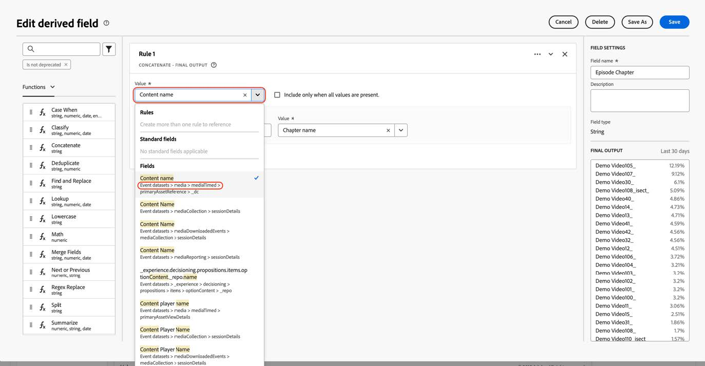

# Migrer le Customer Journey Analytics pour utiliser les nouveaux champs de médias en flux continu

Ce document décrit comment une configuration Customer Journey Analytics qui utilise le type de données Adobe Streaming Media Services appelé « Media » doit être mise à jour pour utiliser le nouveau type de données correspondant appelé « [Détails de création de rapports multimédia](https://experienceleague.adobe.com/en/docs/experience-platform/xdm/data-types/media-reporting-details) ».

## Migration de Customer Journey Analytics

Pour migrer une configuration Customer Journey Analytics de l’ancien type de données appelé « Media » vers le nouveau type de données appelé « [Détails sur les rapports multimédia](https://experienceleague.adobe.com/en/docs/experience-platform/xdm/data-types/media-reporting-details) », vous devez mettre à jour les configurations suivantes qui utilisent l’ancien type de données :

* Vues des données

* Champs dérivés

### Migration des vues de données

Pour migrer les vues de données vers le nouveau type de données :

1. Localisez toutes les vues de données à l’aide du type de données « Média » obsolète. Il s’agit de tous les champs pour lesquels le chemin commence par `media.mediaTimed`.

1. Effectuez l’une des opérations suivantes :

   * Dans ces vues de données, insérez les champs du nouveau type de données « Détails des rapports sur les médias ».

   * Créez un champ dérivé qui utilise le nouveau type de données « Détails des rapports sur les médias » s’il est défini, ou qui revient à l’ancien type de données « Médias » si le type de données « Détails des rapports sur les médias » n’est pas défini.

### Migrer les champs dérivés

Pour migrer des champs dérivés vers le nouveau type de données :

1. Recherchez tous les champs dérivés à l’aide du type de données « Média » obsolète. Il s’agit de tous les champs dérivés qui contiennent des champs pour lesquels le chemin commence par `media.mediaTimed`.

1. Remplacez tous les anciens champs du champ dérivé par le nouveau champ correspondant de « Détails sur les rapports multimédia ».

Pour mapper les anciens champs aux nouveaux champs, reportez-vous au paramètre [Content ID](https://experienceleague.adobe.com/en/docs/media-analytics/using/implementation/variables/audio-video-parameters#content-id) sur la page [Paramètres audio et vidéo](https://experienceleague.adobe.com/fr/docs/media-analytics/using/implementation/variables/audio-video-parameters). L’ancien chemin du champ se trouve sous la propriété « Chemin du champ XDM » tandis que le nouveau chemin du champ se trouve sous la propriété « Chemin du champ XDM de création de rapports ».

## Exemple

Pour suivre plus facilement les directives de migration, prenons l’exemple suivant qui contient une vue de données avec des champs de l’ancien type de données « Média » obsolète. Dans cette vue de données, vous devez ajouter les nouveaux champs correspondants.

### Mise à jour de la vue de données

Vous pouvez utiliser l’une des options suivantes pour mettre à jour la vue de données :

#### Option 1

1. Recherchez une mesure ou une dimension qui utilise l’ancien champ à partir du type de données obsolète.

   

1. Vérifiez le nouveau champ correspondant dans la section [Décalage de chapitre](https://experienceleague.adobe.com/en/docs/media-analytics/using/implementation/variables/chapter-parameters#chapter-offset) de l’article [Paramètres de chapitre](https://experienceleague.adobe.com/fr/docs/media-analytics/using/implementation/variables/chapter-parameters).

1. Recherchez le nouveau champ correspondant dans la vue de données.

   

1. Faites glisser le nouveau champ vers la mesure ou la dimension.

1. Répétez ce processus pour toutes les mesures et dimensions qui utilisent des champs du type de données « Média » obsolète.

#### Option 2

Cette option crée un champ dérivé qui sélectionne la valeur de l’ancien champ ou la valeur du nouveau champ en fonction de celui qui existe pour un événement spécifique. Ce champ dérivé remplace l’ancien type de données « Média » dans tous les projets où il est utilisé.

Si vous souhaitez créer un champ dérivé pour le « Nom du chapitre » qui utilise le nouveau type de données « Détails des rapports sur les médias » s’il est défini, ou qui retourne à l’ancien type de données « Médias » si le type de données « Détails des rapports sur les médias » n’est pas défini :

1. Faites glisser une clause « Case When » dans les champs dérivés.

   

1. Renseignez la clause [!UICONTROL **If**] à l’aide de la valeur du paramètre **Chemin d’accès au champ XDM de la création de rapports**, comme indiqué dans le paramètre [Nom du chapitre](https://experienceleague.adobe.com/en/docs/media-analytics/using/implementation/variables/chapter-parameters#chapter-name) sur la page [Paramètres de chapitre](https://experienceleague.adobe.com/fr/docs/media-analytics/using/implementation/variables/chapter-parameters).

   

   

   

   

1. Renseignez la valeur de secours à l’aide de l’ancien champ du type de données « Média » obsolète.

   

   

   Il s’agit de la définition finale du champ dérivé.

   

1. Pour mettre à jour les champs dérivés, recherchez un champ dérivé qui utilise les anciens champs obsolètes (chemin commençant par `media.mediaTimed`).

   

1. Placez le pointeur de la souris sur le champ dérivé à mettre à jour, puis cliquez sur l’icône [!UICONTROL **Modifier**].

1. Recherchez tous les champs de l&#39;ancien type de données (chemin commençant par `media.mediaTimed`) et remplacez-les par le nouveau champ correspondant.

   

1. Vérifiez le nouveau champ correspondant dans la section [&#x200B; Nom du contenu (variable)](https://experienceleague.adobe.com/en/docs/media-analytics/using/implementation/variables/audio-video-parameters#content-name-variable) de l’article [Paramètres de streaming multimédia](https://experienceleague.adobe.com/en/docs/media-analytics/using/implementation/variables/audio-video-parameters#content-name-variable).

1. Remplacez l’ancien champ par le nouveau.

   

1. Répétez ce processus pour tous les champs dérivés utilisant des champs de l’ancien type de données « Média » obsolète.

   La migration de la configuration CJA est terminée.
