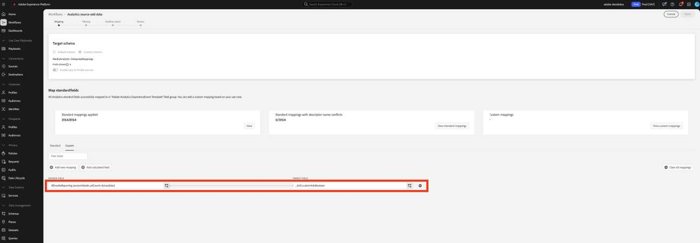

# Migrer la préparation des données pour les champs personnalisés vers les nouveaux champs de médias en flux continu

Ce document décrit le processus de migration du service de préparation des données qui existe en plus des flux de collecte de données Adobe activés pour les données de collecte de médias en flux continu Adobe. La migration convertit un mappage de préparation de données à partir du type de données de collecte de médias en flux continu Adobe appelé « Média » pour utiliser le nouveau type de données correspondant appelé « [Détails de création de rapports multimédia](https://experienceleague.adobe.com/en/docs/experience-platform/xdm/data-types/media-reporting-details) ».

## Migrer la préparation des données pour les champs personnalisés

Pour migrer les mappages de la préparation des données de l’ancien type de données appelé « Média » vers le nouveau type de données appelé « [Détails des rapports sur les médias](https://experienceleague.adobe.com/en/docs/experience-platform/xdm/data-types/media-reporting-details) », vous devez modifier les mappages de la préparation des données :

>[!IMPORTANT]
>
>Pour éviter de perdre des données, assurez-vous que le connecteur source Analytics a été déployé à l’aide des nouveaux champs de `mediaReporting` avant de suivre les étapes de cette section.

1. Dans Adobe Experience Platform, dans la section [!UICONTROL **Sources**], accédez à l’onglet [!UICONTROL **Flux de données**].

1. Recherchez le flux de données responsable de l’importation des données de médias en flux continu d’Adobe Analytics vers Adobe Experience Platform via la collecte de données Adobe.

1. Sélectionnez [!UICONTROL **Mettre à jour le flux de données**] pour modifier la configuration de la préparation des données en remplaçant chaque mappage source personnalisé contenant un champ obsolète par le nouveau champ correspondant du nouvel objet XDM.

1. Recherchez les mappages contenant les champs sources de l’objet « Media » obsolète.

1. Remplacez ces sources à l’aide des champs du nouvel objet « Détails des rapports multimédia ».

1. Vérifiez que les mappages fonctionnent toujours comme prévu.

Pour mapper les anciens champs aux nouveaux champs, reportez-vous au paramètre [Content ID](https://experienceleague.adobe.com/en/docs/media-analytics/using/implementation/variables/audio-video-parameters#content-id) sur la page [Paramètres audio et vidéo](https://experienceleague.adobe.com/fr/docs/media-analytics/using/implementation/variables/audio-video-parameters). L’ancien chemin du champ se trouve sous la propriété « Chemin du champ XDM » tandis que le nouveau chemin du champ se trouve sous la propriété « Chemin du champ XDM de création de rapports ».

## Exemple

Pour suivre plus facilement les instructions de migration, considérez l’exemple de flux de données suivant qui contient un seul mappage. Dans ce cas, vous ne devez appliquer les directives de migration qu’une seule fois.

1. Dans Adobe Experience Platform, dans la section [!UICONTROL **Sources**], accédez à l’onglet [!UICONTROL **Flux de données**].

1. Recherchez le flux de données responsable de l’importation des données de médias en flux continu d’Adobe Analytics vers Adobe Experience Platform via la collecte de données Adobe.

1. Sélectionnez **[!UICONTROL Mettre à jour le flux de données]** pour accéder à l’interface utilisateur de modification, comme illustré dans l’image ci-dessous.

   

1. Dans l’onglet **[!UICONTROL Mappage]**, sélectionnez **[!UICONTROL Personnalisé]**.

1. Identifiez les mappages personnalisés qui reposent sur des champs `media.mediaTimed` en tant que sources.

   

   Dans cet exemple, comme vous avez créé un groupe de champs personnalisés sur le schéma de votre organisation de développement, le champ cible se trouve sous `_dcbl`. Le chemin d’accès au groupe de champs personnalisés diffère en fonction du nom de l’organisation.

1. Pour chaque mappage qui utilise l’objet `media.mediaTimed`, recherchez son correspondant dans l’objet `mediaReporting` à l’aide de cette documentation.

   Par exemple, pour Network, le correspondant de `media.mediaTimed.primaryAssetViewDetails`.broadcastNetwork est `mediaReporting.sessionDetails.network`.

   

1. Dans le champ **[!UICONTROL Source]** , remplacez le chemin `media.mediaTimed` par le chemin `mediaReporting`. Le champ cible reste inchangé.

   

1. Sélectionnez **[!UICONTROL Suivant]** pour enregistrer vos modifications.

   Le statut indique **[!UICONTROL Traitement]**. Une fois les modifications appliquées, le statut indique **[!UICONTROL Activé]**.

   

## Exemple avec différents types de données

Dans l’exemple ci-dessus, tous les types de données impliqués étaient des chaînes. Le remplacement du mappage était donc direct.

Si le type de données du champ source est différent du type de données du champ cible, vous devez suivre les instructions des sections [Guide de dépannage de la préparation des données](https://experienceleague.adobe.com/en/docs/experience-platform/data-prep/troubleshooting-guide), [Gestion des formats de données avec la préparation des données](https://experienceleague.adobe.com/en/docs/experience-platform/data-prep/data-handling) et [Fonctions de mappage de la préparation des données](https://experienceleague.adobe.com/en/docs/experience-platform/data-prep/data-handling).

Par exemple, si le type source est une chaîne et que le type cible est une valeur booléenne, la préparation de données peut automatiquement analyser la valeur et convertir la valeur source en valeur booléenne.

Si le type source est un nombre et que le type cible est une valeur booléenne, vous devez utiliser des fonctions de manipulation de données :

Mappage avec `media.mediaTimed` à un champ personnalisé.

Mappage avec `mediaReporting` au même champ personnalisé :

